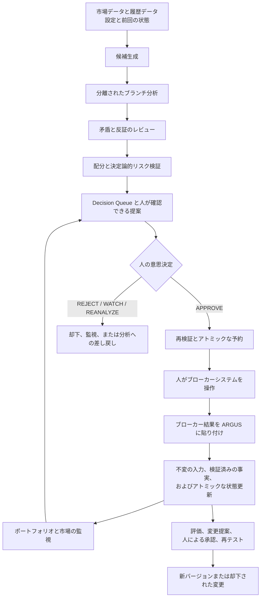
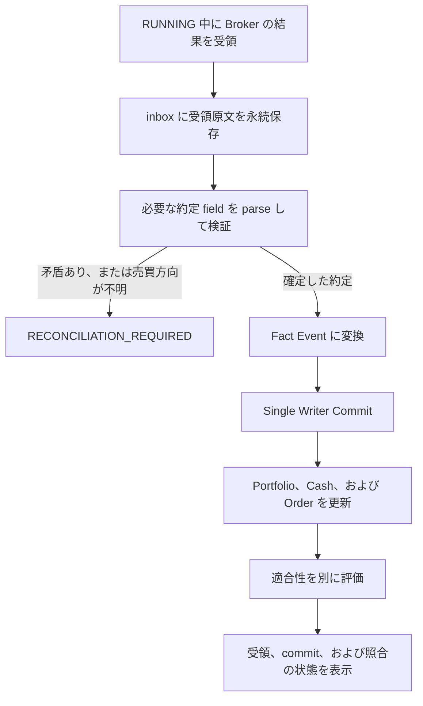
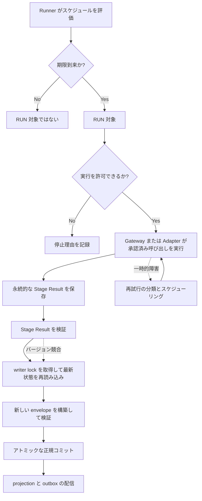
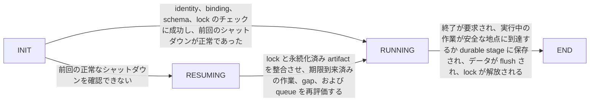
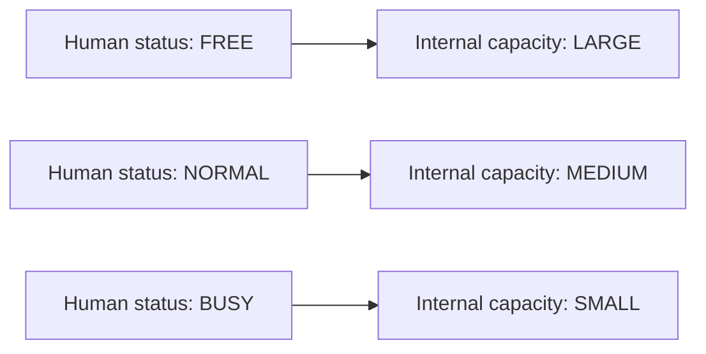
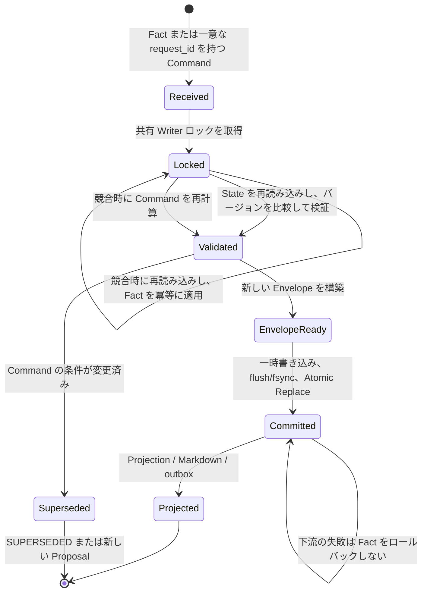

# ARGUS Human System Design - Full Candidate

> Status: FULL_HSD_CANDIDATE. This is a noncanonical human-readable review artifact and not a Freeze candidate. Human review is required before any later promotion decision.

# 設計環境

Argus では、派生ビューを設計ソースと実装やテストが取り違えないよう、設計上の権威を明示的な階層として定めている。設計内容に関する唯一の一次ソースは `docs/source/argus_design_source_v0.1.md` であり、SHA-256 `feff970e4dc59c599c7fc5e48c5f77b87e7806aa156e87f8dd26bdae36609681` によって識別される。対象設計は、ローカルファーストな `argus` 初期実装のベースラインである v0.1.7 Final Freeze である。

構造化設計データ（Structured Design Data）は、そのソースを設計要素、型、関係、プロセス、状態、責務、および境界として再編成したものである。原則として実装とテストから直接参照することを意図しているが、権威として Design Source に取って代わるものではない。表とソース位置の参照は、移動と検査を補助するものであり、派生成果物を独立した権威やソースの代替物として扱ってはならない。権威の競合が生じた場合は、Design Source が優先される。この人間可読設計自体も非正規の投影であり、人によるレビューを待っている。

生成された設計の範囲には、権威としての Human System Design、実装、テスト結果、または Design Source に存在しない設計上の追加事項は含まれない。この区別は重要である。初期リリースから除外された内容が、必ずしも設計全体から削除されたとは限らない。

## 初期スコープと延期スコープ

自動取引と常時稼働は初期スコープ外である。追加の分析ブランチ、データベース、およびダッシュボードは MVS 後まで延期される。この2つの区分は明確に分けたままにしなければならない。スコープ外の機能を早期に実装してはならず、延期された機能についても、初期実装の一部ではないという理由だけで設計から消してはならない。

## 運用情報の分離

ランタイム識別情報、構成、ユーザーステータス、ドメイン状態、ランタイム状態、シークレット、およびランタイム成果物は、それぞれ別個の情報クラスである。権威、書き手、内容、および復旧条件が異なるクラスを統合すると、バインディング、権限、および復旧が曖昧になり、シークレットが露出するおそれがある。このため、各クラスには固有の権威境界がある。

| 情報クラス | 権威と書き手 | 含まれる内容 | 含まれない内容 | 必須の障害時動作 |
|---|---|---|---|---|
| ランタイム識別情報（Runtime Identity） | その物理形式は後続の契約で定義される。Bootstrap または専用メカニズムが書き込む。 | 候補フィールドは `schema_version`、`state_id`、`environment`、`data_root_id`、および `created_at`。 | パス、ドライブ文字、予算、シークレット、ステータス、ドメイン状態、ランタイム状態、プラン階層、およびコードパス。 | 識別情報を解決できない場合、通常起動を続行してはならない。 |
| 構成（Configuration） | `config.json`。Config Writer が書き込む。 | ランタイム、モデル、予算、通知、ポートフォリオとリスクのポリシー、戦略、監視、選択、中断、バックアップ、およびアーカイブの設定。 | シークレット値、ユーザーステータス、およびドメイン状態。 | スキーマまたは必須値に不備がある場合、結果は `CONFIG_REQUIRED` または規定された同等の結果となる。 |
| ユーザーステータス（User Status） | `user_status.json`。Status Writer が書き込む。 | `status_version`、ステータス、`changed_at`、および `BUSY` リース。 | ポリシー、予算、およびポートフォリオの事実。 | バージョン競合時には、古くなった自動遷移を破棄する。 |
| ドメイン状態（Domain State） | `portfolio.json` エンベロープ。Canonical State Writer が書き込む。 | 事実、観測、判断、ワークフロー、およびコミット支援。 | 会話履歴および暗黙的な記憶。 | 権威を判定できない場合、システムは `RECOVERY_REQUIRED` に移行する。 |
| ランタイム状態（Runtime State） | 正規ランタイム領域またはその投影。Runner または Writer が書き込む。 | 実行、ジョブ、再試行、ロック、および関連するランタイムデータ。 | ユーザーステータスおよびランタイム識別情報。 | 復旧中は最新の状態から再構築する。 |
| シークレット（Secret） | 環境変数または OS で保護されたストア。該当するサブシステムが使用する。 | API キーなどのシークレット値。 | プロジェクトファイル、構成、ログ、エビデンス、レポート、およびバックアップ。 | 漏えいが疑われる場合、アダプターを停止し、`SECURITY_INCIDENT` を発生させる。 |

ランタイム成果物も独立したクラスであり、識別情報、構成、ステータス、状態、またはシークレットと統合してはならない。その権威、内容、および障害時動作の詳細は、このセクションでは定めない。

これらの境界により、運用上の所有関係が明確になる。また、未解決の識別情報によって通常起動が阻止され、不正な形式の構成には修正が要求され、古くなったステータス自動処理が新しい決定を上書きできず、正規状態が不確かな場合には復旧が開始され、シークレットの露出が疑われる場合には影響を受ける外部アダプターが停止されることも保証される。

## 1.1 システムの目的

ARGUS は、設計上の各目的および課題を、それに対処する仕組みと結び付け、各仕組みが何を保護するのかを追跡できるようにする。その対象範囲には、人間参加型（human-in-the-loop）の投資支援、閉じた投資意思決定ループ、ローカル優先での継続性、事実状態の保存、認知負荷の制御、検証後の段階的な移行、および承認を条件とする改善が含まれる。

ARGUS は、人間の投資判断に取って代わるのではなく、それを支援する。調査、独立した分析、矛盾の特定、具体的な提案の作成、監視、および評価を行う。提案を承認または却下し、ブローカーでの操作を実行する責任は、引き続き人間が負う。

本システムは、選定から評価および改善まで、投資プロセスのつながりを維持する。想定する流れは、金融商品の選定、分析、提案、人間による意思決定、執行事実の受領、ポートフォリオの更新、注視、再評価、そして改善である。

ローカル運用では、PC のシャットダウン、スリープ、オフライン期間、および外部 API の障害が日常的に発生することを前提とする。したがって、永続化されたループ、再試行可能なトランザクションジョブ、未コミットの作業、再試行、および復旧後の追い付き処理は、例外的に付加される経路ではなく、通常の運用経路である。

ARGUS は、単一書き込み主体（single writer）、アトミックコミット（atomic commits）、不変の事実、訂正または置換、およびバックアップ後の照合によって、中断、並行処理、断絶、および不正確な入力からポートフォリオの事実を保護する。また、ユーザー状態を用いて人間の処理能力を判断し、意思決定キュー、TTL、通知タイミング、および重要度と優先度の個別の扱いを用いることで、提案と通知を人間が処理できる範囲内に保つ。

実資金の利用への移行は段階的に行う。定量的バックテスト、モデルの履歴リプレイ、およびペーパートレーディングは互いに区別したままとし、バックテストの成功だけでは実資金での運用は認められない。実資金での運用開始には、人間による別個の意思決定が必要である。

システムの改善も制御下に置く。変更提案は意思決定キューに入り、人間の承認を必要とし、テストを経た後にのみバージョンの有効化に至る。B4 では、旧目的と新目的を並行して測定する。これにより、人間の監督なしに、システムが自らの目的や規則を正当化し、変更することを防ぐ。

## 1.2 全体アーキテクチャ

Argus は、閉じた Human-in-the-loop 型の投資意思決定システムとして構成される。そのアーキテクチャは、ランタイムのスケジューリング、外部 API、Canonical State の書き込み、リスク検証、Human Approval、ブローカー事実の取り込み、アラート、バックアップと復旧、履歴データ、コスト統制、ストレージ保護、管理された変更、および検証を結び付ける。この統合的な見方が必要なのは、各メカニズムを個別に説明するだけでは、それらがどの運用上の前提や障害に対処し、どの資産を保護するのかが明らかにならないためである。

中核ループは、投資判断を、ローカル優先の運用、永続的な状態、検証、および管理された改善と組み合わせる。承認などの保護された意思決定点では、人間の権限が明示的に維持される。ブローカー事実は外部の現実についての権威ある観測であり、以前の提案が期限切れになったりポリシーが変更されたりしたという理由だけで破棄されることはない。

### 運用モデルと整合性モデル

ランタイムは、PC が停止中、スリープ中、またはオフラインである状態を例外ではなく通常の状態として扱う。反復ループ、`last_success`、再試行、永続的なステージング、およびキャッチアップ処理により、スケジュールの取りこぼしや中断が原因で作業が恒久的に失われることを防ぐ。また、実行再開後の外部呼び出しコストの重複を減らし、古い入力に基づく意思決定を防止する。

外部 API の作用はローカルトランザクションではロールバックできない。そのため Argus は、ステージングと Canonical Commit を分離する。リクエストには `request_id` とコンテンツハッシュを付与し、冪等な処理を可能にするとともに、永続化されたステージング結果を再利用する。この境界により、外部呼び出しの繰り返しと、同一結果のローカル状態への重複適用を防ぐ。

Canonical JSON State の Writer は一つだけであり、そのコミットはアトミックに行われる。Writer は OS ロックを取得し、現在の状態を再読込し、そのバージョンを確認し、`fsync` を用いてデータを永続化したうえでアトミック置換を実行する。これにより、バージョン競合、部分的な書き込み、およびリソースの重複割当てから、Canonical State の完全性、現金、予約を保護する。

承認とリソース割当ては、一つの整合性判断として扱われる。取引の承認と、その取引に対するスロットまたは予約の取得は同じコミット内で行われ、最初の項目から Writer を通じて直列化される。したがって、現金またはポジション容量が別々のコミットによって複数の取引に割り当てられることはない。

### 独立した安全境界

投資対象としての魅力度の判断と、ハードリスクの強制は分離される。固定コードで実装され、ハッシュならびに `CV-16A` と `CV-16B` のチェックによって評価対象コンテンツに結び付けられた決定論的 Validator が、投資判断を形成した同じ LLM によるポリシー回避や誤った `PASS` から、資金とリスクポリシーを保護する。

貼り付けられたブローカー取引活動は、提案の有効性とは独立した事実経路から取り込まれる。提案の TTL が期限切れであったりポリシーが変更されていたりしても、Inbox は Fact Event とその Compliance Record を記録する。これにより、ポートフォリオ状態とブローカー上の現実との整合性が保たれる。

人間の対応可能状態には、時間制限付きの Lease を用いる。`BUSY` プリセットは `effective_until` の値を持ち、Lease の期限が切れると Status Lease Job が状態を `NORMAL` に戻す。これにより、通知抑制設定の解除忘れによって作業が無期限にキューへ滞留することを防ぐ。同様に、ポップアップの配信成功は人間による確認とはみなさない。Durable Alert Queue は配信とアラートの `ACK` を別々に追跡し、ポップアップが表示されただけでインシデントが対応済みと扱われることを防ぐ。

バックアップからの復旧でブローカー取引活動を巻き戻すことはできない。復元後は Reconciliation が必須であり、不足している事実や訂正が解決されるまで `BUY` と `ADD` の活動は停止されたままとなる。復元された状態が実際の口座と乖離している可能性がある間は、運用を再開してはならない。

### 証拠、コスト、リソースの保護

履歴評価には、Point-in-time Data、改訂情報と Vintage 情報、および当時把握されていた Universe が必要である。Time Gate と Dataset Manifest はこれらの制約を強制し、後日の改訂や Survivor Bias によって、Look-ahead Bias を通じてバックテスト結果が過大評価されることを防ぐ。

後発事象について LLM が学習済みの知識を、確実に除去することはできない。このため、定量的 Replay と Model Replay は、その限界を明示して別々に報告し、真の Out-of-sample Evidence として提示するのではなく、将来に向けた Paper 運用に接続する。これにより、裏付けのないパフォーマンス主張を防ぐ。

コスト権限は厳格なルールである。サービス障害時に、有料 Fallback を自動的に有効化してはならない。あらゆる有料利用は、`approval_ref`、Service Registry、および Budget Gate によって統制されなければならず、これにより未承認の課金と未審査の依存関係拡大を防ぐ。

ストレージ枯渇時は、偶然最初に障害を起こしたコンポーネントに任せるのではなく、明示された縮退順序に従う。「Stop first / Preserve last」と Minimum Data のルールは、Raw Data の増加よりも Canonical State、Audit Record、およびポジション監視を優先して保護する。

管理された改善によって、パフォーマンス評価の基準を書き換えてはならない。`B4` の評価目的は強く保護される。以前の目的を凍結し、新旧の目的を並行して実行し、変更には二段階の Human Approval を必要とする。同様に、Validation Baseline と Oracle は実行前に凍結され、ハッシュで拘束され、別々にコミットされ、Human Approval の対象となる。これらの統制により、目的の変更によってパフォーマンス悪化を隠すことを防ぎ、実装結果を利用して偽の `PASS` を作り出すことを防ぐ。

これらの境界が一体となって、閉じた安全構造を形成する。信頼できない稼働可能性には永続的な復旧で対処し、不可逆な外部作用をローカルコミットから分離し、Canonical Resource を直列化し、ハードリスクと証拠をそれぞれ独立に制約する。観測された事実は提案の変更後も保持され、人間による確認と権限は明示されたままとなる。そして、復旧、コスト、ストレージ、改善、および検証は、保護対象の条件が満たされない場合にすべて安全側に失敗する。

## 1.3 Human と ARGUS の責任分担

ARGUS は、権限と実行責任を分離する。Human、ARGUS、Broker、および Agent/LLM は権限を持つ主体であり、Human Interface、Runner、固定された Reducer/Validator/Writer、Provider Adapter/ExternalServiceGateway、Agent Runtime または model provider、および Broker system は、許可された作業を遂行するコンポーネントである。これらの概念を明確に区別することで、Human-in-the-loop による統制と Single Writer の境界が維持される。提案、意思決定、状態更新、および外部実行の権限が混同されると、自動取引や Writer を迂回する経路が可能になり得る。

| 権限主体 | 実行時の実行主体 | 許可された責任 | 境界 |
|---|---|---|---|
| Human | CLI および Tray を含む Human Interface | 投資、提案、Broker 操作、有料サービスと費用、Policy、Break、状態変更、および実資金運用の開始について最終決定を下す。提案を承認または却下する。貼り付けられた Broker の結果を含む、コマンドおよび事実を提供する | 意思決定権限を ARGUS に包括的に委譲してはならない。通常運用では、Canonical JSON を直接編集してはならない。 |
| ARGUS | Runner | ループ、due check、retry、job startup、lease、および queue を運用する。job を run、stage、および state processing にスケジュールする | Broker を通じて自動取引してはならず、重複インスタンスとして動作してはならない。 |
| ARGUS | 固定された Reducer/Validator/Writer | 決定論的な遷移を適用し、schema および Policy を検査し、相互排他と version check を強制し、コマンドまたは事実を Canonical State に反映する atomic commit を実行する | 投資対象としての魅力度を判断してはならず、Canonical State の更新時に決して迂回されてはならない。 |
| ARGUS | Provider Adapter/ExternalServiceGateway | 外部サービスを呼び出し、応答を検証し、raw result を保持し、それを正規化して staged data として保存する | provider-specific API を Business Logic に直接公開してはならない。 |
| Agent / LLM | Agent Runtime / model provider | 証拠に基づいて分析、Update Request、Proposal、Review、および考え得る判断を生成する | Canonical State を直接更新する権限も、自らに Hard Risk PASS または Human Approval を付与する権限も持たない。 |
| Broker | Broker system | Human の操作を受け付け、注文、約定、および取消などの外部事実を確定する | 初期バージョンでは、ARGUS は Broker を直接操作しない。 |

システム全体として、ARGUS は local-first の discovery、analysis、proposal、validation、queueing、monitoring、evaluation、および統制された state processing を担う。これらの能力があっても、ARGUS が Broker になるわけではなく、Human の最終判断を代替するものでもない。同様に、Agent/LLM は recommendation または Update Request を生成できるが、それによる状態変更には、引き続き固定された validation と writing の経路が適用される。現実世界の取引結果は、ARGUS による自律的な Broker 実行ではなく、Human による Broker の操作から生じ、提供された事実として ARGUS に戻される。

## 1.4 エンドツーエンド・プロセス

ARGUS は、閉ループ型の意思決定支援システムである。その価値は、個々の定義そのものではなく、候補選定、分析、リスク検証、人による承認、事実の記録、監視、改善が制御された形で結び付いていることから生まれる。このため、本設計では、承認、コマンド、事実、ポリシー、ステージ、インシデント、ステータス、ロール、責任、権限をそれぞれ異なる概念として扱う。承認は実行ではなく、コマンドは事実ではなく、ポリシーはそれ自体がその内容を強制するゲートではない。これらの意味を分離しておくことで、ある意思決定やイベントを、後続の手順が実際に行われたことを示す証拠と取り違えるのを防ぐ。

投資判断のライフサイクルは、次のように進む。

1. **候補を生成する。** ARGUS は、市場データと履歴データ、設定、前回の状態を用い、機械的なフィルターと複数の探索ブランチを通じて候補プールを構築する。あるブランチでデータが欠けていても、暗黙にスコア 0 へ変換しない。また、ブランチ間で共通に適用する除外条件は、意図的に限定したままとする。

2. **独立した初回分析を行う。** エージェントまたは LLM は、候補レコードと凍結された証拠を用いて各候補を評価する。分析ブランチは論理的に分離したままとし、あるブランチが別のブランチの結論や、すでに統合済みの推奨を主要な入力として取り込むことはない。

3. **分析を批判的に検討し、統合する。** エージェントまたは LLM は、各ブランチの結果に含まれる矛盾、反証、未解決の問いを特定する。その結果として、統合レポートまたは追加調査の要求を生成する。調査には予算と停止条件による上限を設ける。重大な情報不足がある場合、BUY または ADD の推奨は行わない。

4. **具体的な取引を作成し、検証する。** ARGUS は、レポートをポートフォリオ、ポリシー、現金ポジション、リスク情報と組み合わせる。資本を配分して具体的な取引を形成し、決定論的リスク検証器（deterministic risk validator）へ提出する。その結果は、`VALIDATED` の提案、却下、調整、または情報不足のいずれかとなる。投資対象としての魅力度と、必須のリスク制約は別々に評価する。

5. **人による確認へ提案を振り分ける。** キューとルーターは、提案、その TTL、`valid_if` 条件、検証結果を処理する。意思決定キュー（Decision Queue）は、再評価、重複排除、優先順位、通知条件を扱い、人が確認できる提案を生成する。個々のエージェントが人へ直接通知することはない。

6. **人の意思決定を得る。** ヒューマンインターフェース（Human Interface）は、具体的な取引と、それに反対する理由を提示する。人は `APPROVE`、`REJECT`、`WATCH`、`REANALYZE` のいずれかを選択し、ヒューマンコマンド（Human Command）を生成する。承認は提案のリビジョンおよび `trade_hash` に結び付けられており、後から行う取引や変更後の取引に対する包括的な承認ではない。

7. **再検証と予約をアトミックに行う。** 共有サービスとライターは、承認コマンド（Approval Command）を最新の状態、ポリシー、利用可能なリソースとともに処理する。提案を再検証し、同一のコミット内で承認と、その `execution_slot` または予約を確立する。コミットが成功すると、提案は `AWAITING_SUBMISSION` に移行する。関連する条件が変化している場合、以前の承認は再利用しない。

8. **手動で注文を出す。** 人は、注文指示に従い、ブローカーのシステムを用いて買いまたは売りの操作を行う。発生した注文と約定はブローカー側に存在する。初期バージョンでは、ARGUS がブローカーのインターフェースを操作したり、自ら注文を出したりすることはない。

9. **確認済みのブローカー事実を記録する。** 人は、ブローカーの結果を ARGUS に貼り付ける。事実取り込み機構（Fact Ingress）とライターは、元の入力を保持し、そのスキーマを検証して事実へ変換し、ポートフォリオ、現金、ロット、注文、監査履歴に対する更新をアトミックにコミットする。現実世界で確認済みの約定は、その後 TTL または同様の提案条件が失効したというだけの理由では却下しない。

10. **監視し、次のアクションを提案する。** ランナーとエージェントランタイムは、更新されたポートフォリオ、イベント、監視設定を用いてポジション、候補、市場を監視し、再分析を開始する。それらは、新たな `HOLD`、`ADD`、`REDUCE`、`SELL` の提案を生成する場合がある。ローカルシステムが停止している間は、監視が継続する保証はない。

11. **システムを評価し、改善する。** ARGUS と人は、ログ、結果、コスト、人の作業負荷をレビューする。評価の結果、変更提案（break proposal）、人による承認、再テストへ進み、その後、新しいバージョンを採用するか、変更を却下する場合がある。履歴上の事実と従前の目的は、消去せず保持する。



このフローは、ライフサイクルを完全なものに保ちながら、ヒューマン・イン・ザ・ループ（human-in-the-loop）の境界を維持する。提案は人に提示される前にポリシーに照らして検査され、承認は特定の取引表現に結び付けられ、条件が変化すれば再検証が必須となる。また、外部での実行は、事実の取り込みとアトミックコミットを経た場合に限り、正準状態（canonical state）となる。インシデントとステータス変更も同じ制御された連鎖に属する。これらは、通知やコマンドと同一視せず、責任を負うロールと仕組みを通じて表現し、振り分けなければならない。

## 2.1 候補の発見

候補の発見は、明示的に定義された対象市場について固定された初期ユニバースから始まる。決定論的な一次フィルターにより、十分な流動性や許可された商品範囲への包含といった共通要件を満たさない金融商品を除外する。このフィルターでは LLM を使用しない。ある発見ブランチだけに影響するデータ欠損を、すべてのブランチに適用する共通の除外条件としてはならない。

残った金融商品は、Value、Growth、Change、Quality、Event、Contrarian、Theme の各発見ブランチで独立に評価される。各ブランチはそれぞれ固有のデータを使用し、固有の観点を維持する。それらの結果は、単一の総合スコアや共通の結論に集約するのではなく、候補の和集合として統合する。候補には、後続の評価に向けて `ELIGIBLE` 状態を付与できる。

続いて各候補は、Fundamental、Valuation、Bull、Bear、Macro、Risk、Technical、Portfolio Fit の相互に分離された分析ブランチに入る。これらのブランチは、候補と凍結されたエビデンスを基に処理する。各結果には、ブランチの識別情報、入力ハッシュ、出力に加え、評価を実施できなかった場合には未評価となった理由を保持する。ブランチを分離しておくことで、早期の統合によってブランチ固有の欠損情報、反証、または見解の不一致が消失することを防ぐ。

Contradiction Engine（矛盾検出エンジン）は、ブランチの結論を平均化することなく、各分析を比較する。矛盾と未解決の関係を抽出し、それらが可視の状態に保たれるようにする。対立がある場合は、追加調査を行うか、`UNRESOLVED` 状態とする。見かけ上の合意へ暗黙に変換してはならない。

ユニバースから投資レポートに至るまで、入力、ルール、出力をこのように分離することで、分析根拠を追跡可能にする。生成されるレポートは、分析、矛盾、投資仮説、無効化条件を構造化し、推奨、理由の重み、確信度、配分、退出条件としてまとめる。このレポートは、人によるレビューおよび配分への入力であり、それらに代わるものではない。配分と Risk Gate（リスクゲート）は後続段階に引き続き配置され、それらへの移行は 2.2 節で説明する。

## 2.2 分析、反証、意思決定への入力

Argus における投資分析用語には、それぞれ固有の役割がある。これらを日常的な意味だけで読むと、探索対象の集合、未解決の見解の相違、投資仮説、リスクを統制する制約の境界が曖昧になり得る。以下の定義は、分析、配分、リスク、モニタリングの各データが互いにどのように関係するかを定める。

| 概念 | Argus における役割 | 定義と境界 | 主な用途 |
|---|---|---|---|
| 投資対象領域（Universe） | 対象集合 | 初期バージョン向けに明示的に定義され、固定された投資市場内の証券の母集団。候補集合（Candidate Pool）とも、現在の保有銘柄の集合とも異なる。 | 一次フィルタリングおよび複数の探索分岐 |
| Candidate Pool | ワークフローの対象集合 | 個々の探索分岐が選出した証券の和集合。Universe 全体ではなく、分岐ごとの状態とデータ欠落理由を保持する。 | 独立分析への入力 |
| 分析上の矛盾（Contradiction） | 分析上の関係 | 分析分岐間の対立または未解決の関係。単なる否定的評価でも、各分岐を平均して得られる結果でもない。 | 追加調査および報告 |
| 投資仮説（Thesis） | 状態を持つ判断 | 投資根拠と、その仮説を無効にする条件の両方を含む投資仮説。調査（Research）、提案（Proposal）、保有（Holding）とは別個のエンティティであり、改訂履歴を保持する。 | 継続的な監視および売却判断 |
| 配分（Allocation） | プロセス | 魅力度に加え、ポートフォリオ、現金、方針、リスクを考慮して取引数量を決定する。購入すべきかどうかの分析とは別である。 | 取引案（Proposed Trade）の生成 |
| 強制的リスク方針（Hard Risk Policy） | 方針および制約の集合 | 現金取引限定、現金、エクスポージャー、バケット、流動性、鮮度、コストなどを対象とする、機械的に適用可能な制約。決定論的リスク検証器（Deterministic Risk Validator）は、証券の魅力度を評価することなく、これらの制約を適用する。 | BUY、ADD、SELL、REDUCE アクションのゲート |
| ポジション監視用最小データ（Position Watch Minimum Data） | データ集合 | ストレージが危機的な状態にある場合でも、保有ポジションの重大なリスクを監視するために必要な、市場データ、必須開示情報、正規化結果、鮮度評価の最小集合。このデータには、候補生成や発見に使用するデータよりも高い保護優先度が与えられる。 | ストレージ劣化時の継続的なモニタリング |

これらの概念を組み合わせることで、発見、判断、数量決定、強制適用、モニタリングが明確に区別される。探索分岐は、固定された Universe を、状態を持つ Candidate Pool へと絞り込む。独立した分析によって Contradiction が明らかになった場合、暗黙に平均化するのではなく、追加調査が必要となり得る。Thesis は、投資判断の根拠、その無効化条件、改訂内容を記録する。その後、Allocation が数量を決定し、Hard Risk Policy が、その結果得られるアクションを独立してゲートする。ストレージに制約が生じた場合でも、既存ポジションの監視に必要な最小データは、保護対象となるモニタリングの基準として維持される。

## 2.3 投資判断とリスク検証の分離

投資分析、配分、およびハードリスク検証は、それぞれ異なる問いに答える。投資対象としての魅力度、ポジションサイズの決定、およびハードリスクチェックを単一の判断にまとめると、ポリシー上の制約が迂回されるおそれがある。そのため本設計では、「買うべきか」「どれだけ買うべきか」「提案された取引は機械的制約を満たしているか」という問いを分離しつつ、それぞれの出力を順番に接続する。

分析では、投資を行うべきかを評価する。その出力は、関連する Evidence に裏付けられた独立した分析上の結論であり、投資判断とその根拠の両方を保持する。

配分（Allocation）では、取引を行う場合にどれだけ取引するかを決定する。投資判断に加え、現在の Portfolio State、Policy、現金、エクスポージャー、相関、およびリスクを考慮する。数量ゼロも有効な配分結果である。配分が取引を提案する場合、その提案は具体的であり、口座、銘柄、売買区分、数量、注文種別、価格条件、有効期限、最大コスト、および投資仮説を特定する。

決定論的リスク検証器（Deterministic Risk Validator）は、投資対象としての魅力度を再評価しない。この検証器は、変更不能な取引提案、最新の State、適用対象の Policy、裏付けとなる Evidence、および評価時刻を受け取る。そして、個々の制約に関する計算結果とともに、`PASS`、`REJECT`、`ADJUST_REQUIRED`、`DATA_INSUFFICIENT` のいずれかを返す。

各検証結果は、その判断に使用された入力および実装そのもの、すなわち `trade_hash`、`state_version`、`policy_hash`、validator code hash、Evidence hash、および `evaluated_at` に結び付けられる。この結び付けにより、どの提案、状態、ポリシー、エビデンス、検証器の実装、および時点から結果が生成されたかを特定できる。

取引提案の後続処理は Section 2.4 に記載し、より広範なリスク制御の扱いは Section 6.4 に記載する。

## 2.4 人による判断

ARGUSは、判断候補、人による権限の行使、外部取引、永続的な問題、および通知の試行を、それぞれ別個の記録として保持しなければならない。これらを単一のワークフロー状態として扱うと、承認が再利用されたり、問題の状態が失われたり、リソースが二重に予約されたり、Brokerですでに発生した事実が拒否されたりするおそれがある。特に、プロポーザル（Proposal）の作成、検証、キューへの登録、承認、期限切れ、および置換は、それぞれ異なる段階である。条件が変化した後に、古い判断を新しい注文の根拠としてはならない。

### 2.4.1 判断と外部現実を表す記録の分離

| 記録 | 意味とバインディング | 必要な分離 | 主な処理経路 |
|---|---|---|---|
| Proposal | ワークフロー状態を持ち、`revision`、`trade_hash`、TTL、および`valid_if`条件にバインドされた具体的な判断候補 | 関心表明またはWatch登録、Approval、Order、およびIncidentとは分離する | Decision Queue |
| Approval | 特定のProposalの`revision`および`trade_hash`に対して権限を行使する人によるコマンド（Human Command） | 注文が送信または約定されたことを意味しない。現在の状態を再検証し、Slotまたは予約を確保しなければならない | Approval Service |
| Order | 送信待ち、送信済み、一部約定、取消済みなどの状態を含む外部取引単位 | ProposalのTTLとは独立したライフサイクルを持ち、Holdingではない | Broker execution management |
| Execution Fact | Brokerで実際に発生した約定などの事実 | OrderまたはProposalの検証とは異なる経路から入る | inbox → Commit |
| Incident | `OPEN / ACKNOWLEDGED / RESOLVED`状態を持つ永続的な問題記録 | Proposalが期限切れになっても消滅せず、Alertの通知状態とも異なる | リスクおよびシステム問題の追跡 |
| Alert | Event、Incident、または同様の状況を人に知らせるために使用する永続的なQueue項目 | popupなどの通知手段そのものではない | Alert QueueおよびRouter |
| Notification | `notification_id`で識別される外部への提示試行 | `delivered`、`acknowledged`、`resolved`はそれぞれ異なる事実であり、混同してはならない | CLI、Windows popup、または別の提示チャネル |
| Decision Queue | すべてのHuman Proposalを再評価し、優先順位を付け、通知を制御する単一のワークフロー兼安全経路 | Agentは人に直接通知しない | Proposal、Break、およびEmergencyの処理 |

これらの境界により、人による承認（Human approval）とBroker上の現実との関係を、両者を同一視することなく維持できる。Approvalが権限を付与する対象は、識別されたProposalのバージョンと取引内容に限られる。Approvalは、BrokerがOrderを受け付けたことを証明するものでも、すでに発生した約定の状態を変更するものでもない。

### 2.4.2 Proposalのライフサイクル

Proposalのライフサイクルは、候補となる判断の有効性を、作成から最終処理まで可視化する。

| 状態 | 意味 | 開始条件または遷移 |
|---|---|---|
| `DRAFT` | Proposalを準備中である | 分析およびAllocationの結果から生成される |
| `VALIDATED` | 検証が完了している | `PASS`などの結果が確定し、ハッシュでバインドされる |
| `QUEUED` | Proposalが人による判断を待っている | Decision Queueに登録される |
| `APPROVED` | 人が特定の`revision`および`trade_hash`を承認している | 最新のStateを再検証し、Slotまたは予約の取得を承認とともにコミットする |
| `REJECTED` | 人がProposalを却下している | `REJECT` Commandが発行される |
| `EXPIRED` | Proposalがもはや有効ではない | 通知前または注文送信前の評価で、そのTTLまたは`valid_if`条件が満たされない |
| `SUPERSEDED` | 実質的な条件が変化したため、置換が必要である | 数量、価格、Policy、またはその他の実質的な条件が変化する |

したがって、変更後のProposalにApprovalを引き継ぐことはできない。実質的な条件に影響する変更がある場合、以前の判断を暗黙に再利用するのではなく、それに代わるProposalを生成する。Proposal、`ApprovalCommand`、Order、予約、およびExecution Factの間に設けるトランザクション境界は、リソース計上と、権限付与と確認済み外部イベントとの区別の両方を維持する。承認済み作業の後続処理は§2.5で説明する。

## 2.5 売買と売買結果

注文が承認または送信されただけでは、売買は完了していない。ARGUS は結果が確定するまで、注文状態とその注文用に確保したリソースを Broker の状態と整合させ続けなければならない。TTL の期限切れやシステム停止だけを理由に、未解決の注文の `execution_slot` や予約を解放すると、同じリソースが別の取引に割り当てられるおそれがある。

### 注文状態と予約

管理対象となるリソースは、注文状態、`execution_slot`、`BUY` のために予約した最大支払額とコスト引当額、および `SELL` のために予約した数量である。これらは、次のように注文へ紐づけたままにする。

| 注文状態 | Broker の状態 | ARGUS の処理 |
|---|---|---|
| `AWAITING_SUBMISSION` | 承認済みだが、Broker に対する操作はまだ行われていない | `execution_slot` と、`BUY` の最大支払額とコスト引当額または `SELL` の数量のいずれかを保持する。 |
| `ORDER_OPEN` | Broker に送信済み | slot と残りの予約を保持する。 |
| `PARTIALLY_FILLED` | 一部約定済み | Fact ごとに Position、Cash、および残りの予約を更新する。 |
| `CANCEL_PENDING` | 取消を依頼したが、まだ確定していない | 予約を解放しない。 |
| `FILLED` | 全数量が約定済み | 累計数量を照合した後にのみ処理を完了する。 |
| `CANCELLED` / `REJECTED` | Broker による確定済み | 累計約定数量と取消数量を照合してから、残りの予約を解放する。 |
| `UNKNOWN` | 状態が不明 | TTL の期限切れや停止だけを理由に slot または予約を解放しない。 |

これにより、取消がまだ確定していない場合や結果が不明な場合も含め、ARGUS が確定済みの Broker Fact と照合できるまで、リソースは予約されたままになる。

### Broker の結果の受領と適用

Broker の約定は、外部で実際に起きたことを表す事実である。そのため ARGUS は、その事実が元の Proposal、Approval、TTL、または注文条件に引き続き適合するかという判定とは分けて、その事実を受領して commit する。その後の Policy 変更や TTL の期限切れによって、Broker がすでに完了した約定を消してはならない。



1. システムが `RUNNING` の間、Fact Ingress は Broker から受領した原文を、`receipt_id`、`received_at`、および content hash とともに inbox へ永続保存する。`RUNNING` 以外では、システムが実行可能な状態ではないため、ARGUS はこれを error として拒否する。ただし `RUNNING` 中であれば、通知時間外でも acknowledgement を返す。
2. Parser / Validator は、`account`、`instrument`、`side`、`quantity`、`price`、`currency`、timezone 付きの `executed_at`、および Broker ID を決定論的に検査する。確定済みの Fact candidate または照合待ちの item のいずれかを生成し、data に矛盾がある場合や売買方向が不明な場合に推測しない。
3. Canonical Writer は、確定した Execution を Fact Event に変換し、Single Writer Commit を通じて適用する。これにより Portfolio、Cash、および Order state が更新される。重複 ID は冪等に処理する。
4. 続いて ARGUS は、commit 済みの Fact を、TTL、承認された内容、および注文条件を含む元の Proposal と Approval に照らして評価し、その結果を Compliance Record に記録する。適合性からの逸脱は、確定済み Fact を拒否する根拠にはならない。
5. Human Interface は、受領済み、適用済み、および照合待ちの状態を区別して表示する。必要に応じて Reconciliation を開始し、値が同じという理由だけで別々の約定を重複として扱わない。

保持する artifact は、Broker から受領した原文、Execution Fact、Compliance Record、および Reconciliation state である。結果に矛盾がある場合や売買方向を特定できない場合、ARGUS はその結果を `RECONCILIATION_REQUIRED` とし、推測による解釈を適用しない。これにより、Broker における現実と Policy 評価の区別を保ちながら、Portfolio を実際に起きたことと整合させ続ける。

## 2.6 ポートフォリオ管理

ポートフォリオの意思決定は、魅力度だけに基づいてはならない。配分と出口の判断では、ポートフォリオ制約、現金、役割配分、投資仮説、ポートフォリオリスク、および機会費用も考慮しなければならない。したがって、これらの判断は、明示的な Portfolio Policy と決定論的な検証に結び付ける。

### 分類軸

各 lot は、ポートフォリオ内での役割と想定保有期間という2つの軸で、それぞれ独立に分類する。この2軸を加算するなどして、同じ lot を二重に数えてはならない。

| 軸 | 値 | 意味 |
|---|---|---|
| Role Bucket | INCOME / GROWTH / EVENT / DEFENSIVE / OTHER / CASH | ポートフォリオ内での lot の役割。これらの bucket は全体を漏れなく網羅し、相互に排他的である。 |
| Holding Horizon | SHORT / MEDIUM / LONG / CORE | 想定する期間。Role Bucket とは別の軸であり、自動的に `SELL` 状態になることを意味しない。 |

### Portfolio Policy の有効化

Portfolio Policy には、`UNCONFIGURED` と `ACTIVE` の2つの状態がある。

- `UNCONFIGURED` では、人間が必須の bucket、`target`、`min / max`、評価ルール、およびその他の必須値を設定しなければならない。検証に成功し、policy hash が確定した後にのみ、Policy は `ACTIVE` になる。その時点で初めて、本番の `BUY / ADD` gate を評価できる。
- 必須値が欠けている場合、または有効な Policy が不適切に変更された場合、処理は fail-closed となる。すなわち、Policy は `UNCONFIGURED` に戻るか、変更が拒否され、本番の `BUY / ADD` は停止する。欠損値をゼロまたは無制限として解釈してはならない。実際の約定に関する Fact の import は引き続き許可される。

### 運用モードと制約の強度

`target`、`min / max`、および Policy Mode は、同じ強度で強制されるものではない。target は配分上のソフトな目標であり、最小値と最大値の境界はハード制約である。初期構築と回復は、通常の制約から場当たり的に除外するのではなく、進捗条件と終了条件を明示した管理対象のモードとして扱う。

| モード | 目的と開始根拠 | 許可される進捗 | 禁止される振る舞い |
|---|---|---|---|
| `NORMAL` | 有効な Policy の下での通常運用 | 取引後に適用されるすべてのハード制約を満たす取引に限る。 | ハード制約に違反する取引は許可されない。 |
| `BOOTSTRAP` | 初期の現金保有状態から段階的にポートフォリオを構築する | 開始時に列挙した未充足の制約に限り、段階的に解消できる。このモードでは、各 `constraint_id`、開始値、許容差、期限、進捗、および終了条件を記録する。 | LLM がその場でモードを変更したり、期限到来時に baseline をリセットしたりしてはならない。 |
| `REPAIR` | 価格変動、Fact、または同様の事象によって生じた違反から回復する | 取引は、新たな違反を生じさせず、既存の違反を悪化させず、対象の違反を厳密に縮小しなければならない。`BOOTSTRAP` と同じ記録済みの管理項目を使用する。 | 測定可能な進捗のない取引を回復と表現してはならない。 |

target とハードな境界を同じように扱うと、配分または回復のいずれかが実行不能になりかねない。同様に、構築または回復を非公式な適用免除として扱うと、違反が恒久化するおそれがある。資産がゼロの場合、または評価額を算定できない場合、比率検査を合格としてはならない。

### Stop 条件と後続処理

出口の処理では、見直しの理由と、その後に取る措置を分ける。価格変動だけでは、完全な売却判断にはならない。

| Stop の種類 | 入力と発動条件 | 必須の対応 | ガードレール |
|---|---|---|---|
| Thesis Stop | Thesis、無効化条件、および Evidence が、購入根拠の崩壊を示している。 | `SELL / REDUCE` の再分析を最優先する。 | 根拠となる Fact を消去しない。 |
| Risk Stop | エクスポージャー、セクター、相関、または上限の data が、ポートフォリオリスクの増大を示している。 | 主に `REDUCE` を検討する。 | Risk label だけを理由に、その position をハード制約の適用対象外にしてはならない。 |
| Price Stop | 価格変動。例：`-8% / day` または `-15% / 5 days`。 | 再分析を必須とする。 | 価格だけに基づいて即時の `SELL` を発動しない。 |
| Time / Opportunity Stop | Thesis が実現しないまま期間を超過したか、より良い代替機会が存在する。 | 資本を投下し続ける価値を再評価する。 | 保有期間を自動的な `SELL` 期限に変えてはならない。 |

### 高配当 core Policy

ポートフォリオでは、長期の core 保有を目的として、高配当株式を一定の割合で保有してよい。この目標は確立されているが、本番用の配分比率はまだ確定していない。

次の配分は、将来に向けた例示的な指針にすぎず、承認済みの本番用 Portfolio Policy ではない。Core / Income `30%`、Long Growth `20%`、Medium `25%`、Short / Event `10%`、Cash `15%`。これらの例を承認済みの Policy 値と誤認すると、未承認の制約が本番環境にハードコードされるおそれがある。

高配当 core 保有の評価では、配当利回り、持続可能性、フリーキャッシュフロー（`FCF`）、配当性向、財務健全性、事業構造、および減配リスクを考慮する。調整は、Backtest、Paper、または Break analysis を通じて行い、人間の承認を必要とする。

配当金の処理では、税引前金額、源泉徴収税額、および実際の受取額を区別してから、現金をポートフォリオへ戻す。これは Fact 処理である。配当再投資（`DRIP`）は先送りとし、初期段階では必須としない。

## 2.7 監視と再評価

監視では、保有ポジション、投資候補、およびそれ以外の市場を区別しなければならない。この3つを同一の頻度で扱うことや、ローカル PC が利用できない間も監視が継続すると示唆することは、重大なリスクを検知または回避するシステムの能力を実際以上に見せることになる。そのため、本設計では優先度と観測可能な遅延の両方を明示する。

| 監視範囲 | 対象 | 主なトリガー | 相対的な頻度 | 結果 |
|---|---|---|---|---|
| ポジション監視（Position Watch） | 保有銘柄 | 投資仮説の変化、無効化条件、および重大イベント | より短いサイクルかつ最優先 | 数量がゼロになると終了する。継続監視が妥当な場合は候補監視（Candidate Watch）に移ることがある |
| 候補監視（Candidate Watch） | レビュー済みの非保有銘柄 | 見送り理由の解消、バリュエーションの変化、および新しいイベント | Position Watch より低い優先度 | 候補のステータスに従って更新される |
| 市場監視（Market Watch） | 候補集合の外側にある、より広い市場 | 銘柄選定の開始点 | 定期的な選定 | 追加レビューの対象となる候補を生成する |

「イベント駆動（Event-driven）」とは、システムがすでに取得したイベントを、次の週次または月次サイクルを待たずに処理することを意味する。プロバイダーが直ちに公開すること、ローカルマシンが常時稼働していること、または ARGUS がユーザーへの即時プッシュ通知を保証することを意味しない。

### イベントから人間の意思決定まで

データの欠落と遅延の境界を明示したままにするため、イベントは明確に分かれた段階を通過する。

```text
プロバイダーイベント
    -> Adapter が証拠を取得して検証
    -> Watch が証拠を当初の投資仮説と比較
    -> Agent の分析が推奨候補を生成する場合がある
    -> Queue と Router がステータス、TTL、および配信時間帯を評価
    -> 人間がレビューして意思決定
```

1. Adapter は、決算、開示、大幅な価格変動、重要ニュース、減配、業績予想の修正、大株主の変動、規制変更などのイベントと証拠を取得する。来歴（Provenance）を検証し、ポーリングを使用する場合はポーリング遅延を記録する。
2. Watch コンポーネントは証拠を当初の投資仮説と比較し、その仮説を「不変」「強化」「弱化」「無効化」のいずれかに分類する。データ不足を明示し、必要に応じて完全な分析を要求する。
3. Agent Runtime は、独立した分析と矛盾チェックを含む凍結済みの証拠とともに、イベントを分析する。ADD、HOLD、REDUCE、または SELL の候補を生成する場合がある。証拠が重大な点で不十分な場合、BUY または ADD は配分または検証へ進むことができない。
4. Queue と Router は検証済みの提案を受け取り、そのステータス、TTL、および配信時間帯を評価して、人間向けの表示を準備する。意思決定の責任は引き続き人間が負う。

TDnet 情報の取得経路は未決定のままであり、本設計では有料の TDnet API を使用しない。

### 観測可能な遅延

エンドツーエンドの応答時間は、それぞれ独立した制約を受ける複数の区間の合計である。全体の遅延を単一の値だけで報告すると、どこで時間を要したか、またそれをどの主体が制御しているかが不明瞭になる。

| 区間 | 起点と終点 | 主な依存要因 |
|---|---|---|
| 公表 | イベント発生からプロバイダーによる公表まで | ARGUS の制御外 |
| プロバイダー更新 | 公表からプロバイダーで利用可能になるまで | プロバイダーのプランとスケジュール |
| ローカル利用可能性 | プロバイダーで利用可能になってからローカル PC が稼働可能になるまで | ローカルファースト運用 |
| ポーリングと取得 | ローカル PC の稼働からデータ取得まで | 監視頻度と通信 |
| 分析とキュー投入 | 取得からキュー投入可能になるまで | 処理能力と予算 |
| 通知時間帯 | キュー投入可能になってから配信機会まで | ステータスと時間帯のポリシー |
| 人間と市場 | 配信から市場機会への対応まで | 人間が対応可能な時間、取引時間、およびその他の外部条件 |

これらの境界により、運用者は、公表の遅延、プロバイダーの遅延、ローカルの停止時間、ポーリング遅延、分析の滞留、通知ポリシー、および人間または市場による遅延を区別できる。また、「イベント駆動」の運用が、エンドツーエンドのリアルタイム保証と誤解されることも防止する。

## 3.1 起動

起動処理は、投資分析の進行を許可する前にランタイムの基盤を確立する。この順序には明確な意図がある。安全性、コスト制御、状態管理の基盤より先に分析機能を構築すると、動作条件が一度も検証されていない振る舞いが実装に蓄積しかねない。そのため起動設計では、各サブシステムの責務と呼び出し順序の両方を定めるとともに、各境界で型付けされた失敗を維持する。

### 起動処理の責務

起動処理は、明確に限定された4つのコンポーネントに分割される。これらの責務を分離しておくことで、識別情報、構成、環境バインディングの失敗を、単一の仕組みの内部に埋没させず、正しい権限主体に帰属させることができる。

| 順序 | コンポーネント | 責務 | 境界 |
|---:|---|---|---|
| 1 | `RUNTIME-IDENTITY-DOCUMENT` | 論理インスタンスの識別情報を提供する。 | 可変の構成やパスは含まない。§4.0を参照。 |
| 2 | `RUNTIME-CONFIG-MECHANISM` | 構成を読み込んで検証し、スナップショットを生成する。 | シークレット値は、それを使用するサブシステムが解決する。§4.0を参照。 |
| 3 | `RUNTIME-ENTRY-RESOLUTION` | 起動対象と、バインディングに使用する入力を解決する。 | ディレクトリから環境を推測しない。§4.0を参照。 |
| 4 | `RUNTIME-BOOTSTRAP-ORCHESTRATOR` | サブシステムの呼び出し順序を制御し、環境バインディングAPI（Environment Binding API）を呼び出す。 | 起動トークンが永続的な書き込み権限になることはない。§4.0および§4.2を参照。 |

各サブシステムは、それぞれ固有の型付けされた失敗を維持する。上位境界では、それらの失敗を既存の起動結果またはインシデント（Incident）に対応付ける。本設計は、すべてのサブシステムで共有する単一の肥大化した失敗列挙型を導入しない。

### 基盤優先のデリバリー順序

実装と検証は、ランタイム基盤から始め、実用最小限のスライス、履歴運用、ペーパー運用、ライブ運用準備、最後にマルチブランチ展開へと進む。この順序により、投資分析エージェントを追加する前に、人による承認（Human Approval）、コスト、状態の整合性、および再試行の経済性に関する懸念を解消する。

| ステージ | 確立される能力 | この時点で実施する理由 |
|---:|---|---|
| 0 | 設計およびADRのベースライン、独立したテスト戦略 | 権限とテスト基準を最初に確立する。 |
| 1 | OpenAI、J-Quants Free、EDINETのセットアップ | 外部機能を準備する。 |
| 2 | Dev、Runtime、Test Dataの分離、Windows Manifest、Secret、Config Schema | 環境の安全境界を確立する。 |
| 3 | Shared Service、Status Writer、CLIの`status` / `help` | 人が操作するエントリーポイントを提供する。 |
| 4 | Runnerの単一インスタンス、Lifecycle、clock、wait、Lease | ランタイム基盤を確立する。 |
| 5 | Writer lock、Atomic Commit、recovery、Config Snapshot、Correction | 状態の整合性を保護する。 |
| 6 | Gateway、Paid Governance、Service Registry | 外部依存関係の境界を確立する。 |
| 7 | Stub Provider、Test Dataset Generator | 安全なテスト入力を提供する。 |
| 8 | Budget Gate、Usage、Review、Circuit Breaker | コストと再試行を制御する。 |
| 9 | Alert Queue、Severity / Priority、Override、Popup、ACK | 人への通知経路を確立する。 |
| 10 | Durable Stage、retry resume | 重複課金と復旧に対処する。 |
| 11 | External Storage、marker、growth、dual backup | データを保護する。 |
| 12 | J-Quants Free / EDINET Adapter CV | プロバイダー構造を確認する。 |
| 13 | CV fixture、frozen criteria | 検証の整合性を保護する。 |
| 14 | Risk Validator、Decision Queue | 取引安全性のゲートを確立する。 |
| 15 | Single-ticker slice、Historical Test | エンドツーエンドのMVSを提供する。 |
| 16 | 人による承認を伴うJ-Quants Light、Capability Verification | Paper Providerゲートを確立する。 |
| 17〜18 | Realtime Paper、Live Readiness | 運用計測後にのみ判断する。 |
| 19 | Multi-branch expansion | 基盤の確立後にのみ拡張する。 |

このデリバリー順序は§49に由来する。

## 3.2 ランタイム実行

ランタイム実行は、ローカル停止、外部処理、状態更新、および再試行をまたいで回復可能でなければならない。外部呼び出しと正規ローカルコミットの間に永続的な境界がなければ、回復時に外部リクエストを繰り返し、同じ作業に再度課金され、または同じ結果を複数回適用するおそれがある。長時間実行ジョブとイベント駆動処理にも、中断、回復、および再評価に関する明示的な規則が必要であり、古くなった前提を暗黙のまま引き継いではならない。

したがって、ランタイムは各判断をトランザクションとして扱い、その Job が正規コミットに到達するまで完了とはみなさない。再試行可能な Job は、Job 全体を再実行せず、保存済みの Stage Result から再開できる。この境界は、Runner の状態、再試行可能な Job、クロックとキャッチアップ動作、外部呼び出し、およびローカルコミットを対象とする。これは、Daily、Weekly、Monthly、Quarterly の各 Job に加え、Event の取り込み、Watch、再分析、および Queue 処理にも適用される。

### 実行とコミットのフロー



期限到来判定の結果は、明示的に `RUN` 対象または `RUN` 対象ではない、のいずれかとなる。クロックの不連続が生じた場合、Runner は処理期限が到来しているかを再評価する。再評価せずに以前の期限到来判定を再利用してはならない。

| ステップ | コンポーネント | 入力 | 処理 | 出力 | 次の境界 | 回復規則 |
|---:|---|---|---|---|---|---|
| 1 | Runner | ウォールクロック、`last_success`、`scheduled_for`、およびスケジュール規則 | Job の期限が到来しているかを判定する | `RUN` 対象または `RUN` 対象ではない | 実行判断 | クロックの不連続後に期限到来状態を再評価する |
| 2 | 判断レイヤー | 期限が到来した Job | 関連性、鮮度、重複、予算、および Adapter の状態を確認する | 実行許可または停止理由 | 外部呼び出し | 実行が許可されていない場合は呼び出しを開始しない |
| 3 | Gateway / Adapter | 承認済みリクエスト | 外部 API またはモデル API を呼び出し、`request_id`、入力と出力のハッシュ、provider、model、usage、および provenance を含む Stage Result を保存する | 永続的な Stage Result | 検証 | 一時的障害を再試行する |
| 4 | Validator / Writer | 検証済みの Stage Result | writer lock を取得し、最新状態を再読み込みして、更新を決定論的に構築する | 新しい envelope 候補 | コミット | バージョン競合後に再計算する |
| 5 | Writer | 新しい envelope 候補 | schema と不変条件を検証し、一時ファイルを書き込み、flush と `fsync` を行ってからアトミック置換を実行する | 正規コミット | projection / outbox | コミット前に停止した場合は、inbox または保存済みの Stage Result から再開する |
| 6 | Projection / Router | コミット済み状態 | projection と Markdown を生成し、outbox を配信する | Human 向け view または通知試行 | Job の完了 | `event_id` により再生の重複を排除する |
| 7 | 判断レイヤー | 再試行可能なエラー | エラーを分類し、burst retry の後に jitter 付き exponential backoff を使用し、`RETRY_PENDING` と `next_retry_at` を記録する | 遅延された回復可能な再試行状態 | 次のサイクル | `MAX_RETRY` 到達時にも Job を永久に破棄してはならない。上限なく再試行するのではなく、回復可能な状態で保持する |
| 8 | 判断レイヤー | schema、policy、authentication、または quota の障害 | 分類し、再試行不可の状態を記録する | `BLOCKED`、`CONFIG_REQUIRED`、`DATA_INVALID`、`POLICY_NOT_READY`、または `BUDGET_OR_QUOTA_BLOCKED` | Human の対応または構成修復 | 自動的に再試行しない |

再試行可能な結果と再試行不可の結果は、意図的に分離される。再試行可能な障害は永続的かつスケジュール可能な状態に保たれる。`MAX_RETRY` への到達は、上限のない自動再試行を終了させるが、Job を永久に破棄するものではない。Job と回復に必要な情報は、回復可能な状態で引き続き利用できる。これに対し、schema、policy、authentication、および quota の障害は、明示的な再試行不可の状態で Human の対応または構成修復を待つ。

### 外部呼び出し境界での回復

API 呼び出しが成功した後にローカルコミットが失敗した場合、回復処理は同じ `input_hash` に関連付けられた Stage Result を再利用し、外部コストを再度発生させない。コミット前の停止は、inbox または保存済みの Stage Result を通じて再開する。コミット後の停止は、`applied_event_ids` と outbox を通じて projection または配信を再開する。これらの境界により、通知の成功を正規コミットの成功として扱うことなく、外部効果、正規状態、および Human 向け配信をそれぞれ独立して回復可能に保つ。

### 定期 Job の責務

各定期実行では、Job の目的と、その結果を再評価しなければならない条件を記録する。その入力、出力、実行または停止の結果、および回復経路は明示された状態に保つ。

| 頻度 | Job | 入力 | 出力 | 回復上の考慮事項 |
|---|---|---|---|---|
| Daily | Position Watch、Significant Event Check | Holdings、theses、provider data | Incident、Proposal、Log | 欠落を記録し、catch-up によって未実施の処理を回復する |
| Weekly | Candidate Watch、Portfolio Review | Candidates、portfolio、policy | 再分析、Allocation candidates | 再利用前に関連性を再評価する |
| Monthly | Stock Selection、Performance Report、System Health Report | Universe、results、run telemetry | Candidate、Report | データを取得できなかった期間を回復する |
| Quarterly | Architecture-level Break | Logs、evaluations、constraints | B3 change Proposal | Human の承認を必須とする |

イベント駆動処理には、同じ永続性と回復の原則が適用される。その範囲には、Event の取り込み、Watch、再分析、および Queue 処理が含まれる。ランタイムは、Job が実行または停止した理由、使用したものと生成したもの、および結果の再評価が必要になる時点を示せるだけの Run 履歴を保持する。

## 3.3 中断と再開

ランナーは、小規模で明示的な状態機械を使用し、通常の起動、通常運用、異常終了後の復旧、および正常なシャットダウンが混同されないようにする。これにより、不確実な正準状態に対して処理が再開されること、およびクラッシュ自体が有効なランタイム状態であるかのように記録されることを防ぐ。ランナーの状態は `INIT`、`RUNNING`、`RESUMING`、`END` のみである。

### ランナーのライフサイクル



`INIT` では、ランナーは identity、environment binding（環境との結び付け）、schema、および lock の状態を検証する。これらのチェックに成功し、前回の実行が正常に終了していた場合、ランナーの lock を取得し、通常実行の準備を行って `RUNNING` に入る。正準状態を確立できない場合、またはその他の必須チェックが失敗した場合、起動は fail-closed（安全側に閉じる）で失敗する。

前回の正常なシャットダウンを確認できない場合、ランナーは復旧範囲を特定して `RESUMING` に入る。オペレーティングシステムによる kill またはクラッシュは、独立したランナー状態ではない。復旧中、ランナーは lock、inbox、outbox、durable stage（永続化済み段階）、および commit を整合させる。その後、期限到来済みの作業、gap、および queue を再評価する。整合に成功するとランナーは `RUNNING` に戻る。回復不能な不整合は incident となり、起動は失敗する。

`RUNNING` で終了が要求されると、ランナーは新しい job の受け付けを停止する。実行中の作業を安全な地点まで進めるか durable stage に保存し、保留中のデータを flush し、lock を解放してから `END` に入る。クラッシュによって `END` への遷移が生じることはない。代わりに、次回の `INIT` が直前のシャットダウンが確認されなかったことを検出し、復旧を開始する。

### 時刻管理と catch-up

スケジュール時刻と経過時間には異なる clock を使用する。両者を同じ clock として扱うと、sleep 後またはシステム clock の変更後に、期限到来の判定を誤る可能性がある。

| 対象 | 時刻源または復旧 evidence | 必須動作 |
|---|---|---|
| schedule、due time、および market calendar | `Asia/Tokyo` の time-zone-aware wall clock（タイムゾーンを認識する実時間時計） | 再開後、システムの sleep 中に経過した schedule 時刻を検出する。 |
| wait、timeout、および retry interval | monotonic clock（単調時計） | オペレーティングシステムの clock 調整による変化を回避する。 |
| 大きな clock または time-zone の変更 | wall-clock observation（実時間時計の観測） | `CLOCK_DISCONTINUITY` を記録し、期限到来済みの job を再評価する。 |
| 停止期間後の復帰 | `last_success`、cursor、および inbox | freshness（鮮度）と TTL に基づき、`RUN`、`REANALYZE`、`EXPIRE`、`MERGE`、または `DROP` を選択する。 |

これらの規則を組み合わせることで、catch-up（追い付き処理）が明示的になる。再開は、中断された timer の続きから単に処理するのではない。現時点で何が期限到来済みであるべきかを再構築し、保存済みの作業がまだ利用可能かを判定し、freshness と TTL に基づいて適切な action を適用する。関連する runtime artifact とその保存上の役割については、セクション3.5で説明する。

## 3.4 状態とデータ

現在状態、運用モード、severity、配信priority、ポートフォリオ分類は、それぞれ分離して扱わなければならない。これらを単一の状態軸にまとめると、誤った遷移判断を生じさせる可能性がある。同じ分離原則は、確認済みFact、特定時点のObservation、Judgmentの結果、変更要求、永続化段階、表示用の派生物にも適用する。これらの概念を混同すると、現実の事実を拒否し、履歴を破壊し、並行更新時または更新中断時に正本を破損させ、再実行を安全でないものにする。

### 状態軸と分類軸

| 概念 | 意味と固定値 | 境界 |
|---|---|---|
| State | ドメインオブジェクトまたは実行時オブジェクトの現在値と遷移履歴 | User Status、Policy Mode、または単純な分類値の総称として使用しない。 |
| User Status | 人間が制御する現在の状態：`FREE / NORMAL / BUSY` | 設定ではなく、`human_capacity` への入力である。 |
| `human_capacity` | Status Mapperが導出する内部制御値：`LARGE / MEDIUM / SMALL` | 人間の直接入力でもUser Statusそのものでもない。キューと処理範囲を制御する。 |
| Runner State | 実行時の状態機械：`INIT / RUNNING / RESUMING / END` | OSによるkillまたはcrashは状態ではなく終了イベントであり、User Statusとは無関係である。 |
| Policy Mode | ポリシー状態：`NORMAL / BOOTSTRAP / REPAIR` | Holding HorizonおよびRole Bucketとは別であり、ポートフォリオ制約の適用を統制する。 |
| Holding Horizon | 想定保有期間：`SHORT / MEDIUM / LONG / CORE` | 強制的な`SELL`状態ではなく、Role Bucketから独立している。 |
| Role Bucket | ポートフォリオ分類：`INCOME / GROWTH / EVENT / DEFENSIVE / OTHER / CASH` | Holding Horizonに加算せず、同じlotを二重計上しない。 |
| severity | 影響度分類：`INFO / WARNING / CRITICAL` | 配信priorityから独立している。 |
| priority | 配信優先度：`P0`から`P3` | severityから暗黙に導出しない。 |

### データの意味と更新経路

| 種別 | 意味 | 必須の扱い |
|---|---|---|
| Fact | 約定、現金、ポジション、配当、税金、コストを含む、確認済みの現実 | TTLまたはポリシー違反を理由に、確認済みFactを拒否しない。過去に遡って上書きしない。 |
| Observation | 価格、FX、流動性など、特定時点の観測 | FactおよびJudgmentから分離し、`as_of / published / retrieved / source / revision / hash`を保持する。 |
| Judgment | Decision、Thesis改訂、分類などの判断結果 | 判断行為ではなく結果を保存する。Factを上書きせず、変更を履歴へ追記する。 |
| Command | `request_id`で識別され、Writerに対して人間またはシステムが発行する変更要求 | 発生した事実を記録するFact、および判断候補であるProposalと区別する。 |
| Correction | 誤った人間入力に対する変更管理 | 以前の記録を削除せず、訂正履歴を追記する。Broker上の現実を巻き戻したり、ガバナンスを迂回したりしない。 |
| Evidence | 情報源または許可された抜粋、取得詳細、hash、vintage | URLだけとして保存しない。Observationの根拠を提供し、分析、監査、再現を支える。 |

### 永続化段階とauthority

外部処理結果、正本の更新、表示用派生物は、同一のartifactではない。Durable Stage Resultは、外部サービスまたはモデル呼出しの出力をCommit前に保存する。これはCanonical Stateではない。検証と再開後の処理を可能にしつつ、有料の外部サービスまたはモデルを繰り返し呼び出すことで再度課金されることを防ぎ、同時に結果の重複適用を防ぐ。

| Artifactまたは段階 | Authorityと用途 | 不変条件 |
|---|---|---|
| Durable Stage Result / Durable Stage | 検証および再開後のCommit処理のために、外部サービスまたはモデル呼出しが生成する中間永続化結果 | Canonical Factと区別する。再度課金されることと重複適用を防ぐために使用する。 |
| Commit | 検証済み遷移を1つのatomicなState versionとして成立させるtransaction結果 | 外部APIの副作用は同じrollback境界の外にある。 |
| Canonical State | `portfolio.json`にある、現在の正本PortfolioおよびWorkflow記録 | Projection、Markdown、backup、会話履歴を正本として扱わない。CommitできるのはSingle Writerだけである。 |
| Current Envelope | 現在状態と復旧に必要な最近の参照を含むCanonical State構造 | 無制限の履歴を埋め込まず、archiveを参照する。 |
| Projection | watchlist、queue、Markdownなど、Canonical Stateから再生成される表示用または互換用データ | 独立して更新してはならない。 |
| Artifact | identity、state、log、report、validation recordを含む設計上または運用上の成果物 | 各artifactのauthorityとcanonical statusの違いを維持する。 |
| Configuration | `config.json`にある、人間が宣言した運用規則の単一の正本 | Status、State、secret、identityから分離する。versionとhashを記録し、job開始時にimmutable snapshotを取得する。 |
| Runtime Identity | `state_id / environment / data_root_id`など、immutableな論理instance identity | deployment identity、run identity、path、設定値、secret、Status、domain Stateを含めない。 |

永続化構造は、Canonical Envelope、inbox、archive、Durable Stage、Projectionで構成する。この構造は、Factの単一の正本と、再現可能なatomic updateを支える。実行時データから監査データに至るまで、次の所有規則を適用する。

| データ | Producer | Consumerまたは目的 | 保持・更新規則 |
|---|---|---|---|
| Runtime Identity | Setupとbootstrap | bindingとstartup | immutableとする。`state_id / environment / data_root_id`などのidentifierを含むが、path、secret、Status、domain Stateは含めない。 |
| Configuration | 明示的な人間設定とconfiguration writer | job、policy、budget、notification | `config.json`を単一のauthorityとし、version/hashとjobごとのimmutable snapshotを保持する。 |
| User Status | `StatusChangeCommand` | capacity、queue、notification | `status_version`とともに`user_status.json`へ保存する。ファイルの直接編集は通常操作ではない。 |
| Facts | Broker結果、入出金、配当、税、fee、corporate action、Correction | Portfolio、cash、position | 確認済みの現実を拒否、破棄、または過去に遡って書き換えてはならない。 |
| Observations | Provider Adapter | 分析、risk、monitoring | `as_of / published / retrieved / source / revision / hash`を保持する。 |
| Judgments | Agentと人間 | Proposal、evaluation、audit | immutableなDecision、Thesis revision、Human Decisionを保持する。 |
| Workflow | queue、approval、order、reservation、monitoring | execution control | Proposal、Order、Incidentなどのworkflow objectごとに独立したstateを維持する。 |
| Raw Data | Provider Adapter | normalizationとaudit | 許可された範囲内でimmutableに保存する。 |
| Normalized Data | Provider Adapter | selectionとanalysis | provider非依存を維持し、provenanceを通じてRaw Dataまで追跡可能にする。 |
| Durable Stage | 外部サービスまたはモデル呼出し | validationと再開後のCommit処理 | 有料呼出しの反復による再度の課金と重複適用を防ぐ。Canonical Factとして扱わない。 |
| Audit / Decision Log | Canonical Commitから生成するProjection | 人間または他AIによるreviewとevaluation | MarkdownはProjectionであり、正本ではない。 |

### 独立したドメインライフサイクル

Research、Thesis、Holdingは、それぞれ独自の状態機械を持つ。発見、候補化、分析、monitoring、終了を、銘柄単位の1つのstateへ圧縮してはならない。同一銘柄が、holding statusとcandidate status、旧版と新版のThesis revision、複数のDecisionを同時に持つ場合がある。lotとtrancheは、DecisionおよびThesisに対して多対1で関連付けられる。

#### Research

| 遷移元 | Triggerとaction | 遷移先 | Guardまたは結果 |
|---|---|---|---|
| 未登録 | universeまたはbranch探索で発見し、sourceとbranch固有のstateを記録する | `DISCOVERED` | candidate評価の対象にできる。branch dataの欠落をnegative evaluationに変換しない。 |
| `DISCOVERED` | candidate条件を満たし、candidateとして登録する | `CANDIDATE` | candidate monitoringへ移行できる。`DATA_INSUFFICIENT`をscore 0へ変換しない。 |
| `CANDIDATE` | 独立分析が完了し、branch resultとcontradictionを保持する | `ANALYZED` | ReportまたはProposalを生成できる。未評価事項の理由を保持する。 |
| `ANALYZED` | 継続monitoringの判断を行い、monitoringを登録する | `WATCH` | candidate monitoringであり、trading approvalではない。 |
| 任意のstate | 対象から除外するかtrackingを終了し、理由を記録する | `ARCHIVED` | counterfactual sampleとして残してよい。履歴を削除してはならない。 |

#### Thesis

| 遷移元 | Triggerとaction | 遷移先 | Guardまたは結果 |
|---|---|---|---|
| 未作成 | 分析によってinvestment thesisを確立し、revisionとして保存する | `VALID` | invalidatorとeventのmonitoringを開始する。以前のrevisionを上書きしない。 |
| `VALID` | 反証またはeventによって一部悪化し、Evidenceを比較して再分析する | `WEAKENED` | `HOLD`、`REDUCE`などのactionを候補にできる。data不足時は`UNKNOWN`を検討する。 |
| `VALID / WEAKENED` | 購入根拠が崩壊し、Thesis Stopを評価する | `INVALIDATED` | `SELL / REDUCE`の再分析を最優先にする。価格だけを理由に即時`SELL`としてはならない。 |
| 任意のstate | Evidence不足または未解決の矛盾があり、不確実性を明示する | `UNKNOWN` | `BUY / ADD`を停止してよい。`true`または`VALID`を推論してはならない。 |

#### Holding

| 遷移元 | Triggerとaction | 遷移先 | Guardまたは結果 |
|---|---|---|---|
| holdingなし / `CLOSED` | 確認済みの`BUY` Execution Factを適用し、quantityが0より大きくなった時点でPosition、lot、Cashを更新する | `OPEN` | position monitoringを開始する。未確認Executionから遷移してはならない。 |
| `OPEN` | 一部`SELL`後もquantityが0より大きい場合、lot、Cash、損益を更新する | `OPEN` | monitoringを継続する。累積quantityを新しいfillとして扱わない。 |
| `OPEN` | `SELL`後にquantityが0になった場合、全売却の整合性をCommitする | `CLOSED` | position monitoringを終了し、必要ならcandidate monitoringを維持する。slotとreservationの整合性が成立する前に完了してはならない。 |

## 3.5 ストレージ、バックアップ、およびリカバリ

ストレージは、単なるファイル配置場所ではなく、各成果物の権威によって統制される。Canonical State は運用上の信頼できる唯一の情報源である。Projection、レポート、ログ、検証結果、およびバックアップは、特定の読者またはリカバリ活動を支援するが、Canonical State の代わりに独立して編集可能な代替物となってはならない。Storage Manager は、これらの区別、各成果物の保持特性、および成果物をその生成者と統制対象の commit まで追跡するために必要な情報を維持する責任を負う。

### 3.5.1 成果物の役割と不変条件

ランタイムのストレージモデルは、権威ある状態、永続的な事実、派生 View、運用診断情報、およびリカバリ資料を分離する。この分離により、利便性のためのコピー、Projection、またはレポートが暗黙のうちに正本としての権威を獲得することを防ぐ。

| 成果物 | 役割と生成者 | 主な用途 | 必須の不変条件 |
|---|---|---|---|
| `SYSTEM.md` | デプロイ時に生成される起動成果物 | Human operator および Runner | 起動手順、権威、バージョン、entry point、およびリカバリ経路を識別する。§4 を参照。 |
| `portfolio.json` | Single Writer が書き込む Canonical State | すべてのドメイン処理 | 1つの Atomic Commit 単位であり、Projection を介して更新されない。§4 および §13 を参照。 |
| `watchlist.json`、`decision_queue.json`、`runtime_state.json` | Canonical State から再生成される Projection | UI および互換性を必要とする利用者 | 独立して更新されることはない。§4 を参照。 |
| `performance.json` | 評価によって生成される派生結果 | レポート | 計算条件と参照した commit を記録する。§4 および §36 を参照。 |
| `inbox/` | Fact ingress が受理する永続的な入力 | Parser および Writer | 適用が完了するまで、受信した原本を保持する。§4 および §12 を参照。 |
| `evidence/` | Provider acquisition によって生成される Evidence artifact | 分析および監査 | 許可された範囲内で、情報源、取得時刻、hash、および原内容を保持する。§4 および §29 を参照。 |
| Decision および関連する Audit Log | commit record から生成される Audit Projection | Human および他の AI system | `event_id` または `commit_id` によって重複排除する。Application Log は代替物ではない。§4 および §28〜§30 を参照。 |
| `logs/application/YYYY-MM-DD/` | Application Log。生成 component および Writer implementation は未決定のままである | 運用およびインシデント分析 | `Asia/Tokyo` 境界で日次 rotation を使用し、canonical information より低い権威を持ち、有限期間保持される。§2.6、§4、および §28 を参照。 |
| `reports/` | 分析または評価によって生成される Human-facing artifact | Human Review | 権威ある状態ではない。§4 および §9〜§10 を参照。 |
| `validation/` | test process によって生成される Validation artifact | Gate decision | plan、input、expectation、observation、および evidence を区別して保持する。§4 および §46B を参照。 |
| `archive/events` | compaction または Writer によって生成される append-only の fact history | rebuild および audit | hash、対象範囲、および high-water mark を保持する。§13.4 を参照。 |
| `archive/observations` | acquisition および archive processing によって生成される append-only の observation history | 分析および replay | revision および vintage を保持する。§13.4 および §39 を参照。 |
| `archive/audit` | commit 時に生成される append-only の audit history | review | 過去の record は削除されない。§13.4 を参照。 |
| `stage/` | external call または model call の前後で書き込まれる durable stage | validation および commit resumption | request、input hash、output hash、および usage を保持する。§2.5 および §13.4 を参照。 |

Application Log は、runtime、job、adapter、error、および同様の運用情報を記録する。これは Canonical State、Fact、Event、および Audit Record とは別の成果物である。Application Log の書き込み失敗だけを理由として、それ以外は有効な Canonical operation を失敗させてはならない。反対に、ログには Secret、Credential、Token、または同等の機密値を決して含めてはならない。

### 3.5.2 バックアップおよびリカバリの制御フロー

バックアップ snapshot はリカバリを支援するものであり、Broker が保持する live execution fact に優先しない。バックアップの成功と Canonical Commit の成功は別個の結果であり、それぞれ個別に観測されなければならない。

1. Canonical commit の後、Backup Job は recent snapshot と long-term snapshot を作成する。各 snapshot は、`commit_id`、`state_version`、content hash、および version reference を持つ。snapshot は平文の Secret を含んではならず、その freshness は監視される。
2. Human はリカバリする snapshot を選択して配置する。システムは `RESTORE_RECOVERY` に入る。古い snapshot の配置は通常運用を許可しない。
3. ARGUS は `RECONCILIATION_REQUIRED` に入り、復元された状態を Broker の execution、cash、および position fact と照合する。責任を担う implementation component はまだ決定されていない。不明な差異を推測によって消し去ってはならず、確認対象の Correction または欠落 Fact の候補として扱う。
4. Writer は確認済みの差異を Event として commit する。Reconciliation は、それらの commit によって一貫した状態が生成された後にのみ完了する。不整合が残る場合、BUY および ADD の禁止は継続する。通常運用は Reconciliation の完了後にのみ再開する。

この手順は、選択した snapshot の後に発生した実際の fill または cash movement がリカバリによって消去されることを防ぐ。したがってリカバリは、現実を無条件に置き換えるものではなく、Reconciliation の基礎を復元する。§4.5 および §4.7 を参照。

### 3.5.3 ストレージ配置場所、容量、および形式

初期の物理 Data Root は `L:\emori\InvestmentAgentData` である。その marker identity を検証しなければならず、drive letter だけでは正しい storage root が mount されていることの十分な証拠にならない。

容量値は意図的に異なる status を持つ。

- `2TB` は概算の最大使用量ガイドラインである。予約済みの割り当てでも、最終的な容量要件でもない。
- `1.8TB` は Soft Warning level の候補である。固定 threshold ではなく、最終 threshold は dataset を観測した後、統制された validation によって設定される。

監視対象には、絶対使用量、volume の空き容量、directory 使用量、ならびに日次および週次の増加量が含まれる。これらの測定は、制御されていない adapter output および log loop の検出を支援する。

| データクラス | 初期形式または候補形式 | ストレージルール |
|---|---|---|
| ZIP、XBRL、および PDF を含む Raw response と source material | Original またはその他の許可された形式 | 取得後は immutable である。 |
| 正規化された time series | 初期の標準候補としての JSONL | provider-independent schema を使用し、provenance を保持する。 |
| 小規模な metadata record | JSON を使用可能 | 小規模で個別の record を対象とする。 |
| 将来の大容量または query-intensive な data | SQLite または Parquet の候補 | 容量または検索性能が bottleneck となった場合、統制された Break を通じて migration する。これらは現在の必須形式ではない。 |

ストレージ監視、警告 threshold、および format migration は、採用済みの default、候補値、観測された measurement、および将来の transition condition の違いを維持しなければならない。これらの運用上の選択はいずれも、Canonical State の権威を変更せず、immutable な Raw data の書き換えを許可しない。

## 3.6 デプロイ

デプロイは、稼働中のシステムをその場で変更することではなく、既知のランタイムバージョン間で行う制御された移行である。この手順は、意思決定の再現可能性、支出管理、状態の完全性、および復旧可能性を保護する。コードを置き換えてよいのは、ランタイムが停止し、復旧可能なバックアップが作成された後に限る。状態、構成、およびデータを、コードのデプロイの一環として上書きしてはならない。

### ジョブ内での構成の安定性

各ジョブは、検証済みで不変の構成スナップショットを取得することから開始する。すべての意思決定の背景となった条件を後から再構築できるように、構成のバージョンとハッシュを run、stage、および意思決定の記録とともに記録する。すでに実行中のジョブへ新しい構成を動的に注入してはならない。

| 状況 | 必須の動作 | 失敗時の処理 |
|---|---|---|
| ジョブを開始する場合 | ジョブ全体で使用する不変の構成スナップショットを取得し、検証する。 | スナップショットが利用できないか無効である場合は開始を拒否し、`CONFIG_REQUIRED` を報告する。 |
| ジョブの実行中に構成が変更された場合 | 現在のジョブでは当初のスナップショットを維持し、変更は次のジョブから有効にする。 | 現在のジョブの意思決定条件を暗黙に変更してはならない。 |
| 予算上限が既存の予約額を下回る値へ引き下げられた場合 | 既存の予約を維持し、新しい上限に違反する予約の作成を停止する。 | 既存の予約を暗黙に取り消してはならず、`LIMIT_BELOW_EXISTING_RESERVATION` を報告する。 |

この境界により、1 つのジョブでは、開始から終了まで一貫した 1 組の意思決定条件とコスト上限が使用される。

### 制御されたデプロイ手順

デプロイは、順序付けられた fail-closed（安全側に閉じる）手順に従う。検証、バックアップ、置換、またはスキーマチェックが失敗した場合は、次のステップへの進行を停止する。

| ステップ | 責任を負う当事者またはコンポーネント | アクション | 必須の証拠または結果 | 失敗時の対応 |
|---:|---|---|---|---|
| 1 | 人間のオペレーター | 開発コードを準備し、テストする。 | Acceptance および CV の判定が成功する。 | デプロイせず、ランタイムを停止したままにする。 |
| 2 | 人間のオペレーターおよび ARGUS runner | `RUNNING` のランタイムを正常に停止する。 | ランタイムが `END` に到達し、lock を解放する。 | クラッシュした場合、次回の起動では `RESUMING` に入る。アクティブな間はコードを置き換えてはならない。 |
| 3 | ARGUS backup job | 状態と構成のスナップショットを作成し、復旧可能であることを検証する。 | 検証済みのバックアップが利用できる。 | 失敗したバックアップを成功した commit として扱ってはならず、アプリケーションの置換へ進んではならない。 |
| 4 | デプロイ機構を介した人間のオペレーター | 状態、構成、またはデータを変更せずに、ランタイムの `app/` コードを置き換える。 | 新しいアプリケーションコードが、制御された 1 回の置換としてインストールされる。 | 部分的な置換が発生した時点で停止し、完全性が回復してから先へ進む。 |
| 5 | ARGUS migration and validation component | コードの要件を構成および状態のスキーマと比較し、必要な migration を実行して結果を検証する。 | スキーマが有効であるか、システムが `MIGRATION_REQUIRED` を報告する。migration の活動は監査可能である。 | バージョンまたはスキーマに不整合がある間は runner を起動してはならない。 |
| 6 | 人間のオペレーターおよび ARGUS runner | 先行するすべてのチェックが成功した後に限り再起動する。 | ランタイムが、検証済みのコード、構成、および状態を使用して起動する。 | いずれかの前提条件が満たされない場合は、停止したままにする。 |

`SYSTEM_VERSION`、`CONFIG_SCHEMA_VERSION`、および `STATE_SCHEMA_VERSION` は個別に追跡する。これにより、コードのリリースが、構成および永続化された状態との互換性を示す証拠であると誤認されることを防ぐ。

初期のデプロイモデルは手動であり、明示的なバージョン系譜を維持する。自動ダウンロード、自己置換、および自動 rollback は初期スコープの対象外である。したがって、復旧は、意図的な停止、検証済みのバックアップ、制御されたコード置換、スキーマ検証または監査可能な migration、および明示的な再起動に依存する。

## 4.1 外部サービス境界

ARGUS は、プロバイダー固有の依存関係、継続課金、外部障害、およびストレージの Binding エラーを Business Logic から分離する。外部依存関係は、Gateway、Provider Adapter、予算統制、Identity 統制、および縮退処理を通じて、一貫した順序で制御される。Business Logic は Domain Service Interface を使用し、外部 API に直接アクセスしない。

### サービスカタログ

各外部サービスには、明示的な目的、境界、Adapter、出力、および制約がある。

| サービス | 目的 | Adapter | 出力 | 制約 |
|---|---|---|---|---|
| J-Quants | 構造化された市場・財務データ | `JQuantsProvider` | Raw data、normalized data、および provenance | 無料サービスは開発用である。PAPER での使用前に、Human Approval、Light evaluation、および capability `PASS` が必要である。 |
| EDINET API | 法定開示 | `EDINETProvider` | Original data、normalized data、および provenance | Adapter CV と Freshness を評価する。 |
| 有料 TDnet API | 対象外 | 使用しない | なし | その費用条件は現在の設計と整合しない。再導入には、正式に統制された `Break` と Human Approval が必要である。ここでの `Break` は ARGUS のガバナンス機構であり、一般的なソフトウェアの破壊的変更（breaking change）を意味しない。 |
| OpenAI およびその他の Model API | 推論 | `ModelProvider` | Stage Result、usage、および cost | Budget reservation、Paid Governance、および Circuit Breaker の統制を適用する。 |
| News / Web Provider | 将来のニュース取得 | `NewsProvider` | Raw および normalized evidence | 後の段階で導入するものであり、Provider はまだ決定していない。 |

### 境界の責務

`ExternalServiceGateway` は、Application または Agent から Domain Service Interface を介して外部サービス要求を受け付ける。サービスが enabled かつ configured であるか、Human approval と paid-service policy、secrets、rate limits、retries と Circuit Breaker、cost と usage、Budget Gate と reservation、ならびに `request_id`、provenance、audit data を一元管理する。適切な Provider Adapter に統制された要求を送り、共通の telemetry と audit records を出力する。また、プロバイダー障害を、システムの他の部分がプロバイダー固有の挙動を知らずに扱える形式へ正規化する。

Provider Adapter は、プロバイダー固有の endpoint、request format、pagination、および response format を担う。response を検証し、raw data を保持し、data を canonical schema に正規化し、規定された形式で data を保持する。その結果には `FetchResult`、provenance、ならびに raw data と normalized data が含まれる。上位の Agent はプロバイダー固有の response を直接読み取らない。プロバイダー固有の障害は、Gateway が扱える形式に変換される。

この分離により、プロバイダーの schema と failure mode が上位レイヤーの logic に漏れ出し、依存先の置換や共通ガバナンスを困難にすることを防ぐ。

### Data Root の Binding

Data Root はローカルストレージであるものの、外部境界の一部である。data を使用する前に storage binding を検証しなければならず、drive letter だけでは identity の十分な証拠にならない。したがって、Data Root へのアクセスは Business Logic に組み込まず、同じ統制された境界の背後に置く。Provider、budget、および storage の詳細な挙動は、Section 4.2、4.3、および 4.4 で定義する。

# 4.2 プロバイダー運用とストレージの安全性

ARGUS は、外部サービスが利用に適しているかどうかと、そのストレージが意図したストレージであるかどうかの両方を把握しなければならない。成功した要求だけを追跡するのでは不十分である。サービスが HTTP の成功応答を返しても古いデータを提供することがあり、見慣れたドライブ文字が誤ったディスクを指すこともある。そのため、プロバイダー運用では、ライフサイクルおよび健全性レジストリと、同一性を検査したストレージ結び付け、およびストレージ容量逼迫時の対応を組み合わせる。

## プロバイダーのライフサイクルおよび健全性レジストリ

レジストリは、正しいアダプターまたはゲートウェイの選択、有料サービスのガバナンスの適用、期限切れおよび認証問題の認識、ならびに接続性とデータ品質の区別に十分な情報を記録する。

| レジストリ情報 | 運用上の意味と用途 |
|---|---|
| `service_id` および `provider` | サービスを識別し、そのアダプターまたはゲートウェイを選択する。 |
| `plan_tier`、`paid`、および `enabled` | 構成検証と有料サービスのガバナンスのために、契約および有効化の状態を記録する。 |
| `human_approval_ref` | 有料サービスを有効化するときに必要となる、費用権限の根拠を提供する。 |
| `activated_at` および `renewal_or_expiry_at` | 更新または期限切れの接近に対する警告と、サービスの期限切れの検出を支援する。 |
| `last_successful_call_at` および `last_auth_success_at` | 継続中の接続障害と、単に古くなった認証とを区別する。 |
| `expected_data_freshness` および `observed_data_freshness` | 鮮度の契約と観測されたデータを比較する。HTTP の成功応答があっても、古いデータを健全とはみなさない。 |
| `health` | 接続性、認証、契約、鮮度、およびカバレッジの状態を統合し、その結果を警告およびインシデントに結び付ける。 |

このレジストリにより、エンドポイントへの到達が可能なままであるというだけで、期限切れのサービス、無効な認可、または古いデータが利用可能と扱われることを防ぐ。関連するサービス構成とプロバイダー境界の規則は、4.0 節および 37A 節で定義する。

## Data Root（データルート）の同一性と結び付け

大容量 Data Root の初期配置先は `L:\emori\InvestmentAgentData` である。ドライブ文字だけでは、同一性の証明として決して十分ではない。ARGUS は書き込み前に、ストレージのマーカーとその Environment Binding（環境結び付け）を検証する。不一致がある場合は書き込みを停止し、`DATA_STORAGE_IDENTITY_MISMATCH` または `ENVIRONMENT_BINDING_MISMATCH` として報告する。これにより、ドライブ文字が偶発的に再割り当てされても、データが別のディスクに転送されることを防ぐ。

ARGUS は、外部 Data Root に加え、内蔵 SSD に保持される Canonical State（正本状態）、直近のバックアップ、および Application Log（アプリケーションログ）について、空き容量、ディレクトリ使用量、および増加量を監視する。ストレージ容量が逼迫した場合は、次の順序で制御された縮退を開始する。

| 優先順位 | データまたは活動 | 必須の対応 |
|---|---|---|
| 1 | ニュースおよび任意の未加工データ、履歴拡張、探索用の大量データ、ならびに重要でないレポート | 最初に停止する。 |
| 2 | Application Log、候補となる未加工データ、重要でないアーカイブ、および再生成可能な派生データ | 正本情報より前に縮退させる。Application Log の保持量は有限にする。 |
| 3 | Canonical State、人間の判断・訂正・実行事実、監査およびインシデントの記録、キューと予約、ならびに直近のローカルバックアップ | 可能な限り最後まで保護する。 |
| 4 | Position Watch Minimum Data（ポジション監視の最小限データ） | 重大なリスクの監視を支えるため、取得と正規化を引き続き優先する。 |
| 5 | Position Watch Minimum Data を保存できなくなった場合 | `POSITION_WATCH_DATA_UNAVAILABLE` を Investment P0 Incident（投資 P0 インシデント）として起票する。監視が継続しているように装ってはならない。 |

Application Log だけの書き込み失敗は、それ自体では Canonical Commit（正本コミット）またはその他の投資に関する正本処理を失敗させない。ARGUS は、その障害を可能な範囲で観測可能な状態に保つ。ただし、同じストレージ障害が正本の安全性を脅かす場合は、Storage Fail Closed（ストレージの安全側停止）を適用する。

警告の閾値、Application Log の正確な保持期間、およびクリーンアップ方法は未決定である。周辺のストレージ設計は、4.1 節および 4.7 節でさらに定義する。

# 4.3 費用と利用量

Model API の費用は、単なる観測指標ではない。これは実行前に評価される Hard Gate であり、すべての有料サービスは引き続き Human Approval（人間による承認）の対象となる。これにより、暗黙の料金設定、上限、または Fallback の振る舞いによって、承認なしに費用 Commitment が拡大することを防止する。

## 実行前の制御

Paid Service Governance、Budget Policy、Model Call、および Budget reservation が統制範囲を構成する。有料サービスの有効化と Model Call の開始には、事前承認、Budget reservation、および Hard Gate の通過が必要である。

ゲートは、per-call または per-job、per-run、daily、monthly のすべての Budget 階層に適用される。ARGUS は実行前に `estimated_max_cost` を予約し、実行後に実際の使用量に基づいて予約を精算する。

## Fail-closed の結果

| 条件 | 結果 | 必須の振る舞い |
|---|---|---|
| 有料サービスが有効化されているが `human_approval_ref` がない | Configuration Validation Error | 有料サービスを開始しない。 |
| Pricing が不明、または上限見積もりができない | `COST_ESTIMATE_UNAVAILABLE` | 対象の Model Call を開始しない。 |
| いずれかの Budget 階層を超過する | `BUDGET_EXCEEDED` | 対象の Call を開始せず、新規探索、候補分析、および通常の Break を停止する。 |

## 未確定の利用量閾値

次の使用率閾値は、確定済みのポリシーではなく候補である。`NOTICE` は `70%`、`WARNING` は `85%`、`CRITICAL` は `95%`、`BUDGET_EXCEEDED` は `100%` である。

# 4.4 外部障害

局所的な停止、プロバイダー障害、利用不能または破損したストレージ、および整合しない入力は、通常想定される運用上の危険である。すべての障害を再試行可能として扱うと、際限のない再試行、安全でない継続、または回復不能な状態を引き起こす可能性がある。そのため ARGUS は各障害を分類し、その結果となる状態、即時の対応、回復条件、および人の関与の必要性を明示する。

この処理は、ランタイム、アダプター、状態、ストレージ、予算、シークレット、およびクロックの全体に適用される。その目的は、事実を推測することなく、各障害を安全な停止、上限のある再試行、または照合へ振り分けることである。

## 障害と回復の動作

| 障害 | 影響範囲と状態 | 再試行 | 即時の動作 | 回復と人の関与 |
|---|---|---|---|---|
| 一時的なネットワーク障害またはタイムアウト | 外部ジョブ。再試行可能 | あり | 短時間に限って再試行した後、ジッター付きバックオフを使用する。 | `next_retry_at` 以降、または次のサイクルで再試行する。通常、人の関与は不要である。 |
| HTTP 429 レート制限 | プロバイダージョブ。再試行可能 | あり | プロバイダーの `Retry-After` 指示を最優先で遵守する。 | サーキットの状態と予算を再確認した後にのみ再試行する。通常、人の関与は不要である。 |
| プロバイダーからの 5xx 応答の反復 | アダプターを使用するジョブ。`ADAPTER_DEGRADED` | あり | サーキットブレーカー（障害の連鎖を防ぐ遮断機構）を使用し、定められた期間、通常のジョブを停止する。 | `next_allowed_at` 以降に健全性を再評価する。この状態が続く場合は人による確認が必要である。 |
| クォータまたは課金枠の不足 | 有料ジョブ。`BUDGET_OR_QUOTA_BLOCKED` | 待機だけでは不可 | 新規呼び出しを停止する。 | 人が予算またはサービス契約を解決しなければならない。 |
| 無効なキーまたは権限 | アダプター。`CONFIG_REQUIRED` | なし | アダプターを停止する。 | 人がシークレットまたは権限を修正しなければならない。 |
| スキーマまたはポリシーの不整合 | ジョブまたは状態。`DATA_INVALID` または `POLICY_NOT_READY` | 上限のない再試行は不可 | コミット、および影響を受ける `BUY` または `ADD` アクションを停止する。 | 有効なデータまたはポリシーを提供する。人の関与が必要になる場合がある。 |
| ランナーロックの所有者が不明 | ランナー。`RUNNER_LOCK_RECOVERY_REQUIRED` | ロックの自動奪取は不可 | 2つ目のランナーの起動を拒否する。 | ホスト、プロセス ID、開始時刻、およびハートビートを検証する。人の関与が必要になる場合がある。 |
| Canonical State（正規状態）が不明または破損 | すべての書き込み。`RECOVERY_REQUIRED` および System Critical | なし | 空の Portfolio を作成しない。 | バックアップ、コミット履歴、および Broker 記録を照合する。人の関与が必要である。 |
| Data Root が利用不能 | データ取得。`DATA_STORAGE_UNAVAILABLE` | サービス復旧後はあり | 可能な限り State と Status を読み取り可能に保つが、鮮度に依存する `BUY` および `ADD` アクションを停止する。 | 正しいストレージを再接続し、カーソルから追いつく。必要に応じて人を関与させる。 |
| ストレージ識別情報の不一致 | 書き込み。`DATA_STORAGE_IDENTITY_MISMATCH` または `ENVIRONMENT_BINDING_MISMATCH` | なし | 書き込みを停止し、System Critical 状態を記録する。 | 正しいバインディングを確認する。人の関与が必要である。 |
| ストレージ容量の不足 | データ保持。`STORAGE_WARNING` または `CRITICAL` | 条件付き | 定義された縮退順序を適用する。 | 容量を回復し、完全性を検証する。`CRITICAL` では人による確認が必要である。 |
| Position Watch の最小データを保存不能 | ポジション監視。`POSITION_WATCH_DATA_UNAVAILABLE`、`CRITICAL`、および `P0 INVESTMENT` | サービス復旧後はあり | Incident を作成し、監視が継続中であるかのように示さない。 | データ取得および保存能力を回復し、通知ルールに従って通知する。 |
| バックアップが古い | 回復能力。`BACKUP_STALE` Warning | あり | ローカルバックアップと外部バックアップを別々に評価する。 | 現時点で正常なバックアップを作成する。この状態が続く場合は人による確認が必要である。 |
| 送信前の Model 再検証が利用不能 | 承認済み Trade。`HOLD_FOR_REVALIDATION` | 保留期間内はあり | `DO NOT SUBMIT`。Incident を作成する。 | `hold_ttl` 内に再検証する。期限切れの場合は Trade を失効させ、その予約を解放する。必要に応じて人を関与させる。 |
| 約定入力の矛盾 | Portfolio への適用。`RECONCILIATION_REQUIRED` | 推測は禁止 | 元の入力を保持し、コミットを保留する。 | Broker と口座の記録を照合し、その後、修正または欠落している Fact を提供する。人の関与が必要である。 |
| 古いスナップショットからの復元 | Canonical State。`RESTORE_RECOVERY` の後に `RECONCILIATION_REQUIRED` | 照合後にのみ再開 | `BUY` および `ADD` を停止する。 | 約定、現金、およびポジションを照合し、その後、必要な Fact を追加する。人の関与が必要である。 |
| シークレット漏えいの疑い | アダプターまたは認証情報。`SECURITY_INCIDENT` | 再利用なし | 影響を受けるアダプターを停止する。 | 人が調査し、シークレットのローテーションなどの措置を講じなければならない。 |
| クロックの不連続 | 期限評価。`CLOCK_DISCONTINUITY` | 再評価 | 不連続を記録する。 | 期限到来ジョブを再評価する。通常、人の関与は不要である。 |

# 5.1 CLI と Human Interface

ARGUS は、同じコマンドおよびサービス層に対する 2 つのビューとして、コマンドラインインターフェースとトレイインターフェースを提供する。どちらのインターフェースも独自のビジネスルールを持たず、Canonical State に直接書き込まない。どちらも各操作に指定されたサービスと Writer を使用するため、人がどの方法でコマンドを呼び出しても、検証と更新の動作は一貫する。

## Human operations

| 操作 | 人が入力するもの | システムの動作 | 担当経路 | 安全側の失敗動作 |
|---|---|---|---|---|
| `help [command]` | 任意指定のコマンド名 | 利用可能な操作と引数を表示する | Shared Service | 未知のコマンドであることを説明する。 |
| `status free/normal/busy ...` | ステータス、および該当する場合はリースのプリセット | 絶対終了時刻を解決して表示し、バージョンを確認してからステータスを更新する | Status Writer | バージョン競合時には上書きせず、現在の状態を再読み込みする。 |
| `budget status/review/set` | 表示要求または金額 | 使用量、予約額、残予算を表示するか、設定変更を検証する | Budget Service / Config Writer | 予算を自動的に増額しない。 |
| `proposals list/show` | Proposal 識別子または一覧要求 | Decision Queue の人間可読ビューを提示する | Decision Queue | 利用できない場合、Proposal が実行可能な状態にないことを示す。 |
| 承認または却下 | Request ID、コマンド種別、Proposal revision、Trade hash、および関連する Decision data | Decision を Commit する前に、現在の状態、Policy、TTL、および Validator を再検証する | Approval Service / Writer | 重要な条件が変わった後に古い Approval を再利用しない。以前の Request は `SUPERSEDED` になる場合がある。 |
| `execution paste` | Broker の原文または構造化フィールド | `RUNNING` 中は、Inbox entry を Fact として Parse する前に Durable に保存し、その後 Receipt と適用状態を返す | Fact Ingress / Writer | `RUNNING` 以外では操作を拒否する。不明または矛盾する Fact は照合待ちのまま残す。 |
| `alerts`、`alert ack`、または `incidents` | 必要な場合は Alert ID または Incident ID | Durable Queue を読み取り、明示的な Acknowledgement を記録する | Alert / Incident Service | Popup を表示しただけでは Acknowledgement とみなさない。 |
| `system status/version` | 入力なし | Runtime と Service の状態を集約する | Shared Service | 観測不能な Component を `NOT_OBSERVABLE` として報告する。 |

CLI は短命な Process とすることができる一方、Tray は継続的に、または Runner と並行して動作できる。どちらも Shared Command Path の Client であり続ける。Runner が `RUNNING` でないときも `status`、`help`、`system status` は利用可能である。`execution paste` は Runner が `RUNNING` の間だけ受け付けられ、この設計はその状態以外で Execution Data を Durable に受領することを要求しない。

CLI と Tray は Runner Lock を取得しない。これらは適切な Writer が所有する Lock を経由する。Tray を停止しても Canonical State または Runner State を損傷してはならない。

## BUSY lease resolution

相対指定の BUSY 選択肢は、Timezone-aware で排他的な絶対終了時刻に変換する。これにより日および週の境界での曖昧さを防ぎ、ARGUS は約束された期限と Transition が実際に適用された時刻を区別できる。

| BUSY の選択肢 | 有効な終了時刻 | 期限切れ後の状態 | 注記 |
|---|---|---|---|
| 1 hour | 設定時刻の 1 時間後 | `NORMAL` | Timezone-aware な排他的終了時刻として保存する。 |
| 3 hours | 設定時刻の 3 時間後 | `NORMAL` | 同じ排他的終了の規約を使用する。 |
| Rest of today | 翌日の 00:00 JST | `NORMAL` | CLI は解決した絶対時刻を表示する。 |
| Rest of this week | 次の日曜日の 00:00 JST | `NORMAL` | 1 週間は日曜日 00:00 から土曜日 24:00 までとする。 |
| Until changed | 終了時刻なし | 自動 Transition なし | リース種別 `UNTIL_CHANGED` として記録する。 |

リースの期限が切れると、Runner の次の実行機会に Transition が適用される。Record には、契約上の `effective_until` と実際の `applied_at` の両方を保持する。ステータス保守の Notification は独立した Notification Window を作らず、次に許可された Window に相乗りする。

# 5.2 Human の対応可能状態

ARGUS は、人の対応可能状態とシステム内部の処理 capacity を別々に扱う。人は 3 つの対応可能状態のいずれかを選択し、Status Mapper は対応する capacity を一方向に導出する。内部負荷や Queue の逼迫によって、人が表明した対応可能状態が書き換えられることはない。この分離により、自動処理の変更が人の意図と誤認されることを防ぐ。

この対応関係は、判断および通知の Durable な経路を維持しながら、ARGUS が提示する作業量を制御する。これは Status、capacity、Queue、Incident、Alert、および Notification にまたがって適用される。人の対応可能状態が低下したときも、作業を消去したり、通知せずに破棄したりするものではない。



## 各状態で受け入れる作業

| Human status | 導出される capacity | 継続して有効な作業 | 保留する作業 |
|---|---|---|---|
| `FREE` | `LARGE` | 新規の `BUY`、`ADD`、および `SELL` 作業、Allocation、Break、通常の Watch 活動 | 特に定められていない |
| `NORMAL` | `MEDIUM` | Position Watch、有力 Candidate、`BUY` および `SELL`、重要な `ADD`、重大な Break | 優先度の低い Proposal |
| `BUSY` | `SMALL` | Position Watch、重大 Risk、Thesis 崩壊、重大な `SELL`、関連する Core Position の監視 | 新規探索、通常の Break、通常の Candidate 通知 |

`BUSY` は、BUSY Lease によって期限付きにできる。Status とそこから導出される capacity は、どの作業を進行または提示できるかを決定するが、それ自体が通知経路になるわけではない。

## 通知との境界

通知を送信できるかどうか、許可される時間帯、priority、および Override は、Notification Policy に従う。本節ではこれらの規則を再定義しない。`BUSY` を設定したという理由だけで通常通知が即時配送されることはなく、ARGUS は `BUSY` の間だけ使用する重大 Risk 専用の Email 経路を新設しない。

この区別により、処理 capacity、Proposal の有効性、Incident の解決、または通知配送を混同することなく、Human load を管理可能な状態に保つ。一部の作業が延期されても、判断および通知の Durable な経路は維持される。

# 5.3 判断待ち

停止後にProposalを再提示する前、または承認前には、そのProposalを再評価しなければならない。そうしなければ、期限が切れたProposal、別のProposalと重複するProposal、または前提条件が実質的に変化したProposalが人に提示されるおそれがある。再評価の結果は、Proposalに対して実行するアクションとは分けて保持する。

| 再評価結果 | 適用条件 | アクション | 継続性および監査上の扱い |
|---|---|---|---|
| `EXPIRED` | ProposalのTTLが経過している。 | 提示または承認の対象となり得るProposalの集合から除外する。 | 監査履歴には保持する。 |
| `REANALYZE` | 重要な条件が変化している。 | Proposalを再分析する。 | 以前のProposalとの関係を保持する。 |
| `RERANK` | Proposalは引き続き有効だが、優先順位を再検討する必要がある。 | Decision Queue内の位置を更新する。 | 既存のProposalを継続する。 |
| `MERGE` | 別のProposalと実質的に同等である。 | 重複するProposalを統合する。 | 元のProposalへの参照を保持する。 |
| `KEEP SILENT` | 実質的な変化がない。 | 新たな通知を作成せずにProposalを保持する。 | その記録の保持を継続する。 |

これらの結果により、再評価によって履歴が暗黙に消去されたり、古いProposalが新しい判断に変えられたりすることを防ぐ。通知の動作については、§5.4で詳しく説明する。

# 5.4 通知

ARGUS は、Alert の作成、配送、人による確認、および解決を、それぞれ別個の事実として追跡する。表示に成功しても人による確認にはならず、確認だけでは根本の Incident は解決されない。これらの段階を分離しておくことで、配送試行または Popup が成功しただけで、問題が対処済みであるとシステムが報告することを防ぐ。

## Notification のライフサイクル

| 現在の状態 | 条件または操作 | 記録する操作 | 次の状態 | 運用上の意味と制約 |
|---|---|---|---|---|
| 未作成 | Event が Alert の条件を満たす | Durable Alert Queue に書き込む | `created` | Alert は Notification Router の処理対象になる。表示自体は権威ある事実ではない。 |
| `created` | Window、Status、および priority が配送を許可する | `notification_id` を付けて Adapter 経由で送信する | `delivered` または `UNKNOWN` | 配送が確認されたら `delivered_at` を記録する。送信直後に処理が停止して結果が不明な場合は、`UNKNOWN` を使用する。 |
| `delivered` | 人が `alert ack` を実行する | `acknowledged_at` を記録する | `acknowledged` | Acknowledgement は Incident の認識と関連付けることができる。Popup の表示成功は ACK ではない。 |
| `acknowledged` | 解決条件が満たされる | `resolved_at` を記録する | `resolved` | Queue の View を更新する。人による確認で Incident が自動的に解決されることはない。 |
| `UNKNOWN` | 再確認または再試行の条件が満たされる | 同じ ID で再試行する | `delivered` または `UNKNOWN` | 重複配送の可能性を記録する。外部 Service による Exactly-once 配送は保証されない。 |

## Severity と配送 priority

Severity は発生した事象を表し、priority は Notification を配送時にどのように扱うかを決める。Investment Notification と System Notification は異なる境界に従うため、Severity から priority を暗黙に推論してはならない。

| Severity | 代表的な対象 | 配送上の扱い |
|---|---|---|
| `INFO` | 完了および Status Maintenance | 通常の Notification Window に従い、別個の配送機会を作らない。 |
| `WARNING` | Budget が `85%` に到達、Adapter の縮退、Backup の失敗、または Storage の増加 | 通常の Window に従う。Status が `BUSY` の間は Notification を保持し、CLI で確認できるようにする。 |
| `CRITICAL / SYSTEM` | 閉じたクラスに属する System failure | System Critical override が `ENABLED` の場合に限り、`BUSY` および通常の Window を迂回して即時 Popup を表示できる。 |
| `CRITICAL / INVESTMENT` | 保有銘柄に関わる重大な Incident | Investment P0 Policy に従う。System Critical override を使用してはならない。 |

Investment の配送 priority は `P0` から `P3` までである。

| Priority | 対象 | 扱い |
|---|---|---|
| `P0` | 既存保有に関わる重大 Risk、および同様の緊急事項 | Notification Window に従うことを条件として配送対象になる。 |
| `P1` | 重要な再評価 | Queue に保持する。 |
| `P2` | 通常の投資機会 | Queue に保持する。 |
| `P3` | 改善または優先度の低い判断 | Queue に保持する。 |

人に届くまでに、すべての対象は次の順序で処理される。Relevance、Duplicate detection、TTL / Validity、Priority、User Status / Capacity、Notification time、Durable outbox、そして最後に Human delivery である。この順序により、重大な Event のすべてを配送制御の迂回許可として扱うことなく、`BUSY` の間も重要事項を保持する。

## Notification Window と override

通常の配送 Window は Human Status に応じて決まる。

| Status | 許可される Window | 配送規則 |
|---|---|---|
| `FREE` | `12:00` 以上 `13:00` 未満、および `17:30` 以上 `24:00` 未満 | Notification を配送できる。 |
| `NORMAL` | `17:30` 以上 `24:00` 未満 | Notification を配送できる。 |
| `BUSY` | `17:30` 以上 `24:00` 未満 | `P0` Notification のみ配送できる。 |

Investment Emergency と System Critical は別個の override 経路である。

| 経路 | Configuration | 対象となる Event | 動作 | 境界 |
|---|---|---|---|---|
| Investment Emergency | 無効 | Investment `P0` | Risk の検出、記録、および分析は継続するが、Notification は `17:30` まで保留する。 | System Critical 経路を使用してはならない。 |
| System Critical | 初期値は `UNCONFIGURED`。人が `ENABLED` または `DISABLED` を選択する | `CANONICAL_STATE_CORRUPTION`、`DATA_STORAGE_IDENTITY_MISMATCH`、`ENVIRONMENT_BINDING_MISMATCH`、`MIGRATION_REQUIRED`、および `RUNNER_LOCK_RECOVERY_REQUIRED` | `ENABLED` の場合に限り、即時 Notification が許可される。 | これは閉じたクラスである。この範囲外の Event が通常の配送制御を迂回してはならない。 |

これらの規則により、明示的に構成された閉じた集合の重大な System failure だけに通常時刻の迂回を許可しつつ、Human settings の権威を維持する。Investment の緊急性は引き続き Investment P0 Policy に従い、System override を継承することはない。

# 5.5 インシデントと復旧

ARGUS は、問題の検出、人による確認、解決、再通知を、永続的かつ相互に独立したライフサイクル上の事実として管理する。提案（Proposal）の期限が切れても、または人がインシデント（Incident）を確認しただけでも、根本的な問題が解決したことにはならない。この分離により、関連する意思決定候補が有効でなくなった際に、未解決の問題が消失することを防ぐ。

## インシデントのライフサイクル

Incident には、`OPEN`、`ACKNOWLEDGED`、`RESOLVED` という3つの正式な状態がある。

| 現在の状態 | 条件または操作 | 記録する操作 | 次の状態 | フォローアップと制約 |
|---|---|---|---|---|
| 未作成 | 問題を検出する | `incident_id`、`dedup_key`、およびレビュー情報を記録する | `OPEN` | 必要に応じて Proposal またはアラート（Alert）を作成する。Incident のライフサイクルは Proposal の TTL から独立している。 |
| `OPEN` | 人が問題を確認する | `acknowledged_at` を記録する | `ACKNOWLEDGED` | 再通知ルールを再評価する。確認は、承認、注文の発注、解決のいずれでもない。 |
| `OPEN` または `ACKNOWLEDGED` | 追加の対応が不要であることが証拠によって確立され、解決理由も確立される | 解決理由を記録する | `RESOLVED` | 関連する Proposal を再評価する。Proposal の期限切れだけを理由に、この遷移を発生させてはならない。 |
| `OPEN` または `ACKNOWLEDGED` | 応答のない `P0` 案件で `next_review_at` に到達する | 関連性（Relevance）と再通知上限を確認する | 状態変更なし | Alert をキュー（Queue）へ戻す場合がある。間隔が未指定であっても、通知を無制限に行ってはならない。 |

このライフサイクルにより、Incident はそれ自体の解決条件が満たされるまで永続的に維持される。同時に、関連する Proposal と Alert は、それぞれの状態を混同することなく再評価できる。

# 6.1 Fail Closed

ARGUS は、安全なアクションに必要な条件を確立できない場合、常に Fail Closed とする。設定の欠如、古い情報、実行の不確実性、またはチェックの失敗を、処理を継続する許可とはみなさない。安全な応答は保護対象によって異なり、次のアクションの拒否、未解決の予約の保持、起動またはコミットの停止、確認済み事実の保持、あるいは人によるレビューの要求となる。

## Policy から許可まで

以下の用語は、1つの制御連鎖の異なる部分を表しており、相互に置き換えることはできない。

| 要素 | 役割 | 必須の振る舞い |
|---|---|---|
| Policy | Risk、Portfolio、Budget、Notification、および関連領域について構成された運用規則の集合 | 個々の制約を含む。必要な Policy が構成されていない場合は `UNCONFIGURED` のままとなり得る。その状態を暗黙にゼロ、無制限の容量、または推奨値へ変換してはならない。 |
| Constraint | Trade または State が満たさなければならない条件 | ソフトな目標と、ハードな最小条件または最大条件を区別する。 |
| Validator | 関連する Trade、State、Policy、および Evidence を評価する決定論的な仕組み | 機械的な計算によって Gate 判定を生成する。Deterministic Risk Validator は投資の魅力度を判断せず、LLM による迂回から保護され続けなければならない。 |
| Gate | 後続作業の開始または継続を許可または拒否する境界 | Validator の結果を使用する。Risk、Budget、Time、および運用準備状況は許可条件であり、助言的な観察ではない。 |

Budget Gate は、Model API 呼び出しの前に `estimated_max_cost` を適用可能なすべての Budget レベルと比較する。これは単なるコスト監視ではなく、実行前のハード上限である。Time Gate は履歴入力を `published_at`、revision、および vintage によって制限し、それらが `simulation_time` を超えないようにする。LLM 内にすでに埋め込まれた将来の知識を除去することはできないため、その制約は明示され続けなければならない。

## 各セーフガードの保護対象

| セーフガード | 保護対象 | 防止する障害 |
|---|---|---|
| Human Approval | 資金、Policy、コスト、および System の変更 | 未承認の取引、支出、または自己変更 |
| Single Writer + Atomic Commit | Canonical State | 競合、不完全な書き込み、および二重適用 |
| Environment Binding | TEST / PAPER / LIVE の State とデータ | 環境をまたぐ書き込み |
| Deterministic Risk Validator | Cash、Position、およびハードな Policy | LLM による Gate の迂回 |
| Decision Queue | 人の注意資源と Proposal の有効性 | 直接通知による迂回、期限切れの判断、および通知ストーム |
| Durable Stage | コストと再試行の一貫性 | Provider 呼び出し成功後にコミットが失敗した場合の再課金 |
| Correction / Supersede | 事実の履歴と人による入力 | 破壊的な履歴編集、または Broker の現実をロールバックしようとする試み |
| Backup + Reconciliation | Broker の現実との整合 | 古いスナップショットからの安全でない再起動 |
| Budget Gate | コスト上限 | 無制限の呼び出し、または制御されないキャッチアップの急増 |
| Time Gate / vintage | 履歴評価 | 先読み、または後続 revision による汚染 |
| Validation Integrity | 信頼できるテスト結果 | 後付けされた基準、または偽の `PASS` |

## 能力が低下した場合の安全な振る舞い

| 条件 | 必須の安全な振る舞い | 禁止される近道 | 結果または例外 |
|---|---|---|---|
| ローカル障害により Portfolio の事実が不確実になった | 確認済みの事実だけを適用する | 更新を推測する、または未確認の Execution を約定済みとして扱う | `RECONCILIATION_REQUIRED` |
| BUY / ADD に必要な情報の鮮度が不十分 | Proposal を停止するか、再評価を待つ | 古い情報に基づいて BUY / ADD を有効にする | `DATA_INSUFFICIENT`。SELL は、SELL に必要な情報と既知の数量を用いて別個に評価する |
| 障害後も Order が未解決、またはその status が `UNKNOWN` | Broker の status が確認されるまで Slot と予約を保持する | 時間の経過、システム停止、または TTL の失効を理由に解放する | Incident と人による確認。明示的な `pre_submit_hold_ttl` 規則により管理される送信前保留だけは、その方法で解放できる |
| 遅延した作業を再開する | Model 呼び出しの前に freshness、relevance、TTL、および deduplication を確認する | 古い Proposal を一斉配信する | `DROP`、`MERGE`、`EXPIRE`、または別途定義された disposition |

Fail Closed は、現実を破棄することを意味しない。確認済みの execution 事実は、その Proposal が期限切れであっても、approval がなくても、またはその後に Policy が変更されていても、記録しなければならない。その結果生じる逸脱は別途記録する。

## 変更不能な境界

| 境界 | 必須の経路 | 禁止されるアクション | 帰結または限定的な例外 |
|---|---|---|---|
| Broker operation | 具体的な Trade を人に提示する | ARGUS が Broker API を呼び出して BUY または SELL する | 初期スコープ外。将来検討する場合は Break が必要 |
| Canonical State | すべての更新に Command と Single Writer を使用する | Portfolio のテーブル、JSON、または projection を手動編集する | 手動編集は例外的な Config 保守に限定される。それ以外では audit と version の完全性が失われる |
| Writer authority | すべての更新に共通 lock と Single Writer を使用する | 複数の terminal から共有 storage を直接更新する | Commit は拒否される。将来の同等な CAS backend だけが、明示された移行経路である |
| Startup | authoritative な Portfolio を特定できない場合は停止し、Incident を作成する | 新たに作成した空の Portfolio で継続する | Startup は停止する。例外はない |
| Secrets | log、evidence、report、および backup に redaction と allowlist を適用する | key、Authorization header、または secret を含む debug dump を永続化する | `SECURITY_INCIDENT`。例外はない |
| Policy and Budget | `UNCONFIGURED` または null 値に対して明示的な設定を要求する | 欠如をゼロ、無制限の容量、または推奨値に変換する | Fail Closed。明示的なゼロは Policy が許可する場合に限り認められる |
| Proposal approval | revision、quantity、price、Policy、または同等の条件に重要な変更があった場合、新しい Proposal を作成し、再度 approval を得る | 変更後の Trade に古い Approval を再利用する | `SUPERSEDED`。再利用は、Trade が `valid_if` の範囲内で変更されていない間に限り認められる |
| Budget limit | Budget Review を提示する | limit を自動的に引き上げる、または有料の upgrade や fallback を選択する | `BUDGET_EXCEEDED` または別途定義された結果。変更を承認できるのは Human Command だけである |
| Historical evaluation | `as_of` 以前に利用可能だった情報だけを提供する | 現在価格、将来の Web 情報、または後続 revision を持ち込む | その run は不適格となる。LLM の内部知識に関する制約を開示しなければならない |
| Change and rollback | code、Policy、または将来の処理を変更する | Portfolio、確認済み execution、Cash、または Audit history を書き換える | 誤った事実は Correction Event によって処理する。それ以外の変更は拒否する |
| Validation | 理由と approval を付し、別の commit で基準を変更する | test 失敗後、同じ run の中で基準を調整する | その run を `PASS` として使用してはならない |
| Notification override | 時間枠外の Investment Event を Investment `P0` Policy に基づいて保留する | System Critical を装う | closed class への追加には Change Proposal が必要。迂回は Configuration または Design 違反となる |

これらの境界は総体として、local-first operation、commit、Risk、Approval、Notification、backup、および validation にわたって、安全性と権限を保全する。したがって Fail Closed は、安全でない意図を遮断すると同時に、失ってはならない確認済み事実と未解決の義務を保持する。

## 6.2 TEST / PAPER / LIVE

Paper 運用は運用性能のテストであり、投資成績の証明ではない。その目的は、システムが事前に定めた資金境界内で運用できること、安定した執行モデルを適用できること、および、その結果生じた Fact（事実）を本番相当の State（状態）更新経路へ引き渡せることを検証することにある。結果が判明した後に模擬約定ルールを変更した場合、または Paper の結果が実際の執行とは別の State 更新経路を使用した場合、Paper 期間をまたぐ比較は意味を失う。

### Paper の境界と執行モデル

Paper 期間は仮想予算だけで運用する。注文、手数料、税金、スリッページ、決済、および `SIMULATED` Execution（模擬執行）を対象とし、実際の Broker 取引を発注したり、実資金を使用したりしてはならない。Paper 期間の開始前に、注文、手数料、税金、スリッページ、および決済に関するルールを含む執行モデルを凍結する。観測した結果に合わせてこれらのルールを変更すると、その Run は無効になる。

| コントロール | 適用時点 | 必須の挙動 | 禁止される挙動 | Fail-closed の結果 |
|---|---|---|---|---|
| 実資金を使用しない | `1か月`の Paper 期間 | 仮想予算だけで運用する | 実際の Broker 取引を執行する | Gate `FAIL` |
| Execution を事前に凍結 | Paper 開始前 | 模擬約定より前に、注文、手数料、税金、スリッページ、および決済のルールを固定する | 結果に合わせてルールを変更する | Run を無効化する |
| 指値注文の約定を評価 | 承認済みの取引可能データを利用できる場合 | データ粒度ならびに定義済みの出来高ルールおよび一部約定ルールを用いて約定を判定する | 日中高値または安値が指値に触れただけで全量約定として扱う | 注文を未約定のままにするか、結果を判定不能とする |
| 共通の Fact 経路を使用 | 模擬約定が成立した場合 | `SIMULATED` Execution を実際の執行と同じ State 更新経路へ送る | 特別な直接経路を通じて State を更新する | Validation `FAIL` |

これらのコントロールにより、Run 間で Paper の結果を比較可能な状態に保つ。特に、日中高値または安値が指値に触れたという理由だけで、指値注文を全量約定とはしない。利用可能なデータと凍結済みの約定ルールから執行の成立を確認できない場合、楽観的に推定せず、結果を未約定または判定不能のままとする。

### 評価期間

`1か月`の Paper 期間は、`LONG / CORE` の挙動、長期的な配当の結果、稀な Event、安定した Sharpe または Drawdown の特性、あるいは複数の Break 世代にわたる挙動を評価するには十分ではない。これらの特性は `3 / 6 / 12か月`にわたり引き続き観察する。この長期期間は観察を延長するものであり、Paper 運用を投資成績の証拠に変えるものではない。

ここで使用する環境バインディングのコントロールは、セクション 7.2 に記載された運用境界と一貫していなければならない。

## 6.3 Canonical State の保護

Canonical State（正本状態）は、複数のコンポーネントが更新できる場合、または更新が途中で停止した場合に脆弱になる。いずれの状況でも、バージョン競合、部分書き込み、または重複適用が生じる可能性がある。そのため、Canonical Writer（正本書き込み主体）は、最新の State（状態）の再読み込みから Atomic Replace（原子的置換）までの一連の処理を、単一の決定論的な Commit（コミット）境界として扱う。

### Commit フロー

この境界は、Fact（事実）または Command（コマンド）の受領、共有 Writer ロックの取得、検証、Envelope（エンベロープ）の構築、Commit、および Projection（投影）を包含する。各段階には、それぞれ固有の責務と復旧方針がある。

| 段階 | 入力 | 処理 | 結果 | 保護または復旧の動作 |
|---:|---|---|---|---|
| 1 | Durable inbox（永続受信箱）からの Fact、または一意な `request_id` を持つ Command | 入力が受領済みであることを確認する | 適用候補 | 元の入力を失わずに保持する |
| 2 | 共有 Writer ロック | ロックを保持したまま最新の Canonical State を再読み込みし、`expected_state_version` を比較する | 競合判定 | Fact は再読み込みして冪等に適用し、Command は再計算する |
| 3 | 最新の State、Policy（ポリシー）、TTL、およびリソース | `applied_event_ids`、Schema（スキーマ）、および整合性を確認し、新しい Envelope を構築する | 新しい Envelope | Command の条件が変わった場合は `SUPERSEDED` としてマークするか、新しい Proposal（提案）を作成する |
| 4 | 新しい Envelope | 一時ファイルを書き込み、`flush` / `fsync` を実行して Atomic Replace を使用する | 新しい `commit_id` と `state_version` | 旧バージョンまたは新バージョンだけが正本になり得ることを保証し、部分的なバージョンは決して正本にしない |
| 5 | Commit 済みの State | Projection と Markdown を生成し、outbox（送信箱）を配信する | 表示と通知 | Projection、レンダリング、または配信の失敗が、Commit 済みの Fact をロールバックすることはない |

共有 Writer ロックにより、バージョン確認が意味を持つ。Commit を保護する同一のロック内で、最新の Canonical State が再読み込みされるためである。続いて、ロック取得前の古いビューではなく、その時点で最新の State に対して検証が行われる。Atomic Replace は、中断された書き込みが部分的に更新された正本ファイルになることを防ぎ、この境界を完結させる。



この手順は、§13.2 に記載された Canonical State の保護機構である。

## 6.4 投資リスク

投資リスクの検証では、リスクを増加または追加するアクションと、リスクを低減するアクションを区別する。すべての制約を BUY と SELL に同じように適用すると、安全でない二つの結果のいずれかを招き得る。正当なリスク低減のための SELL が阻止されるか、必要なセーフガードが免除される可能性がある。そのため、リスク検証機能（Risk Validator）は、制約ごとに BUY / ADD と SELL / REDUCE を分けて評価し、以下に明記した例外だけを許可する。

### 方向を考慮した検証

| 制約 | BUY / ADD | SELL / REDUCE | 例外の境界または後続対応 |
|---|---|---|---|
| 口座、銘柄、数量、単位、および承認の整合性 | 必須 | 必須 | 免除しない |
| 現金、コスト、および予約 | 最大支払額は利用可能現金を超えてはならない | コストを照合し、新たな借入を生じさせない | 二重控除を避ける |
| 保有数量および空売りの禁止 | 現物商品のみ | 売却可能な未予約数量を超えてはならない | 免除しない |
| ポジションおよびセクターの上限 | `NORMAL`、または承認済みモードで許可 | 25% から 20% への縮小など、段階的な削減を許可できる | 一度に即時回復することを強制しない |
| バケット下限 | `NORMAL`、または構築もしくは回復ルールの下で許可 | 指定されたリスク低減のための SELL は下限を下回ることができ、そのイベントを記録する | LLM のラベルだけでは例外を付与できない |
| 現金上限 | ポリシーに準拠しなければならない | 保有資産を現金化することで上限超過が生じるという理由だけで、リスク低減のための SELL を阻止しない | 上限超過を是正が必要な項目として維持する |
| 流動性下限 | 購入ゲートとして機能する | 既存の低流動性保有資産の削減を一律に拒否しない | 執行可能性およびその他の必須条件を個別に確認する |
| 鮮度および評価不能 | 情報が不十分な場合は `DATA_INSUFFICIENT` を返す | 数量が減少することが既知である場合と、ポジションを評価できない場合とを区別する | 執行情報の欠落を `PASS` として扱ってはならない |

このポリシーは、現金、数量、エクスポージャー、バケット、流動性、および鮮度の制約を対象とする。これは、交渉不可の本人性、承認、数量、借入、および執行情報のチェックを維持しながら、明示的に統制されたリスク低減を可能にする。関連する設計の詳細は §15B および §17A に定める。

## 6.5 シークレットとデータ保護

セキュリティは、人、システム、外部サービス、環境、ストレージ、データ区分、および履歴の間の境界を明示的に保つことに依存する。これらの境界が暗黙のままであれば、情報または権限が、許可されたことのない経路を通じて境界を越える可能性がある。そのため ARGUS は、慣例に頼るのではなく、各境界における許可された経路と制約を特定する。

保護対象となる境界は、Human/System、Provider、Commit、Development/Runtime、TEST/PAPER/LIVE、Storage、Data、および History である。これらは次のように統制される。

| 境界 | 第1側に属するもの | 反対側に属するもの | 許可された経路と制約 | 関連する設計セクション |
|---|---|---|---|---|
| Human / System | 人による判断、承認、および Broker 操作 | ARGUS の提案および自動処理 | Proposal View と型付き Command / Fact を通じて情報を交換する。通知の表示は承認を構成しない。 | §4.3, §11–12, §24 |
| ARGUS / external service | Domain および Application | Provider API、SDK、および Schema | この境界は ExternalServiceGateway と Provider Adapter を通じてのみ越える。Business Logic は Provider を直接呼び出してはならない。 | §37A |
| External side effect / local Commit | API 利用コストおよび外部レスポンス | Canonical State | Durable Stage、provenance、および idempotency を使用する。外部副作用をロールバックできると仮定してはならない。 | §2.3, §2.5 |
| Development / Runtime | `InvestmentAgent-Dev` | `InvestmentAgent` Runtime | Runtime を停止し、Backup を取得し、手動で Deploy し、Schema を確認する。state、data、または config を上書きしてはならない。 | §4.1, §4.6 |
| TEST / PAPER / LIVE | 各環境の State および Data Root | その他すべての環境 | `state_id`、`environment`、および marker の値をそれぞれ別個に維持する。一致しない場合は起動および書き込みを拒否する。 | §4.1, §46B |
| Internal SSD / external Data Root | Current State、Runtime、および直近の backup | Raw、normalized、historical、および archive data | Storage Manager を通じて接続し、marker identity を検証する。drive letter だけを信用してはならない。 | §4.1, §4.7 |
| Fact / observation / judgment | Facts | Observations および Judgments | Canonical Envelope 内で各ドメインを分離する。導出値を fact と混同してはならない。 | §13.1 |
| Current State / history | `state/portfolio.json` | 追記専用の archive および stage | ID、hash、range、および high-water mark によって履歴を参照する。Compaction は履歴を消去してはならない。 | §13.4 |

これらの統制により、境界を越える処理は明示的かつ監査可能になる。特に、人による意思決定とシステム処理の区別を維持し、TEST、PAPER、および LIVE を分離し、変更可能な drive letter からストレージの identity が推定されることを防ぎ、Current State が変化する間も履歴証跡を完全な状態に保つ。

## 7.1 検証

### 前提

検証は、コマンドを暗記しなくても利用できなければならない。CLI は `help`、`status`、`budget`、`system` を提供し、絶対時刻をエコー表示する。共通セクション構造自体は Human Review 待ちである。このレビュー状態によって、未テストの能力が合格扱いになることはない。

### 問題

CV、RV、MVS、PIT、CAS、Fail Closed といった名称は、実際に確立された以上の保証があるかのような印象を与え得る。設計上の記述や自己申告された結果は測定済みの Evidence ではなく、コンポーネントテストの成功はエンドツーエンドのループを証明しない。能力確認、回帰確認、過去データによる評価、将来に向けた運用評価、Live Readiness レビューを、交換可能な `PASS` の形態として扱うと、未証明の能力が運用へ進められるおそれがある。同様に、曖昧な検証 ID によって、`NOT_RUN` や部分的な成功がシステム全体の合格に見えてしまうおそれがある。構造化設計の Gate は、不完全な Gate セットに依存するのではなく、派生ラベル、同一 semantic type の反復、Prompt Artifact の欠陥も検出しなければならない。

### 目的

本節では、検証クラス、その Evidence、判断限界、Authority を分離する。Capability Verification（CV：能力検証）、Regression Verification（RV：回帰検証）、Minimum Vertical Slice（MVS：最小垂直スライス）、および構造化設計の Gate A–R について、事前に固定する基準を定義する。能力は、設計に記載されていることではなく、対象環境で測定された Evidence によって確立される。

### 検証クラスの範囲と意味

| クラス | 確立する内容 | 必須の境界 |
|---|---|---|
| CV | ホスト、Gateway、Storage、または別の運用依存要素に関わる、局所的な能力または契約 | 事前に固定した要件、入力、期待結果、受入基準に照らして測定する。CV は変更後の回帰ではない。セットは `CV-00` から `CV-50` までとする。 |
| RV | 変更によって、すでに確立済みの能力が壊れていないこと | Test Strategy で `Core`、`Affected`、`Full` の各セットを定義する。`NOT_RUN` は決して `PASS` ではない。セットは `RV-01` から `RV-35` までとする。 |
| MVS | `BUY` から `SELL`、全量売却、再起動後の復旧までの完全な経路 | コンポーネントの成功や `SELL Proposal` の作成だけでは不十分である。`RV-16` を MVS Gate とする。 |
| PIT | シミュレーションで、シミュレーション時点に利用可能だった point-in-time data（時点整合データ）のみを使用すること | 後日の改訂内容や現在の Universe を混入させない。 |
| CAS | 将来のクラウドバックエンドが、サーバー側 conditional write / compare-and-swap（条件付き書込み／比較交換）を提供すること | ローカル OS／ファイルシステムのロックと atomic replace の組合せを、単純な read-then-write シーケンスへ弱めてはならない。 |
| Fail Closed | 必須の Policy、Cost、Identity、Data、または同等の前提条件が確立されていない場合に、安全でない後続作業を拒否すること | そのような前提条件がすべてそろうまで Facts の受領を拒否する、という意味ではない。 |

より広範な評価種別も、相互に区別したままとする。Quant Backtest は、将来データをすべて除外して決定論的な数値ロジックをテストする。Model Historical Replay は、過去のワークフローと推論を参考情報としてのみ評価する。学習済みの将来知識を完全には除外できないため、純粋な out-of-sample 評価とは記述しない。Paper Trading は将来に向けて実施し、実資金を使わず、執行ルールを事前に固定し、結果に `SIMULATED` と表示する。Live Readiness は設計の完了とは別であり、実資金の使用開始は Human が最終決定する。Deferred Scope を、いずれかの合格済みクラスへ暗黙に昇格させてはならない。

### Evidence の契約と結果状態

各 CV の実行前に、その要件、入力、期待結果、受入基準、環境、試行回数を固定する。実行後は、観測結果、成功回数、レイテンシ分布、Evidence、および `PASS`、`PARTIAL`、`FAIL` のいずれか一つだけを記録する。実行していない確認は `NOT_RUN` とする。

Evidence が裏づける範囲は、実際に行使した能力だけでなければならない。HTTP 応答に成功しただけでは Healthy なサービスは確立されず、Free-tier のデータ接続では運用能力は確立されず、未検証の Validator を強制適用済みの Hard Gate と表現してはならない。Human の Approval は、`request_id` や `trade_hash` などの識別子を通じて具体的な Trade との対応を維持する。Artifact Gate の Human Review は、実施されるまで `PENDING` のままとする。

### Capability Verification カタログ

| ID | 検証対象と必須の観測事項 | 判断限界または安全条件 |
|---|---|---|
| `CV-00` | ローカルホスト、パス、権限、API 設定。対象環境を Manifest に記録する | Secrets をログへ出力しない。 |
| `CV-01` | Loop、wait、Due、Sleep、オフライン復旧、実行漏れ検出、Catch-up | 継続的な監視を証明するものではない。 |
| `CV-02`–`CV-05` | Web、市場、J-Quants、EDINET、価格、財務資料。取得、鮮度、欠損データ時の動作 | 有料 TDnet API は対象外とする。 |
| `CV-06` | Canonical persistence。別の Run から最新バージョンを取得する | 古いコピーを Canonical State に昇格させてはならない。 |
| `CV-07` | Atomic State update が atomic かつ durable であること | Windows とファイルシステムが実際に提供する保証を記録する。 |
| `CV-08`–`CV-09` | Markdown、Queue、Incident の各 View の永続化と再生成 | Projection は Canonical State ではない。 |
| `CV-10`–`CV-11` | Notification Adapter、時刻、Status control | 配信と ACK は別個の Facts である。 |
| `CV-12`–`CV-13` | 同一バージョンからの同時更新における排他、バージョン競合、再計算 | 直列化を前提とせず、実際に競合を発生させる。 |
| `CV-14` | ポーリングと cursor gap、項目の取りこぼし、Catch-up | gap を決して隠蔽しない。 |
| `CV-15` | source、query、hash、Prompt、Code、Config の Provenance | 後日の追跡可能性を維持する。 |
| `CV-16A` | `BOOTSTRAP`、`REPAIR`、`SELL` の例外を含む Validator の計算 | 数値的な正しさを確立する。 |
| `CV-16B` | バイパスおよび改変に対する Validator の強制適用、Validation Integrity | 検証されるまで Hard Gate の強制適用を主張しない。 |
| `CV-17`–`CV-19` | 上場廃止銘柄、過去の Universe、公表、改訂を対象とする PIT Data | 将来情報の漏洩を検出する。 |
| `CV-20` | 書込み、通信、Sleep、kill、log、Order、再起動の中断をまたぐ復旧 | いかなる effect も二重に適用しない。 |
| `CV-21` | Retry の分類、`MAX_RETRY` 後の cycle、idempotency | 作業を永続的に破棄しない。 |
| `CV-22` | Human CLI Approval、Reject、Paste、`request_id`、`trade_hash`、Slot Commit | 判断を具体的な Trade に結びつける。 |
| `CV-23` | job、run、日次、月次、Catch-up、quota の各境界における Budget Gate | limit を超える Call を開始しない。 |
| `CV-24` | Secret と Privacy の非出力、Allowlist／Denylist、redaction | debug dump も検査する。 |
| `CV-25` | duplicate start、stale ownership、heartbeat の各条件下における Runner lock | safety check なしで lock を引き継がない。 |
| `CV-26` | Commit failure 後の Durable Stage の再利用 | 完了済みの staged work に対して再度課金されることを避ける。 |
| `CV-27` | Archive rotation、compaction、rebuild、Current Envelope の増大境界 | 定義済みの archive boundary を維持する。 |
| `CV-28` | Restore と Reconciliation | Reconciliation が完了するまで `BUY`／`ADD` を停止し、stale Facts から再開しない。 |
| `CV-29` | wall clock と monotonic clock、Sleep、timezone の動作 | `CLOCK_DISCONTINUITY` を表面化させる。 |
| `CV-30` | 翌営業日における取引終了後の再検証 | Trade が変わった場合は、再度 Approval を要求する。 |
| `CV-31` | Windows の atomic replace、lock、kill recovery | サポート範囲を Manifest に記述する。 |
| `CV-32` | Status／Lease mapping、日次・週次境界、`NORMAL` への遷移 | 自動的に `FREE` へ遷移させない。 |
| `CV-33` | Human による status reset と Lease expiry の競合 | stale な自動遷移を拒否する。 |
| `CV-34` | submit 前の budget failure、`HOLD`、Incident、`hold_ttl`、release | 再検証が未完了のまま Order を出してはならない。 |
| `CV-35` | Alert Queue、Popup、ACK、restart、Window の動作 | 明示された Maintenance の shared/ride-along 方式を検証する。すなわち、alert 専用の別個の maintenance path を作るのではなく、alert が既存の Maintenance path に相乗りして共用することを確認する。 |
| `CV-36` | CLI の `help`、`status`、`budget`、`system`。絶対時刻のエコー表示を含む | 運用をコマンドの暗記に依存させてはならない。 |
| `CV-37` | External Data Storage の connect、disconnect、reconnect、capacity warning | 復旧後に Catch-up する。 |
| `CV-38` | development／runtime の分離、manual Deploy、Schema handling、state／data の上書き防止 | Runtime が停止した後にのみ更新する。 |
| `CV-39` | Raw／Normalized の Provenance、JSONL、originals、regeneration | Raw data は immutable とする。 |
| `CV-40` | Runner lifecycle の `INIT → RUNNING → END`、異常再起動時の `INIT → RESUMING → RUNNING`、Graceful Exit | Crash は永続的な lifecycle state ではない。復旧は次回起動時に行う。 |
| `CV-41` | `RUNNING` でない間も Shared Service が Status、Help、System Status を提供し、Execution Paste を拒否し、同じ Validator と Writer を使用すること | CLI、Tray、Runner の間で動作を分岐させない。 |
| `CV-42` | closed-class の Severity／Priority、3つの Override state、deduplication | Investment Event はこの制御を迂回できない。 |
| `CV-43` | Job boundary における Config Snapshot、固定 hash、limit 引下げ時の動作 | job の途中で configuration を注入しない。 |
| `CV-44` | 同じ `L:` を使用する別ディスク、marker mismatch、recovery における Storage／Environment Identity | mismatch 時は書込みを拒否する。 |
| `CV-45` | Approval の欠如、upgrade／fallback、Correction における Paid Governance | Commitment が拡大する場合は、すべて再度 Approval を必要とする。 |
| `CV-46` | Gateway の retry、cost、audit、error、Adapter boundary | Business Logic は external service に直接依存してはならない。 |
| `CV-47` | ローカル backup、stale state、degradation order、負荷下の Minimum Data | Canonical data と Audit data を保護する。 |
| `CV-48` | J-Quants Free の authentication、schema、raw／normalize flow、retry、bulk structure | Operational capability を合格として報告しない。 |
| `CV-49` | J-Quants Light の coverage、update timing、bulk behavior、rate limit、latency | Human による契約承認後にのみ測定する。 |
| `CV-50` | Service Registry の expiry、authentication、stale／freshness handling、health | HTTP の成功だけでは Healthy ではない。 |

### 構造化設計の完了 Gate

Gate A–R は、構造化データ、semantic type、relationship、Authority、source reconciliation、Prompt Artifact、許可された変更範囲を検証する。記録された Gate 結果は、対応する Human Review に代わるものではない。記載された各 Review は、実施されるまで `PENDING` のままとする。

| Gate | 必須の結果 | 現在記録されている判定 |
|---|---|---|
| A — Source duplication | 完全な source、大きな連続引用、source-bearing layer、appendix を除外する | `PASS`、Human Review は `PENDING` |
| B — Standalone completeness | コピーした source prose がなくても、term、process、state、Data、Constraint、Failure、Verification を把握できる | `PASS`、Human Review は `PENDING` |
| C — Terminology | classification axis を分離し、Universe、Hard Risk、CV、RV、MVS、PIT を使用前に定義する | `PASS`、Human Review は `PENDING` |
| D — Premise/problem/purpose/scope | design content が存在する箇所では共通見出しを順番どおり適用する。Premise は裏づけがある場合にのみ含め、Problem と Purpose を同義にしない | `PASS`、Human Review は `PENDING` |
| E — Standard semantic types | 表外の design prose に、標準 vocabulary または明示的に承認された abnormal-handling type のラベルを付ける | `PASS`、Human Review は `PENDING` |
| F — Same-type consolidation | セクション内の同一 semantic type を、一つの label、list、または table の下へ統合する | `PASS`、Human Review は `PENDING` |
| G — Process | 中核となる Lifecycle、Retryable Job、Execution Paste、MVS、Bootstrap、Event、Restore、Deploy を process table に分解する | `PASS`、Human Review は `PENDING` |
| H — State | Runtime、User Status、Policy、Research、Thesis、Proposal、Order、Holding、Incident、Notification の各 state を区別したままにする | `PASS`、Human Review は `PENDING` |
| I — Table semantics | state、classification、severity、priority、その他の異なる row set を分離し、column の意味を統一する | `PASS`、Human Review は `PENDING` |
| J — Unnamed prose | table 周辺の prose を含むすべての design prose に、明示的な semantic type を付与する | `PASS`、Human Review は `PENDING` |
| K — Type separation | Gateway responsibility、Budget、Storage、Break、Version、その他の concept を semantic type ごとに分離する | `PASS`、Human Review は `PENDING` |
| L — Relationships | problem → purpose → means、I-P-O、state transition、Authority、Policy → Constraint、Failure → Recovery、Data producer／consumer の traceability を維持する | `PASS`、Human Review は `PENDING` |
| M — Specificity | number、time、threshold、exception、prohibition、failure behavior、unknown、design reason を保持する | `PASS`、Human Review は `PENDING` |
| N — Authority | Human、ARGUS、LLM、Writer、Broker、external Service の responsibility、authority、boundary を保持する | `PASS`、Human Review は `PENDING` |
| O — Full-section scan | すべての heading について、common header、同義反復、standard label、consolidation、Process、State、table 後の prose を確認する | `PASS`、Human Review は `PENDING` |
| P — Source reconciliation | source を最初から最後まで意味的に照合し、source prose をコピーするのではなく、欠落を適切な structure に配置する | `PASS`、Human Review は `PENDING` |
| Q — Prompt Artifact | 既存の Transformation Prompt が、現在の artifact role、abnormal-handling semantic type、standalone-completeness requirement と整合することを実証する | `REVIEW`。現在の artifact からは証拠を得られない。Prompt revision は許可された change scope の対象外であり、Design Authority の判断を待つ |
| R — Change scope | 記録する変更を Design Source と Structured Design Data に限定する | `PASS`、Human Review は `PENDING` |

`PASS`、`REVIEW`、`PENDING` の区別は意図的なものである。Gate Q は可視のまま維持し、推論によって `PASS` にしてはならない。これらの Artifact Gate はいずれも Broker の authority を拡張せず、Live Readiness に必要な Human の判断に代わるものでもない。

## 7.2 Historical / PAPER / LIVE

検証は、明確に分けられた段階を通じて進行する。各段階には、それぞれ固有の能力、証拠の限界、完了条件、次のステップ、および意思決定権限がある。個別コンポーネントでの成功は、投資ライフサイクルがエンドツーエンドで機能することの証拠ではなく、短期間の Historical または Paper の結果を、実資金でのパフォーマンスの証明として提示してはならない。

### エンドツーエンドの最小投資ライフサイクル

最小投資ブランチでは、Value + Change 選定と最小分析ブランチを使用し、State、Human Approval、Fact の処理、Watch の動作、およびリカバリを一つの閉ループとしてテストする。

| ステップ | 責任主体とコンポーネント | 入力 | アクション | 結果と次のステップ | 安全条件 |
|---|---|---|---|---|---|
| 1 | Agent Runtime を介した Agent / LLM | Value + Change Data | 独立した Fundamental、Valuation、Bear、および Risk の各分析を実行し、その後に矛盾を特定する | Allocation 向け Candidate Report | 欠けているブランチを否定的証拠として扱わない |
| 2 | ARGUS Validator | Report、State、および Policy | 具体的な Trade を作成し、Risk を評価して、Queue に登録する | Human Approval 向け Validated Proposal | Policy または別の未解決の前提条件が欠けている場合は fail-closed とする |
| 3 | Approval Service を介した Human | Proposal | Human Approval と Slot / reservation を一緒にコミットする | Virtual BUY 向けの `AWAITING_SUBMISSION` | 競合後に stale な approval を再利用しない |
| 4 | ARGUS Fact Ingress / Writer | BUY Paste | fact をコミットし、Position、Cash、lot、および Log を更新する | Position Watch 向けの Holding `OPEN` | 重複した Paste を二重に適用しない |
| 5 | Agent Runtime および Human Interface を介した Agent / LLM / Human | Event、Thesis、および Holding | 再評価し、SELL Proposal を作成して検証し、queue に入れ、approval を取得する | Virtual SELL 向けの承認済み SELL | 欠けている Data を明示する |
| 6 | ARGUS Fact Ingress / Writer | SELL Paste | Cash、cost basis、P/L、および remaining quantity を更新する | close 判定向けの更新済み Holding | partial fill を表現したままにする |
| 7 | ARGUS Writer / Watch component | `remaining quantity=0` | Holding を `CLOSED` としてマークし、Position Watch を終了し、必要な Candidate Watch を保持して、Slot を解放する | restart 検証向けの完了したライフサイクル | Broker と reservation の不整合を未解決のままにしない |
| 8 | ARGUS Runner / Recovery Service | 別の Run または restart | State、Cash、history、Queue、Watch、および outbox を復元して照合する | RV-16 判定向けの復元済み System | 以前の state が不明な場合に空の State を作成しない |

RV-16 が完了テストである。SELL Proposal を生成しただけでは、ライフサイクルは完了しない。

### Historical 検証と point-in-time integrity

Historical 検証では Quant Backtest と Model Replay を区別し、それぞれの限界を記録する。シミュレーションには、シミュレーション時点で利用可能だった Data のみを渡す。後日の改訂、現在の Universe、または将来の価格を、過去の時点に持ち込んではならない。

| Control | 必須の取扱い | 失敗時の取扱い | 設計目的 |
|---|---|---|---|
| Publication Time Gate | `published_at <= simulation_time` を必須とする | Dataset を不適切として扱う | 将来の Data を除外する |
| Revision / vintage | その時点で利用可能だった version を供給する | Data を PIT-incompatible として記録する | 後から修正された値が過去へ漏れることを防ぐ |
| Universe | 該当する場合は上場廃止銘柄を含め、その時点の投資可能な集合を使用する | 評価範囲を縮小し、その制約を明示する | survivor bias を防ぐ |
| Price | 目的に応じて adjusted prices と actual prices を区別する | 架空の Execution を生成しない | split-adjusted prices と order prices の混同を防ぐ |
| Model knowledge | Model snapshot を特定し、完全な隔離は不可能な場合があることを明示する | Replay を完全な OOS として説明しない | 学習済みの将来知識によって生じる限界を保持する |

これらの control は Data の look-ahead effects を防ぐが、Model Replay を真の out-of-sample performance の証明に変えるものではない。したがって、Historical evidence に明記された限界を、後続の Gate 判断にも引き継がなければならない。

### 段階進行と意思決定権限

進行は Gate によって制御される。必要な capability、contract、および validation condition が満たされるまで、段階を進めてはならない。

| 段階 | 必須の baseline または capability | 完了条件 | 許可される次のステップ | 意思決定権限 |
|---|---|---|---|---|
| Design Baseline | `v0.1.7 Final Freeze` | Design、ADR、および Test Strategy の境界が固定されている | Account / API setup | Human review |
| Runtime foundation | Small-scale implementation | CV 内の該当する Capability が pass する | MVS | Test oracle |
| MVS | CLI、Writer、Budget、Lock、Stage、Backup、および関連する foundation | RV-16 が BUY -> SELL -> restart を実証する | Branch expansion | Fixed Gate |
| Historical | PIT Dataset と frozen rule | Quant と Replay が区別され、それぞれの限界が記録されている | Realtime Paper | Validation baseline |
| J-Quants Paper Gate | Free Adapter CV が pass し、Human が Light contract を承認する | Light Capability CV が pass する | Paper を開始する | Human + CV |
| 1-month Paper | Frozen execution rule | Operational performance が評価されている | Paper の継続または Live Readiness | Gate review |
| Live | 必須の Gate、Policy、および Strategy の compatibility | Human による個別の開始判断 | 小規模な実資金運用の候補 | Human only |

Paper は Live の承認を意味しない。Live は、必須の Gate が満たされ、Human が個別に判断した後にのみ開始される。それ以前の段階、自動化された結果、または短い観察期間によって、Human に代わってその判断を行うことはできない。

## 7.3 意思決定結果の評価

意思決定の評価は、長期にわたって監査可能かつ比較可能でなければならない。意思決定の根拠、使用したバージョン、実行時刻、または実行条件を追跡できない場合、後続のレビューで結果を確実に再現または比較することはできない。また、実績が判明した後に目的または評価軸を変更すると、評価は誤解を招くものになる。

### 意思決定の来歴と監査境界

各評価では、意思決定をその入力、根拠資料（Evidence）、タイムスタンプ、実行条件、およびシステムバージョン（System Version）に結び付けるために必要な来歴を保持しなければならない。これは、ログ、評価、反実仮想分析（Counterfactual analysis）、および B1 から B4 までの全体に適用される。意思決定の来歴（Decision provenance）の詳細属性は §26.5 でドメイン別に構造化されており、より広範な設計根拠は §§28–29 に記載されている。

意思決定／監査記録（Decision / Audit Record）が正規記録である。人が読める Markdown は、その記録から導出される投影（Projection）であり、独立した信頼できる情報源ではない。URL だけを固定された Evidence として扱ってはならない。後の監査および再現に必要な根拠資料は、正規の監査記録との関連付けを維持しなければならない。

この分離により、次の 3 つの保護が得られる。

- 後のレビュー担当者が、どの入力および条件によって意思決定が生成されたかを特定できる。
- 結果が判明した後に選ばれた基準ではなく、安定した目的および評価軸を用いて比較できる。
- 読みやすいレポートを進化させても、正規の監査履歴を暗黙に変更することがない。

### 評価ドメインを分離して維持する

投資パフォーマンス、エージェント（Agent）のパフォーマンス、システム健全性（System Health）、コスト、Counterfactual の結果、および理由の重み（Reason Weight）は、それぞれ異なる問いに答える。あるドメインの改善を別のドメインの改善と誤認しないよう、これらを個別に評価しなければならない。

| 評価ドメイン | 測定対象 | 混同してはならない対象 |
|---|---|---|
| 投資パフォーマンス | リターン、ドローダウン（Drawdown）、ボラティリティ（Volatility）、シャープレシオ（Sharpe）、的中率（Hit Rate）、およびインカム利回り（Income Yield） | System Health |
| Agent / Branch | 適合率（precision）、Bull/Bear の精度、リスク警告の性能、偽陽性と偽陰性、および機会損失 | ポートフォリオのリターンそのもの |
| System Health | データ取得、Watch 完了、誤警告、見逃したイベント、期限切れの意思決定、コスト、および注意資源 | 投資成果 |
| コスト | 観測済み、推定、または取得不能として扱う AI コストと、人間の作業時間 | 取得されていない値をゼロとして扱うこと |
| Counterfactual | BUY の意思決定に加え、REJECT / WATCH の意思決定および除外されたサンプル（Samples） | 結果を確認した後に評価対象集団を再選定すること |
| 宣言された Reason Weight | 宣言された寄与とその後の結果 | 確率、因果的寄与、または正式な較正。N<30 の場合は記述的なものに限る |

これらの区別によって、各結果の意味が保たれる。たとえば、健全なデータパイプラインは良好な投資パフォーマンスを立証せず、ポートフォリオのリターンだけでは Agent / Branch の精度を立証しない。同様に、コストデータが欠落している場合、それをゼロコストの観測値に変換せず、取得不能のままとする。

Counterfactual の評価では、選択された結果だけでなく、選択されなかった結果も保持しなければならない。分析を BUY の意思決定に限定したり、結果が明らかになった後でサンプルを再定義したりすると、Counterfactual が支えることを意図した比較が損なわれる。宣言された Reason Weight にも同様に境界がある。これは宣言された寄与と後の結果を比較するものだが、確率、因果関係の証明、または正式な較正ではなく、N<30 の場合は記述的なものに限られる。

詳細な評価設計は §31、§31A、および §§36–37 で定義されている。セクション 7.4 では、確立された評価目的または評価軸の変更が真に必要な場合に用いる、統制された Break 経路を扱う。このような変更は、期待外れの結果または好ましい結果に対する非公式な対応ではない。

## 7.4 変更管理

変更管理は、局所的な変更がシステムの目的を暗黙に再定義したり、確立済みの不変条件を破壊したり、廃止された要件を現行要件であるかのように復活させたりすることを防ぐ。現行の設計ベースライン（Design Baseline）は、過去の変更記録とは分離して保持される。バージョン管理は、現行仕様に必要な範囲に限って保持され、Design Baseline と、Code、Schema、Policy、Data、および Design の各バージョンを対象とする。

### 変更クラスと承認

提案されるすべての Break は、影響に基づいて分類される。クラスによって、レビューすべき事項と、従来の振る舞いをどの程度厳格に保持すべきかが決まる。

| クラス | 範囲 | 必要な統制 |
|---|---|---|
| B1 Parameter | 閾値、期間、スコア、および頻度 | Human Approval、具体的な差分、およびテスト |
| B2 Component | Agents、Skills、Scanners、および Watch モジュール | Human Approval、具体的な差分、およびテスト |
| B3 Architecture | ワークフロー、エージェントグラフ、およびシステム構造 | Human Approval、具体的な差分、およびテスト |
| B4 Objective | Objective と、その Risk、Return、Income、および Human Load の評価関数 | 以前の Objective を Freeze して保持し、新旧の Objectives を並行して測定し、切り替え前に再度 Human Approval を取得する |

Break Proposal は、その `change_id`、対象バージョン、完全な差分、変更後のハッシュ、根拠、期待される便益、影響を受ける Strategies、テスト計画、およびロールバック手順を明示しなければならない。承認は、レビュー済みの差分とベースラインバージョンの両方に結び付けられる。承認後にいずれかが変更された場合、その提案には Human Approval の再取得が必要となる。これにより、Objective または実装が、以前の承認を用いて実質的に異なる振る舞いを正当化することを防ぐ。

ロールバックは Code、Policy、および将来の処理に適用される。実際の実行、Cash、または監査履歴を、以前のスナップショットで上書きしてはならない。したがって、バージョンの切り替えは、すでに発生した事実を書き換えることなく、将来のシステムの振る舞いを変更する。

### 回帰テストの選択

MVS の確立後、RV-01〜35 が Regression Set を構成する。通常の変更では、Affected RV set と Core RV set を実行する。Release または Paper Gate の前、および重要な Runtime、Schema、Provider、または Governance の変更前には、Full RV set が必要となる。選択されたセットは、その変更によって影響を受ける不変条件をテストしなければならない。局所的な修正は、その直接的な症状が消えたという理由だけでは受け入れられない。

| 回帰範囲 | 対象となる変更または障害 | 必要な不変条件または結果 |
|---|---|---|
| RV-01〜02 | TTL と Execution、重複、部分約定、およびキャンセル | 確認済みの Facts を受け取り、二重計上せずに予約を保持する |
| RV-03〜04 | 同一バージョンでの競合および中断位置 | 競合する処理のうち一つだけをコミットし、旧バージョンまたは新バージョンのいずれかで復旧し、Log を再生成する |
| RV-05〜06 | Cash の競合および条件変更 | A が資金を確保した後は B を保留し、古い承認を再利用しない |
| RV-07〜08 | BOOTSTRAP / REPAIR / SELL | 進行に必要な取引を許可し、段階的にエクスポージャーを削減し、空売りを拒否する |
| RV-09〜10 | Binding および Validator の迂回 | 空の Portfolio を作成せず、偽の PASS を拒否する |
| RV-11〜16 | Cash の保全、通知、欠落した分岐、Time Gate、Change、および MVS | 完全な清算後も、Fact、State、評価、および復元の間の整合性を保持する |
| RV-17〜22 | Command の冪等性、Stage、Budget、Runner、Restore、および翌朝の再検証 | 重複取得、重複課金、安全でない再起動、および承認の再利用を防ぐ |
| RV-23〜29 | BUSY、Status の競合、pre-submit、Storage、Deploy、および Budget の各 stage | 時間境界、Human の優先、安全な縮退、および予算を自動増額しないことを強制する |
| RV-30 | Decision Correction | 未送信の Approval を supersede し、その予約を解放する |
| RV-31 | Fact Correction | 以前の Fact を削除せずに訂正を追記し、その後 Current State を再計算する |
| RV-32 | System Critical Override | ENABLED を即時適用し、DISABLED をキューに入れ、ストームを抑制する |
| RV-33 | Human の長期不在 | PAUSE / STOP に入り、再開後に Catch-up / reconciliation を実行する |
| RV-34 | 環境分離 | `state_id` または marker identity が不一致の場合、cross-write を拒否する |
| RV-35 | Historical Provider | `as_of_time` より後の Data を返さない |

`NOT_RUN` を `PASS` と報告してはならない。未実行のチェックが検証成功と誤認されないよう、回帰テストの証跡は明示的な状態を保つ。

これらの統制は、§32〜35 で定められた運用上の変更境界、§46B で定められた回帰検証セット、および §49、§52、Final Freeze に関連する現行バージョンの規則を定義する。

# 8. 機能カタログ

本章では、ARGUS のドメイン状態、人間向け分析、意思決定履歴を明示する構造を定義する。自由形式の文章だけでは、遷移、必須項目、関連エンティティ、反対証拠、投資 Thesis、具体的な Trade、または人間に委ねられた選択肢が不明瞭になり得る。そのため、以下の構造では、人間が読めるこの投影を設計上の正本として扱うことなく、それらの要素を検査可能にする。

## 8.1 ドメイン構造と出力構造

ARGUS は、各ドメインオブジェクトの状態機械と、レポート、監査、レジストリ、ストレージ向けの構造化出力を定義する。対象範囲には、Research、Thesis、Holding、投資レポート、Decision / Audit Records、Service Registry、およびストレージ形式が含まれる。各構造は、該当するエンティティを識別し、必須項目と意味のある遷移を明示しなければならない。これにより、読者は運用状態を説明文から推測する必要がなくなる。

## 8.2 投資レポートの構造

投資レポートは、人間の意思決定者に対して、対象の特定と分析から具体的な選択に至る完全な道筋を提示しなければならない。投資レポートには、次のグループを含める。

| グループ | 必須内容 | 人間向けの目的 |
| --- | --- | --- |
| Identity / State | Company / Ticker、Current State、Strategy Class、Expected Holding Horizon | 対象と関連する時間軸を特定する。 |
| Analysis | Summary、Bull、Bear、Valuation、Macro、Risk、Technical、Portfolio Fit | 独立した分析分岐をまとめて提示する。 |
| Contradiction | Contradictions、Unresolved Questions | 未解決の対立を平均化して消すことなく保持する。 |
| Thesis | Investment Thesis、Invalidators、Expected Events | 分析を後続の Watch / Sell 判断につなげる。 |
| Recommendation | Recommendation、Declared Reason Weights、Confidence | 宣言された重みを確率や測定済み寄与と区別しつつ、推奨を示す。 |
| Trade | Suggested Allocation、Exit Conditions | 提案比率を具体的な Trade にする。配分率だけでは承認は完了しない。 |
| Human view | 1 行の提案、理由の重み、主要な反対論、および選択肢 | 人間が最初からレポート全文を読まなくても意思決定できるよう支援する。 |

Declared Reason Weights は、合計が **100%** となる、宣言された寄与として表示する。これらは確率でも、測定済み寄与でもない。例示的なソース配分は、業績変曲点 **35%**、Valuation **25%**、競争優位性 **20%**、Portfolio 分散 **12%**、Technical / timing **8%** である。これらの値は例であり、固定された運用比率ではない。

## 8.3 意思決定記録と監査記録

最終判断だけを保存すると、その意思決定を再現することも監査することもできなくなる。そのため、すべての Decision / Audit Record は、意思決定が行われた条件、使用した証拠と推論、人間の行為、あらゆる実行事実、および欠損を明示的に保持する。

| 記録領域 | 保持する項目 | 監査上の目的 |
| --- | --- | --- |
| Environment | system / design / schema version、model、Prompt / Rule version、code / policy / config hash、state / commit / snapshot ID | 意思決定時の実行条件を再構成する。 |
| Timing | created、data cutoff、queue entered、notified、human decided、executed、received、committed | 起点となるイベントから Commit に至るまでの遅延を区別する。 |
| Trigger | Weekly Candidate Watch などの開始理由 | 意思決定プロセスが開始された理由を記録する。 |
| Data Provenance | source、`retrieved_at`、`published_at`、query、tool、content hash、revision / vintage、original-source reference | URL だけに依存することを避ける。 |
| Reasoning output | Evidence、Bull、Bear、Contradiction、Thesis、Invalidator、Recommendation、Allocation、Weight、Confidence、Counterargument | 結論と、その根拠の両方を監査可能にする。 |
| Human / Execution | Human Decision、`approval_id`、`trade_hash`、Execution ID、Broker Result、`receipt_id` | 提案、人間による承認、実行事実を混同せずに関連付ける。 |
| Missingness | acquisition failure、missing data、model snapshot `NOT_OBSERVABLE` | 不明な値が成功またはゼロとして記録されるのを防ぐ。 |

これらの記録を合わせることで、発生した事象の再構成に必要な環境、タイミング、トリガー、データ系譜、推論、Human Decision、実行証拠、および欠損情報が保持される。人間による承認は、推奨とも Broker Result とも区別されたままである。提案された Trade が存在しても、それが承認または自律的な発注権限を構成することは決してない。

# 9. 用語および詳細仕様への参照

ARGUS は、エンティティ、状態、権限、データ、および処理の境界を明確に区別するため、統制された語彙を使用する。ARGUS 固有の用語を未定義のものとして扱ったり、裏付けなく2つの用語を同義として扱ったりすると、誰が行為できるのか、システムがどの状態にあるのか、責任がどこから始まりどこで終わるのかについて、読者の理解が変わり得る。

## ARGUS の用語体系の読み方

重要な用語は、その概念カテゴリに従って解釈し、カテゴリ間の関係を維持する。

- **アクターおよびコンポーネント（Actors and components）**は、Human および ARGUS を含め、誰が、または何が関与するかを特定する。
- **状態（States）**は条件を記述するものであり、大文字表記のトークンやアクターまたはコンポーネントの名称だけから推測してはならない。
- **データ概念（Data concepts）**は、Fact および Command を含み、それらを消費または生成するプロセスとは明確に区別しなければならない。
- **Workflow、Policy、および Commit**は、それぞれ異なる種類のシステム概念を表し、同義語として統合してはならない。
- **分析および検証の概念（Analysis and verification concepts）**は、証拠をどのように評価するかを記述するものであり、暗黙のうちに運用上の権限を獲得するものではない。

用語の意味が確立されていない場合は、その不確実性を維持する。特に、`TBD`、`UNCONFIGURED`、候補、および将来の検討事項は、それぞれ別個の未完了の形態のままであり、いずれも確定済みの設計判断として提示してはならない。

## 詳細な定義と責任が記載されている場所

Structured Design は、用語とその関係を §2 で整理している。権限、責任、および境界は、引き続き §4、§16、および §24 で定義される。これらの参照は案内を目的としたものであり、この人間向けの投影文書に権限を移譲するものでも、基礎となる Design Source を置き換えるものでもない。

用語がエンティティ、状態、権限、プロセス、または所有権の境界に影響する場合、読者はそれらの詳細仕様を使用するべきである。見慣れたラベルであることだけでは、同等性を推測する十分な根拠にはならない。

## Structured Design の検証

Structured Design Data は、Gate A から N までを通じて検証される。検証範囲は、ソースの重複、単独での完全性、用語、共通ヘッダー、プロセス、状態、表、意味型、関係、具体性、権限、全セクションの走査、およびソースとの比較を対象とする。

表が存在するか、または代表的なセクションが正しく見えるかだけを確認するのでは不十分である。このようなサンプリングでは、名称の付いていない文章、混在した意味型、およびソース帰属の欠落を見逃す可能性がある。完全な Gate シーケンスが、構造化が完了したと結論付けるための記録済みの根拠となる。

## 変換の状態と境界

変換記録は、Structured Design Data に何が含まれ、何が含まれないかを明らかにする。

| 関心事項 | 記録された状態 | 境界または結果 |
|---|---|---|
| Design Source 本文の複製 | なし | ソース全文、付録、詳細レイヤー、および章またはセクションの連続したコピーは含まれない。 |
| 用語および概念体系 | 作成済み | §2 は、アクター、状態、Fact、Command、Workflow、Policy、Commit、および関連概念を、それらの関係とともに整理する。 |
| 型別の構造 | 作成済み | プロセス、状態、ルール、制約、データ、アクター、Service、Gate、Failure、Boundary、Verification、および Change は分離されている。 |
| ソースロケータ | 維持 | 各主要表、プロセス、およびルールは、その設計上の出典位置を保持する。 |
| 権限、責任、および境界 | 変更なし | §4、§16、および §24 に引き続き明示される。 |
| 未解決事項 | 未解決のまま維持 | §15 は、`TBD`、`UNCONFIGURED`、候補、および将来の検討事項を別々に保持する。 |
| Human System Design | この変換段階では未生成 | Structured Design Data 自体は Structured Design の境界で停止する。 |

最終行は、記録された Structured Design Data 変換の境界を記述するものである。この Human System Design に権限を与えるものではない。本書は引き続き非正本の人間可読な投影文書であり、Design Source と Structured Design Data は、それぞれの権限および完全性に関する役割を保持する。

# 10. 継続設計項目

本節では、すでに確定している事項と、未決定のまま残っている事項を区別する。未決定の値、方式、または Provider を、確定済みの設計選択として扱ってはならない。そのように扱うと、Design Source に存在しない仮定を後続作業へ持ち込むことになる。各項目の現在の状態は、それを確定するために必要な根拠または Human の判断とともに、引き続き可視化される。

未決定の範囲には、Runtime Identity、バックアップ世代数、特定時点の履歴データ、Provider、Policy 値、およびストレージ形式が含まれる。`TBD`、`UNCONFIGURED`、および将来の Provider 候補は、承認済みの既定値ではなく、未解決の設計状態である。

| 未決定項目 | 現在の状態 | 確定に必要なもの | 関連設計領域 |
|---|---|---|---|
| Runtime Identity の物理ファイル名、検出、および厳密な型 | 後続の Contract で確定予定 | 専用の Contract | §4.0 および §4 のファイル表 |
| 内蔵 SSD 上に保持する直近バックアップの世代数 `N` | `TBD` | 運用構成および CV | §4.7 Backup Location |
| 特定時点の履歴データの十分性 | 未決定 | Provider Capability Verification | §37A および §38〜39 |
| News / Web Provider | 将来の Provider | 適法性、許可、契約、および Capability の検証 | §37A |
| 各 Strategy に必要な Latency | 運用構成 | Strategy Policy および測定結果 | §22.1 および §42A |
| 数値の Policy 値、Budget、通知、Retention、および類似の設定 | `UNCONFIGURED` | 明示的な Human による構成 | §4.0、§15A〜17A、§22、および §37B |
| SQLite / Parquet、および Server への移行 | 将来の `Break` 候補 | 容量、検索性能、可用性、および Latency の測定結果 | §4.7 および §44〜45 |
| Reason Weight の正式な較正方式 | 将来の検討事項 | 十分な `N`、方式、交絡の制御、および多重比較設計 | §31A |
| System Critical Override | 初期状態は `UNCONFIGURED` | Setup 時の Human による選択 | §22 |
| Application Log の保持期間 | 未決定 | 運用要件、容量測定、および Human による構成 | §28 |

一覧に示した根拠または Human の判断が得られるまでは、これらの項目は未決定のままとし、固定された実装上の仮定へ昇格させてはならない。
