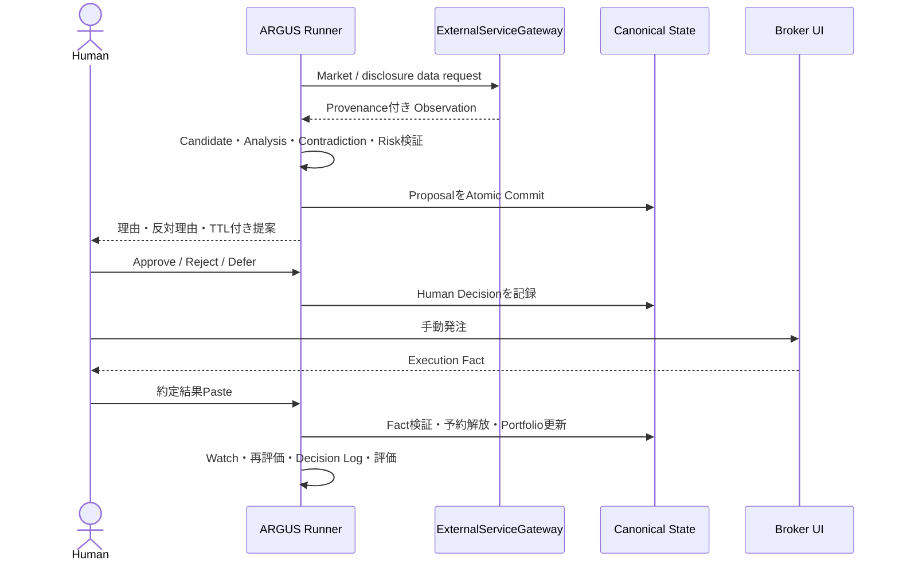
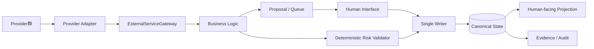
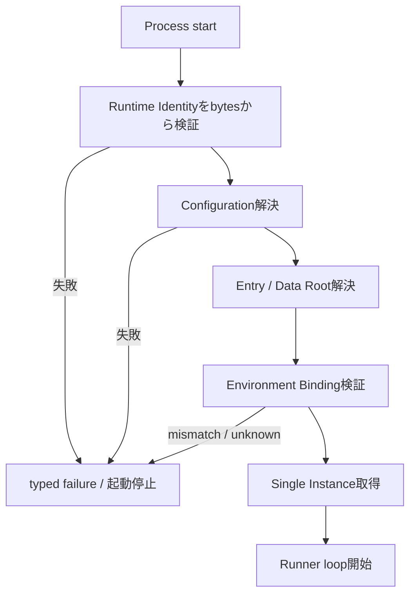
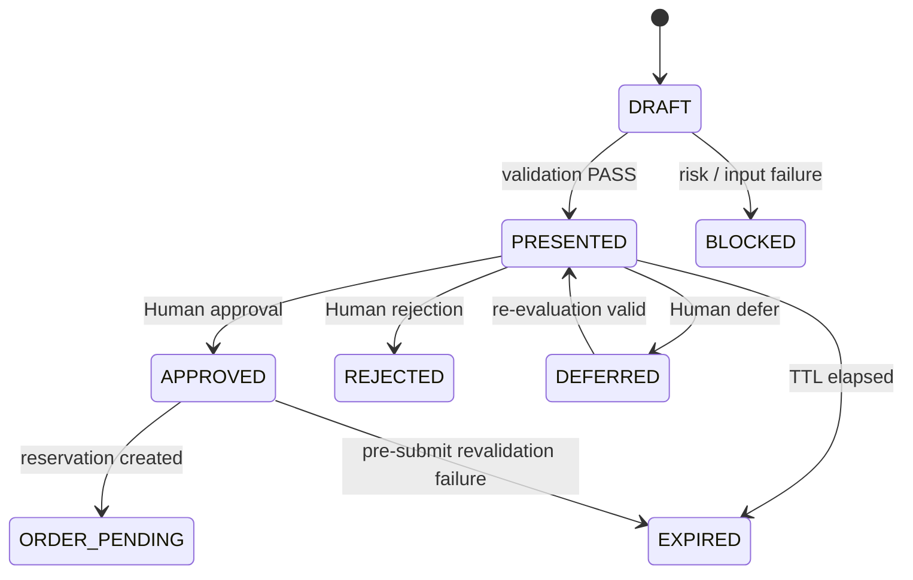
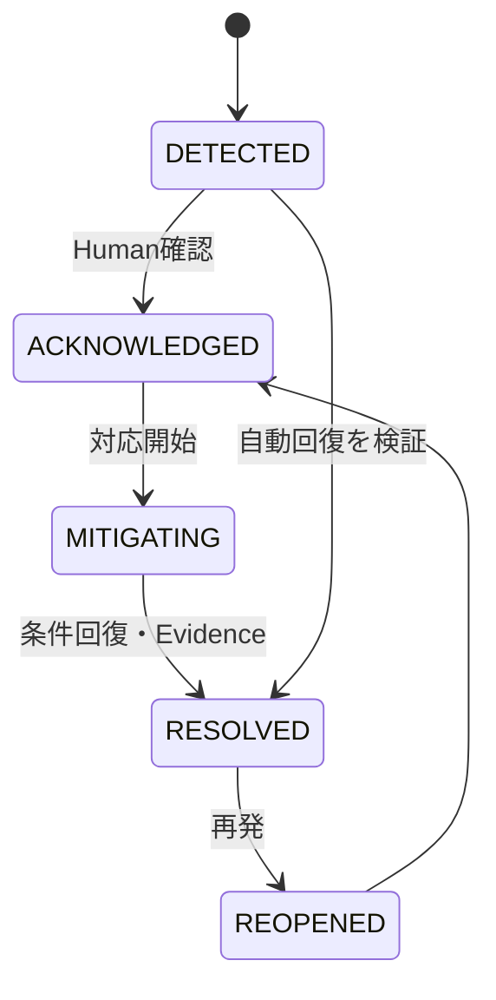

# ARGUS Human System Design v0.1.5

**Status:** HUMAN REVIEW DRAFT  
**Design Authority:** `docs/source/argus_design_source_v0.1.md`  
**Structured input:** `docs/model/argus_structured_design_data_v0.1.md`

## 1. 文書の目的と設計範囲

本書は、ARGUS の現在有効な設計を、人間が責務、処理、状態、制約、異常時挙動まで追跡できる形で示す Human-facing projection である。投資判断を人間から奪う自動売買システムではなく、調査・分析・提案・承認・事実記録・再評価を安全につなぐ投資支援システムとしての全体像と領域設計を扱う。

### 1.1 目的

ARGUS は、限られた Human Attention とローカル実行時間の中で、候補探索から投資判断、手動発注、約定事実の反映、保有後監視、評価までを再現可能かつ監査可能にする。AI は分析、反証、説明、記録を支援するが、資金を拘束する最終判断と Broker 操作は Human が行う。

主な設計目標は次のとおりである。

- Evidence と Data Provenance を伴う投資判断を作る。
- Bull / Bear / Contradiction を分離し、反証可能な Thesis と Invalidator を残す。
- TEST / PAPER / LIVE を分離し、段階 Gate を越えない機能を上位環境へ持ち込まない。
- Canonical State を Single Writer と Atomic Commit で保護する。
- 外部サービス、AI コスト、Human Attention、ストレージ障害を制御可能にする。
- 中断可能な Windows ローカル環境でも、再開と重複防止が成立する。

### 1.2 非目的と自動化境界

初期版は Broker API による自動発注を行わない。ARGUS が出力するのは Proposal であり、Approval や Order Execution ではない。Human が内容と有効期限を確認し、Broker 画面で操作し、得られた約定結果を Paste する。この境界を、利便性を理由に迂回してはならない。

高頻度取引、無人常時稼働、完全なリアルタイム保証、Source に規定されない Cloud 化は初期 Scope ではない。Local から Server への移行は将来の Break 判断であり、現在の設計を暗黙に分散システムへ変えない。

### 1.3 成功の考え方

個別機能のテスト成功だけでは運用可能性を意味しない。Capability Verification（CV）、Regression Verification（RV）、Historical Validation、Paper Trading、Human Load、Cost、Security、実機 Reliability の段階的 Evidence が必要である。LIVE readiness はそれらの Gate を満たした後の Human 判断であり、自動遷移ではない。

## 2. 文書体系と Authority

本章は、どの Artifact が設計内容を決め、どの文書が構造化 View、実行契約、検証仕様として働くかを明らかにする。この区別は、派生文書や実装が一次資料を暗黙に上書きすることを防ぐ。

### 2.1 Canonical Source と projection

| Artifact | 役割 | Authority |
|---|---|---|
| Design Source | 設計内容の唯一の一次資料 | 最上位 |
| Structured Design Data | Source の意味・関係・状態・制約の構造化 View | Source に従属 |
| Human System Design | Human Review 用の読みやすい設計投影 | Source / SDD に従属 |
| ADR | 選択肢、決定、結果、再検討条件 | 対象判断を記録 |
| Contract | Capability の exact public boundary / oracle | Source と整合する範囲 |
| Test Strategy | Evidence、Test level、Gate、変更管理 | 検証の正本 |
| Operating Rules | Human と各 AI Actor の権限、handoff | 開発運用の正本 |

Source、派生文書、実装が矛盾する場合は Source を優先し、矛盾を報告して Fail Closed とする。HSD は、Source の代替正本でも、実装済み状態の証明でもない。

### 2.2 設計状態と実装状態

`Current` は現在有効な設計、`Deferred` は明示的に後段へ送られた事項、`Future` は将来構想を表す。設計済み、Test 設計済み、実装済み、検証済み、運用承認済みは別の状態である。文書上の仕様が存在するだけで Production が完成したとは扱わない。

### 2.3 変更 Authority

Design Authority は ChatGPT による設計議論と Human final approval で成立する。Codex は承認済み Prompt の範囲で実装・検証し、Claude Code は原則 read-only の独立 Review を行う。Conversation memory や Prompt Registry は設計本文の正本ではなく、必要な決定と Evidence は repo Artifact へ外出しする。

## 3. システム全体像

本章は、ARGUS の投資閉ループを、入力データから Human 判断、手動執行、事実反映、監視、評価までの時系列として示す。各段階の詳細は後続章で扱うが、ここでは Proposal と Approval、Execution Fact を混同しない全体境界を明らかにする。

### 3.1 投資閉ループ

次のシーケンス図は、主要 Actor 間の時系列 Interaction を示す。External Provider からの Observation は分析材料であり、ARGUS の Judgment、Human の Command、Broker の Fact へ順に境界を越える。

この流れで ARGUS は Broker を直接操作しない。Approval は発注事実ではなく、Execution Paste は過去 Proposal の正しさを遡及的に変更しない。各 Artifact は生成時点の Data、Config、Version、Reason を保持する。

### 3.2 Component と境界

構成上、Business Logic は Provider 固有 API やファイル配置を直接扱わない。Gateway / Adapter、Canonical State Writer、Projection、Human Interface を分け、外部障害や表示要件が投資規則へ侵入しないようにする。

Gateway は timeout、retry、rate limit、provenance、cost boundary を共通化し、Adapter は Provider schema を内部型へ変換する。Writer だけが Canonical State を commit し、Projection や Review は正本を書き換えない。

### 3.3 横断安全原則

Risk、Environment Binding、Approval、Cost Control は Fail Closed とする。不明、期限切れ、identity mismatch、予算不足、入力不整合を成功側へ倒さない。Raw data は immutable とし、TEST / PAPER / LIVE の State と Data を混在させない。

## 4. Actor、Authority、責任境界

本章は Human、Runner、Business Logic、Provider 境界、AI 開発 Actor の責務を分ける。誰が Observation、Judgment、Command、Fact を作れるかを明確にし、単一 Actor が設計・実装・承認・Review を自己完結することを防ぐ。

### 4.1 運用 Actor

| Actor | 主責務 | 禁止・境界 |
|---|---|---|
| Human | 最終投資判断、Broker 操作、Execution Paste、例外承認 | 不明な Proposal を自動承認しない |
| Runner | Loop、Job orchestration、再開、Queue、通知 | 複数 instance、承認なしの発注 |
| Business Logic | 探索、分析、Allocation、再評価 | Provider API / UI / storage を直接呼ばない |
| Risk Validator | 決定論的な Hard Risk 判定 | AI の裁量で override しない |
| Single Writer | State validation、Atomic Commit | 複数 Writer、部分 commit |
| Gateway / Adapter | 外部 I/O、変換、provenance、障害隔離 | Provider 固有型を domain へ漏らさない |
| Projection | Human-facing 表示 | Canonical State を更新しない |

### 4.2 Fact、Observation、Judgment、Command

Provider 応答は Observation、分析と Recommendation は Judgment、Human の Approval / Rejection は Command、Broker の約定情報は Execution Fact である。Fact と提案評価は別に保存する。後から得た約定価格を使って、過去の Recommendation や Confidence を書き換えない。

### 4.3 開発 Actor

Human は final approval authority を保持する。Codex は Target、APPROVED、Human approval、Canonical hash を実行前に検証する。Claude Code の Critical Path Review は Review Input Manifest で固定された入力に対する独立 read-only Review とし、Finding を自ら修正・Disposition しない。

## 5. Runtime と起動

本章は、Windows 11 ローカル PC 上で中断を前提に実行を継続する仕組みを扱う。常時稼働を仮定せず、Single Instance、transactional job、clock、Runtime Identity、Environment Binding を起動順序の中で結び付ける。

### 5.1 Local-first と persistent loop

Runner は短命な cron job の集合ではなく、Single Instance の persistent loop として定期・event-driven job を選ぶ。PC 停止や sleep は通常事象であり、再起動時に未完了 job を検出して retry できなければならない。重複実行を避け、retry は idempotency key、attempt、next retry time、last error を持つ transactional unit とする。

### 5.2 Transaction boundary

Job は入力 snapshot と version を固定し、計算途中を Canonical State として公開しない。成功時だけ Writer が State と関連 metadata を Atomic Commit する。失敗時は既存 Canonical State を保持し、再試行可能な状態と Evidence を残す。外部 API 呼出しを commit transaction の内部へ無制限に抱え込まない。

### 5.3 Clock と catch-up

評価には wall clock、market/session clock、monotonic duration を目的別に使用する。停止中に期限を越えた job は、再開時に catch-up 方針で処理し、同じ予定を無制限に重複実行しない。Proposal TTL、BUSY lease、通知窓、market session は、それぞれの clock rule に従う。

### 5.4 Runtime Foundation の順序

起動依存関係は、Runtime Identity Document、Runtime Config Mechanism、Runtime Entry Resolution、Runtime Bootstrap Orchestrator の順に分解する。

Runtime Identity は Configuration、Status、State と混同しない。Identity parser は UTF-8 JSON bytes から exact schema と deterministic error ordering で `RuntimeIdentity` または typed failure を返す。Bootstrap の未確定接続は、実装側で推測しない。

## 6. Configuration、State、Data、Artifact

本章は、実行条件、正本状態、入力データ、証跡を別の lifecycle と authority に分ける。単なるファイル分類ではなく、何を再生成でき、何を immutable にし、何を Single Writer が更新するかを定める。

### 6.1 情報種別

- **Configuration:** 実行前提と policy parameter。解決済み snapshot と source provenance を job に結び付ける。
- **Runtime Identity:** 実行主体の identity document。Config の一項目として曖昧に扱わない。
- **User Status:** FREE / NORMAL / BUSY など Human capacity の運用状態。
- **Canonical State:** 現在の Portfolio、Proposal、Order、Queue、Watch、Job 等の正本。
- **Raw Data:** Provider から取得した immutable input。修正は置換でなく新 Artifact と provenance を残す。
- **Projection:** Canonical State から作る人間向け View。再生成可能で正本ではない。
- **Evidence / Archive:** 実行、検証、Decision、過去 envelope を追跡する append-only Artifact。

### 6.2 Single Writer と Atomic Commit

すべての Canonical State 更新は Writer を通す。Writer は expected version、schema、不変条件、environment class、Data Root binding を commit 直前に検証する。Current Envelope の置換は Atomic に行い、過去版を append-only archive へ残す。Compaction は監査可能性と必要な復元点を失わない別 operation とする。

### 6.3 Data Root と Environment Binding

大容量 Data Root は `L:\emori\InvestmentAgentData` を使用するが、drive letter だけを identity とみなさない。marker の schema、UUID、作成時刻、期待 identity を検証する。Locator と Identity を分離し、path containment は Windows lexical rule に従う。marker 不在、破損、mismatch、read inconsistency は typed failure として Fail Closed にする。

TEST / PAPER / LIVE は Root、State、Data、Evidence を混在させない。TEST guard は write boundary で fresh verification を行い、検証済みだったという過去の事実だけで後続 write を許可しない。

### 6.4 Backup、restore、storage pressure

Backup は Canonical State、Configuration、必要 metadata の整合した snapshot として作成し、freshness と restore verification を持つ。Restore は別 Root で検証し、既存正本を即時上書きしない。容量逼迫時は、再生成可能 cache、derived data、古い補助 Artifact の順に縮退し、Raw immutable data や必要な audit record を黙って削除しない。安全な書込みが保証できなければ新規 commit を停止する。

## 7. 候補探索、分析、反証

本章は投資判断の入口である母集団、一次フィルタ、複数探索枝、企業分析、Contradiction Engine を扱う。単一スコアへ早期に圧縮せず、異なる仮説と反対証拠を保持したまま Proposal へ接続する。

### 7.1 母集団と探索枝

母集団は利用可能な市場・銘柄 metadata と Data Source Policy に従って構成し、欠測や stale data を明示する。一次フィルタは Hard eligibility と探索効率のための soft ranking を分ける。複数探索枝は、価値、品質、成長、配当、event 等の異なる観点を独立に走らせ、同じ銘柄が複数枝から得られた事実も provenance として残す。

### 7.2 分析と Thesis

分析は入力 snapshot、取得時刻、Provider、企業・市場情報を結び付ける。Bull、Bear、Contradictions、Investment Thesis、Invalidators、保持 horizon、Confidence を分離する。AI 出力は Judgment であり Fact ではない。重要数値は出典と as-of を持ち、欠測時は推測値で埋めない。

### 7.3 Contradiction Engine

Contradiction Engine は Recommendation を正当化するためでなく、前提間、Fact と narrative 間、複数 Provider 間、Bull と Bear 間の不整合を顕在化する。解消済み、未解消、data不足を区別し、重大な未解消矛盾は Confidence 低下、再調査、Proposal block へつなぐ。

### 7.4 投資レポート

Human-facing Report は一行提案、判断理由と重み、反対理由、根拠、Thesis、Invalidators、Allocation 案、期限、選択肢を含む。Declared Reason Weight は決定時点の寄与説明であり、将来の正解率を保証する値ではない。後日の評価で重みを書き換えず、Counterfactual と calibration 用記録を別に残す。

## 8. Allocation、Hard Risk、Proposal

本章は分析結果を資金配分案へ変換し、決定論的制約を通して Human に提示するまでを扱う。Recommendation の強さと、資金・集中・流動性などの Hard Risk 可否を分離する。

### 8.1 Allocation

Allocation は available cash、発注待ち予約、既存 exposure、Portfolio Policy、役割、holding horizon、取引単位を入力とする。出力は提案数量・金額・Portfolio への影響であり、資金を直接拘束するのは State 上の reservation と Human-approved order lifecycle である。複数 Proposal が同じ資金を二重利用しないよう current availability を計算する。

### 8.2 Deterministic Risk Validator

Hard Risk Validator は、上限、集中、cash、禁止条件、environment、staleness、必要入力を決定論的に判定する。AI の Confidence や Human convenience で bypass しない。不明な条件は PASS ではなく block へ倒す。SELL は risk reduction の性質を考慮した例外を持ち得るが、Source が定める範囲を越えて新しい例外を作らない。

### 8.3 Proposal lifecycle

Proposal は生成、提示、承認、拒否、延期、失効、再評価などの状態を持つ。Approval は proposal identifier、version、terms、TTL に束縛し、内容変更後に旧 Approval を流用しない。

After-close Approval を次 session に執行する場合、market、価格、予算、Risk、TTL を submit 前に再検証する。Budget 不足や条件変化を自動的な数量変更で隠さず、新しい Proposal または Human 判断へ戻す。

## 9. Human 判断、手動執行、Execution Fact

本章は Human Approval から Broker 操作、約定結果 Paste、Portfolio 反映までを扱う。Human-in-the-loop を画面上の確認だけにせず、承認対象の固定と事実受領の分離として設計する。

### 9.1 Human の選択肢

Human は Approve、Reject、Defer、修正要求を選べる。表示は一行提案だけでなく、理由、反対理由、期限、価格・数量、Risk 結果、必要な注意を示す。判断不能または多忙なら Defer が正常系であり、無応答を Approval と扱わない。

### 9.2 Order と予約

承認された Order candidate は資金・数量 reservation を作り、未解決発注を初期段階では一件ずつ直列に扱う。Order 状態と Portfolio holding を混同しない。cancel、reject、expire、partial fill、fill の事実に応じて reservation を解放または実績へ変換する。

### 9.3 Execution Paste

Paste 入力は schema と対象 order を検証し、重複 Paste を idempotent に扱う。約定数量、価格、手数料、時刻等を Execution Fact として保存し、Proposal / Approval へのリンクを張る。不一致、不明 order、過剰約定、parse failure は State を部分更新せず Incident または Human correction へ送る。

## 10. Portfolio、保持、売却

本章は約定後の position を、Portfolio Policy、役割、保持期間、追加投資、売却条件で管理する。単なる残高表ではなく、Thesis と Risk、Policy から継続判断できる状態モデルとして扱う。

### 10.1 Portfolio Policy と役割

Portfolio Policy は target、constraint、構築・回復 mode を持ち、説明上の目標と強制 Hard Constraint を区別する。Position は成長、安定、高配当 Core 等の役割を持ち得る。高配当 Core も無条件永久保有ではなく、Thesis、財務、配当持続性、集中制約に従う。

### 10.2 保持期間

SHORT、MEDIUM、LONG / CORE は評価頻度、期待 catalyst、許容する変動、出口条件を整理する分類であり、時間経過だけで売買を決めるものではない。Position は取得時 Thesis と horizon を持ち、変更は新しい Decision として記録する。

### 10.3 売却と損切り

売却判定は Thesis Stop、Risk Stop、Price Stop、Time / Opportunity Cost Stop を区別する。Thesis の崩壊、Hard Risk 違反、price rule、資本効率の悪化は異なる Evidence と Authority を持つ。売却 Proposal にも理由と反対理由を示し、緊急 Risk であっても Broker 操作は Human が行う。

### 10.4 追加投資

追加投資は初回購入の惰性的延長ではない。最新 Thesis、価格、Portfolio exposure、Policy、Risk、既存 position の performance と invalidator を再評価し、新しい Proposal として承認を得る。

## 11. Watch と Event 処理

本章は保有銘柄、候補、市場を継続監視し、変化を再評価へ接続する。監視は常時リアルタイム保証ではなく、Local runtime と Provider 制約の中で event と定期 job を扱う。

### 11.1 Watch の種類

- **Position Watch:** Thesis、Invalidator、決算、price / risk、corporate action を監視する。
- **Candidate Watch:** Entry condition、情報更新、割安度、catalyst を追跡する。
- **Market Watch:** 市場 regime、指数、金利、volatility など横断条件を扱う。

Watch rule は trigger、source、as-of、severity、cooldown、次の action を持つ。Observation だけで注文を作らず、再分析または Incident / Alert を経由する。

### 11.2 定期処理

Daily、Weekly、Monthly、Quarterly の job は、頻度ごとの分析・整合性・評価を行う。停止中の予定は catch-up policy に従い、同一 period を重複 commit しない。重い job は Human の利用時間と Model API budget を考慮する。

### 11.3 Event-driven 処理

決算、開示、価格変動、Provider failure、storage pressure、deadline 等は event として取り込み、deduplication と provenance を保持する。Local 版は event 到着の完全なリアルタイム性を保証しないため、発生時刻、観測時刻、処理時刻を区別する。

## 12. Human Capacity、Queue、通知

本章は Human が常時応答できない前提を設計へ組み込み、FREE / NORMAL / BUSY、Decision Queue、Incident、Alert、通知配送を結び付ける。重要性と配送可能性を分離し、BUSY を安全規則の解除に使わない。

### 12.1 User Status と BUSY lease

User Status は Human の internal capacity を表し、投資 State とは別に管理する。BUSY は lease として期限を持ち、無期限固定を避ける。BUSY 時は通常通知や非緊急判断を抑制・queue できるが、risk の重大性そのものを下げない。lease の入力時刻、timezone、expiry 解決に失敗した場合は安全側へ倒す。

### 12.2 Decision Queue

Queue item は対象、必要判断、期限、priority、severity、再評価条件、最新 version を持つ。古い Proposal を最新として提示せず、条件変化時には replace / supersede を明示する。Human correction は元入力を隠して上書きせず、訂正理由と前後関係を記録する。

### 12.3 Incident と Alert

Incident は検知、acknowledged、mitigating、resolved 等の lifecycle を持ち、Alert は配送状態を別に持つ。Incident が存在することと通知が届いたことを同一視しない。

### 12.4 Notification Window と配送

Severity、Priority、delivery window、override を分離する。通知不可時間の通常 item は次の opportunity まで保留し、Emergency override は限定条件で使用する。delivery attempt、成功、失敗、retry、最終確認を記録し、送信 API の成功だけで Human が認識したとみなさない。

## 13. 外部サービスとコスト

本章は Market Data、Disclosure、Model Provider などを Business Logic から隔離し、障害、課金、切替、provenance を統制する。新しい Provider や有料 fallback は技術的に利用可能でも自動採用しない。

### 13.1 Gateway / Adapter

ExternalServiceGateway は認証、timeout、retry、rate limit、circuit breaker、request correlation、cost、provenance を扱う。Provider Adapter は外部 schema と内部 domain model の変換を担う。Business Logic は Gateway interface だけに依存し、Provider 名による分岐を散在させない。

### 13.2 Provider decision

Market Data、Disclosure、LLM、Persistence の選択は ADR に記録する。各 ADR は Context、alternatives、decision、consequence、revisit condition を持つ。J-Quants 等の利用は契約・plan・検証 Gate を満たすまで有効化しない。

### 13.3 Paid Service Governance

新しい有料サービス、plan 増額、有料 fallback は、目的、上限、owner、停止条件、Evidence、Human approval が必要である。障害時に無料経路から有料経路へ暗黙に切り替えない。Model API は request / period budget gate、見積り、実績、超過時 block を持ち、品質を理由に無制限再試行しない。

### 13.4 Secret と Privacy

Secret は repo、log、Decision Record、fixture に保存しない。環境変数や secret storage の解決失敗は typed failure とし、masking で存在を偽装しない。外部送信する入力は目的に必要な最小限とし、sensitive data と provider retention の境界を確認する。

## 14. 監査、評価、変更管理

本章は、判断を後から再現し、成績・Agent・System Health を分けて評価し、設計変更を Break と Version で統制する。結果が良かったこととプロセスが正しかったことを混同しない。

### 14.1 Decision Log と provenance

Decision Record は Environment、Timing、Trigger、Data Provenance、Evidence、Bull、Bear、Contradictions、Thesis、Invalidators、Recommendation、Allocation、Reason Weights、Confidence、Counterarguments、Human Decision、Execution を関連付ける。各参照は identifier、version、hash、as-of を持ち、後から静かに置換しない。

### 14.2 Counterfactual と評価

採用しなかった選択肢と、その時点での理由を Counterfactual として残す。評価は投資成績、Agent / Branch の有用性、System Health を分離する。収益だけで unsafe bypass を正当化せず、損失だけで当時合理的だった手続きを失敗と断定しない。

### 14.3 Break と Version

Break は B1 Parameter、B2 Component、B3 Architecture、B4 Objective の階層で扱う。上位 Break ほど広い再検証と Human approval が必要である。Objective Break はシステムの目的を暗黙に変えない保護を持つ。System Version は code、config、model、data、contract、test baseline と関連付ける。

## 15. Failure、縮退、復旧

本章は、外部障害、State 不整合、identity mismatch、容量不足、Human 不在などを正常系の外へ追いやらず、何を継続し、何を停止するかを定める。Safe Degradation は結果を作り続けることではなく、誤った結果を確定しないことである。

### 15.1 Failure classification

失敗は validation、binding、provider、timeout、budget、storage、commit、notification、human timeout 等に分類し、typed code と Evidence を残す。一時障害だけを backoff retry し、schema mismatch、authorization、identity mismatch、Hard Risk failure を無限 retry しない。

### 15.2 縮退順序

非必須 enrichment、低 priority 分析、再生成可能 cache、通知の非緊急 channel の順に機能を縮退する。Risk validation、Approval binding、Canonical commit integrity、Environment Binding、audit minimum を外さない。必要 input がない場合は stale / unavailable を明示し、最新値のように表示しない。

### 15.3 復旧

復旧は原因除去、identity / config / state 再検証、未完了 transaction の判定、必要な replay、結果照合を経て完了する。process が再起動しただけでは resolved としない。backup restore や manual correction は新しい provenance を作る。

## 16. 検証 Architecture

本章は、Requirement、Test、Implementation を分離し、Capability 単位で RED から GREEN、独立 Review、Regression へ進む検証体系を示す。テスト用迂回路で Production boundary を弱めず、Evidence を完了条件にする。

### 16.1 Test level と data

L0 は pure logic / schema、L1 は local component、L2 は integration、L3 は runtime / system、CV は Capability、RV は回帰を扱う。Small Fixture、Raw Provider Fixture、Historical Dataset、Generated Failure Fixture を目的別に使い、Historical time gate で look-ahead を防ぐ。

### 16.2 Baseline と Oracle

Test Baseline は承認済み expectation を hash と version で固定し、Production に合わせて無断更新しない。Oracle は Source / Contract から導き、実装出力そのものを正解生成器にしない。Expected Static RED を含む RED Evidence が Production 実装前に必要である。

### 16.3 Capability workflow

```mermaid
flowchart LR
    C[Contract / Exact Oracle] --> T[Frozen Test]
    T --> B[Baseline]
    B --> R[Expected RED]
    R --> I[小単位の実装]
    I --> G[GREEN verification]
    G --> S[Static analysis]
    S --> M[Review Input Manifest]
    M --> V[独立 Critical Path Review]
    V --> D[Finding disposition]
    D --> H[Human close approval]
```

Review Input Manifest は対象 Artifact と hash を固定する。Review 中の変更は入力境界を壊すため、必要なら新しい Review run を作る。Finding 0 または全 disposition、必須 Evidence、Human approval が Capability close の条件である。

### 16.4 Static analysis と repository health

pytest、ruff、pyright、bandit、pip-audit を原則実行する。Affected Gate と既存 Repository Health debt を区別するが、既知 debt を suppression や config exclusion で隠さない。新規変更が件数、severity、rule、scope を悪化させていないことを Evidence 化する。

### 16.5 段階 Gate

Gate A は Test Foundation、Gate B は MVS、Gate C は Historical、Gate D は Real Provider、Gate E は Paper、Gate F は Live readiness を扱う。上位 Gate は下位 Gate の代替ではない。Paper は実資金を動かさず、market timing、Human load、notification、operation を検証する。

## 17. Minimum Vertical Slice と実装順序

本章は大きな設計を一括実装せず、基盤から安全境界を積み上げる順序を示す。MVS は機能デモではなく、入力から Evidence までの最小閉ループを検証する単位である。

### 17.1 Runtime foundation first

最初に filesystem / Environment Binding、Runtime Identity、Configuration、Entry Resolution、Bootstrap、Single Writer、Evidence 基盤を確立する。これらがない状態で投資 domain の State 更新を先行させない。Contract に未確定接続がある場合は implementation guess で埋めず Design Authority へ戻す。

### 17.2 MVS の閉ループ

MVS は固定 fixture から Candidate / Analysis を作り、Risk を検証し、Proposal を Human に提示し、模擬 Approval と PAPER Execution Fact を Canonical State / Decision Log へ反映する。外部 Provider や LIVE money を必須にせず、同じ Production boundary を通す。

### 17.3 Deployment

Development tree と runtime deployment を分け、手動 deployment でも version、hash、config、migration、rollback point を記録する。runtime directory を開発途中の working tree とみなさず、`.pyc` や cache を Artifact として扱わない。

## 18. Historical、PAPER、LIVE

本章は、過去データでの再現性確認から PAPER 運用、LIVE readiness へ進む条件を示す。各環境の State と Data を分離し、好成績だけで次段階へ進まない。

### 18.1 Historical validation

Quant Backtest は決定論的規則と portfolio math を検証し、Model Historical Replay は当時利用可能な情報だけで analysis / judgment を再生する。dataset version、as-of、corporate action、survivorship、look-ahead を管理する。現在の知識を過去時点へ漏らさない。

### 18.2 PAPER

PAPER は real-time に近い observation と Human operation を使いながら実資金を動かさない。少なくとも一か月の運用を通じて、再起動、catch-up、通知、Decision Queue、manual execution simulation、Human load、cost、failure recovery を評価する。

### 18.3 LIVE readiness

LIVE は自動化レベルを上げる意味ではない。Broker API 自動発注禁止と Human approval を維持したまま、CV / RV、Security、backup / restore、provider operational gate、PAPER Evidence、未解決重大 Finding がないことを Human が確認する。環境切替は新しい binding と explicit action を必要とする。

## 19. CLI と Human Interface

本章は、日常運用で Human が起動、状態確認、判断、事実入力、復旧を安全に行う interface を扱う。UI の簡潔さによって対象 version、期限、Risk、失敗理由を隠さない。

### 19.1 Command model

CLI / Tray は Runner process と分離し、start、status、stop、proposal view、decision、execution paste、incident、diagnostic 等を明確な command と help で提供する。command は Config と Environment を解決し、対象 Runner / State を確認してから action を行う。曖昧な default で LIVE を選ばない。

### 19.2 Human-facing output

表示は action、対象、根拠、反対理由、deadline、状態、次の選択肢を含む。technical error だけでなく Human が取るべき安全な次 action を示す一方、unknown を成功に言い換えない。通知から元 Proposal、Evidence、Decision Record へ追跡できるようにする。

### 19.3 Process lifecycle

Tray は Runner の存在を表示・操作する補助であり、別 Runner を無断起動しない。graceful stop は新規 job 受付を止め、commit 中 transaction を安全に完了または rollback し、停止 Evidence を残す。強制終了後は recovery procedure を通す。

## 20. 未確定事項と Deferred / Future

本章は現在の設計で意図的に決め切っていない事項と、後段の判断を現在仕様へ混入させない境界を示す。未確定を推奨値で埋めることは完成ではなく、誤った Authority の行使になる。

### 20.1 未確定事項

Provider plan の最終 activation、運用 parameter の具体値、通知 channel の一部、Server 移行条件の定量閾値、Runtime Foundation 後続 Capability の exact interface などは、該当 ADR / Contract / Gate で決定する。HSD は存在する requirement と decision boundary を示すが、Source にない値を選ばない。

### 20.2 Deferred

高度な自動 orchestration、machine-readable registry の全面化、完全な realtime ingestion、広い provider fallback、server-native operation 等は後段候補である。Deferred は不要を意味せず、現在 Capability の close blocker でないことを意味する。

### 20.3 Future と Break

Cloud / Server、より高度な automation、新しい投資 objective は Future または Break として再設計・再検証する。現在の Local-first boundary と Human authority を保ったまま、将来拡張点を Adapter、Gateway、Artifact interface に隔離する。

## 21. Human Review 観点

本章はチェックリストで本文を代替するものではなく、通常の設計レビューで重点確認する関係をまとめる。Human は意図、責務、処理、状態、異常系が本書から読み取れ、Design Source と一致しているかを判断する。

### 21.1 設計意図

- 投資支援と Human final authority の境界が期待どおりか。
- Proposal、Approval、Order、Execution Fact が混同されていないか。
- Local-first と将来 Server 構想の境界が自然か。
- Current、Deferred、Future、実装状態を誤認しないか。

### 21.2 安全性と運用

- Risk、Environment Binding、Approval、Cost が Fail Closed か。
- Single Writer、Atomic Commit、Raw immutability、環境分離が十分か。
- BUSY、通知窓、Incident が Human の実際の応答能力に合うか。
- 外部障害、容量不足、再起動、restore の縮退・復旧が成立するか。

### 21.3 投資設計

- Candidate から Analysis、Contradiction、Allocation、Risk、Proposal への接続に抜けがないか。
- Portfolio role、holding horizon、sell rule、additional investment が意図どおりか。
- Watch、Decision Log、Counterfactual、evaluation が学習と監査に十分か。

### 21.4 検証と変更

- Contract、Frozen Test、Baseline、RED、GREEN、Review、Human close の順序が妥当か。
- Historical / PAPER / LIVE の Gate が過不足なく、環境混在を防ぐか。
- 未確定事項が設計済みのように書かれていないか。
- Break と Version が目的変更や暗黙の有料化を防ぐか。

## 22. 詳細仕様への参照

本章は、本書で示した全体・領域設計から exact oracle や検証手続へ進む入口を示す。参照先は本書の説明を省略する代替ではなく、実装・Test が必要とする精密な boundary を提供する。

### 22.1 Canonical / structured input

- `docs/source/argus_design_source_v0.1.md`
- `docs/model/argus_structured_design_data_v0.1.md`
- `docs/adr/argus_architecture_decision_records_v0.1.md`

### 22.2 Contracts

- `docs/contracts/argus_environment_binding_contract_v0.1.md`
- `docs/contracts/argus_runtime_foundation_bootstrap_contract_v0.1.md`
- `docs/contracts/argus_runtime_identity_document_contract_v0.1.md`
- `docs/contracts/argus_critical_path_review_contract_v0.1.md`

### 22.3 Verification / operation

- `docs/test/argus_test_strategy_v0.1.3.md`
- `docs/development/argus_ai_development_operating_rules_v0.1.md`

これらの文書間に矛盾が見つかった場合、実装または HSD 側で独自に補完せず、Design Source を基準に矛盾を明示して Design Authority へ返す。
