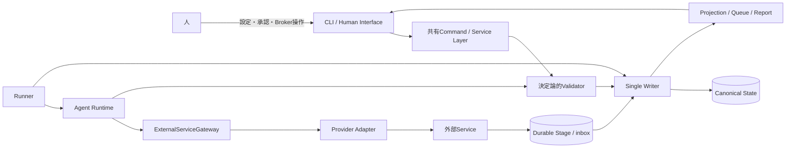
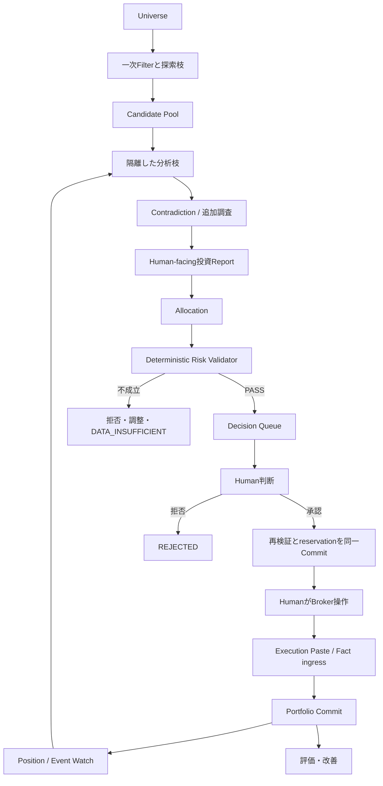
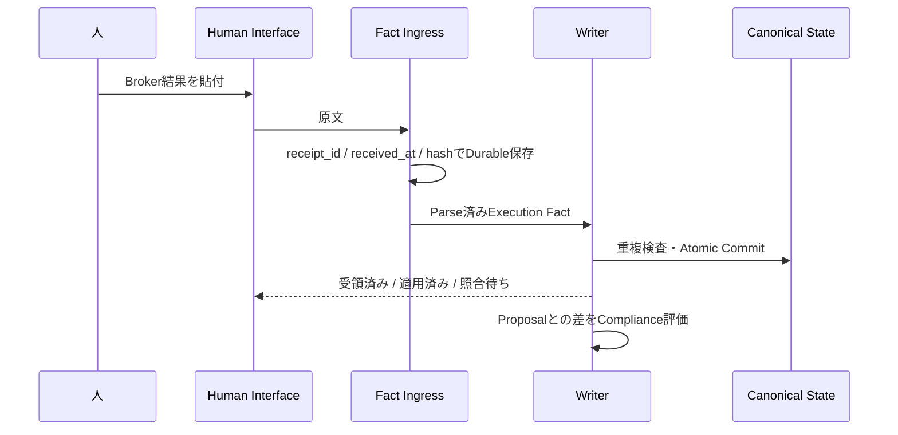
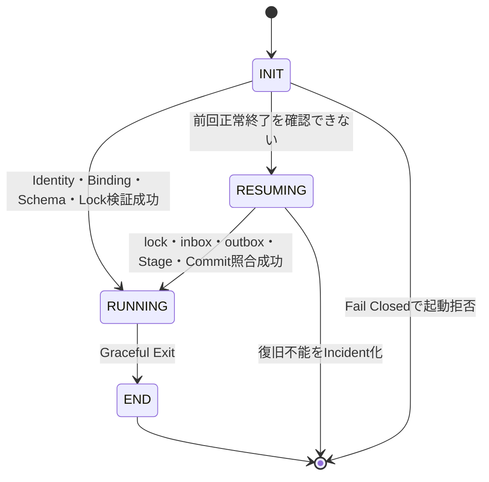
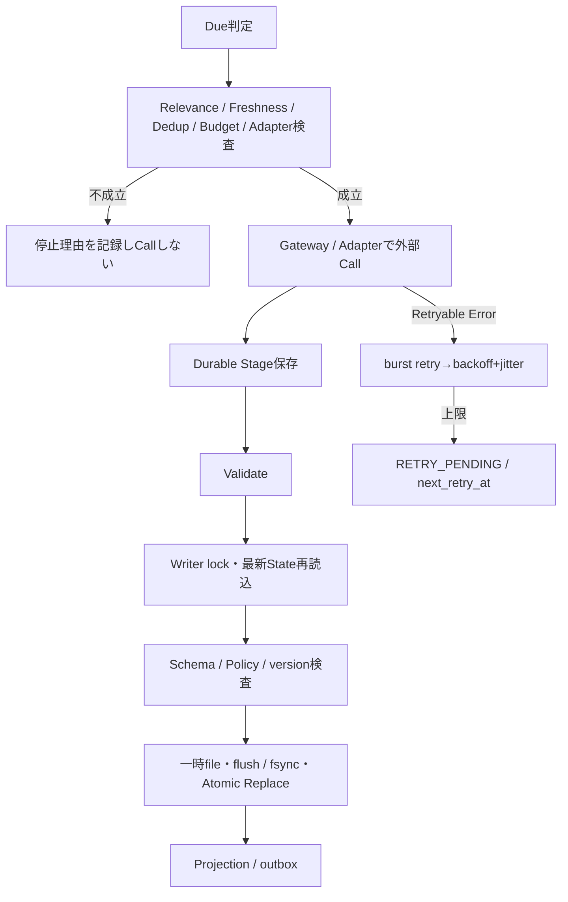
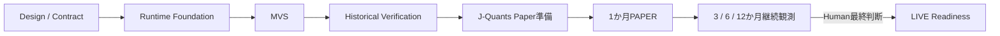

# ARGUS Human System Design v0.1.6

## 目次

- 0. 設計環境
- 1. システム全体構成
- 2. 投資機能
- 3. 実行基盤
- 4. 外部接続
- 5. Human Interfaceと運用
- 6. 安全設計
- 7. 検証・評価・改善
- 8. 機能一覧
- 9. 用語・詳細仕様への参照
- 10. 継続検討事項

## 0. 設計環境

ARGUSは、Windows 11のローカルPC上でPythonにより動作する、Human-in-the-loopの投資支援システムである。internet接続は利用するが、PCは停止、Sleep、Offlineになり得る。WSLや常時稼働Serverを前提にせず、中断と復帰を通常経路として扱う。

人は平日日中の09:00〜17:30に仕事をしており、多忙時には残業もある。このため即時応答を前提にせず、判断待ちQueue、期限、通知Window、BUSY Lease、復帰後Catch-upを設計へ組み込む。

大容量Data Rootの既定位置は `L:\emori\InvestmentAgentData` である。ただしdrive letterだけをIdentityとして信用しない。Data Root markerの `data_root_id`、environment、期待するRuntime Identityを照合し、不一致時は起動またはwriteを拒否する。Raw dataはimmutableとして扱い、TEST / PAPER / LIVEのStateとDataを混在させない。

Data Rootの照合には `data_root_marker.json` のstate_id、data_root_id、environmentを使用する。開発領域 `InvestmentAgent-Dev` とRuntime領域を分離し、手動DeployでもState / Data / Configを上書きしない。

本書は現在の設計を説明する。設計に存在することは、実装済み、検証済み、またはLIVE運用承認済みであることを意味しない。Current、Deferred、Futureと、実装・検証・運用承認の状態を分けて読む必要がある。

## 1. システム全体構成

### 1.1 システムの目的

ARGUSの目的は、AIへ投資判断を丸投げすることではない。候補探索、独立分析、反証、具体的なTrade案、監視、結果評価を一つの追跡可能な流れにし、人が最終判断とBroker操作を行えるようにすることである。

設計は次の課題へ対応する。

| 課題 | 設計上の対応 |
|---|---|
| 複数の分析観点を早期に平均化すると反証や欠損が消える | 探索枝・分析枝を隔離し、Contradictionを明示する |
| PC停止や外部障害で処理が中断する | Durable Stage、inbox、last_success、cursorから再開する |
| 複数Writerや途中停止で正本が壊れる | Single WriterとAtomic Commitを使用する |
| AIが投資判断・Risk・発注を自己完結すると権限境界が崩れる | Human Approval、Deterministic Risk Validator、Broker手動操作を分離する |
| 提案や通知が人の処理能力を超える | User Status、human_capacity、Decision Queue、通知Windowを使用する |
| 過去検証が未来情報や架空約定で過大になる | PIT Data、frozen execution rule、段階Gateを使用する |

銘柄選定から約定結果、Portfolio更新、Watch、再評価、設計改善までを閉ループとして扱う。結果だけでなく、使用したEvidence、Policy、Config、Prompt、Code、State versionを追跡し、後から判断条件を再現できるようにする。

### 1.2 全体構成

Human Interface、Runner、Agent Runtimeは、共通のService Layer、Validator、Writerを経由する。CLI、Tray、Runnerごとに別の検証経路やWriterを持たせない。

Business Logicは外部APIを直接呼ばない。ExternalServiceGatewayが費用、retry、audit、error正規化を担い、Provider Adapterが認証やProvider固有Schemaを扱う。Agent / LLMは分析やProposalを生成できるが、Canonical Stateを直接更新できず、Human ApprovalやHard Risk PASSを自己付与できない。

Runtime Identity、Configuration、User Status、Canonical State、Secret、Deployment Identity、Run Identityは別の情報である。近い名前や同じpath階層を理由に一つのDocumentへ混在させない。

### 1.3 HumanとARGUSの役割分担

| 主体 | 担うこと | 行ってはならないこと |
|---|---|---|
| 人 | 投資の最終判断、Broker操作、有料Service、Policy、Break、実資金開始の承認 | 未確認の自動化へ最終権限を委譲すること |
| ARGUS | 探索、分析、提案、検証、Queue、State更新、監視、評価 | Brokerで自動発注すること、人の承認を生成すること |
| Agent / LLM | 分析、反証、Update Request、Proposal、Review | Canonical State直接更新、Hard Risk PASS、Human Approval付与 |
| 固定Validator / Writer | 決定論的検査、遷移、排他、Atomic Commit | 投資魅力度を判断すること、未設定Policyを補完すること |
| Broker | 外部取引とExecution Factの発生源 | ARGUSの内部Stateや承認を決定すること |
| Provider | DataまたはModel処理の提供 | ARGUSのCanonical Stateを更新すること |

Humanの応答が遅いことは異常ではない。Proposal、Alert、Incident、reservationはDurableに保持し、応答なしを承認・拒否・解決として扱わない。

### 1.4 全体処理

Approval時には最新State、Policy、Cash、Position、既存reservationを再検査し、承認とexecution slot / reservationを同一Commitで成立させる。条件が変わった場合は旧承認を流用しない。

外部API成功とLocal Commitは同じTransactionではない。外部結果をrequest_id、input/output hash、provider/model、usage、provenance付きのDurable Stageへ保存してからCommitする。Commitだけ失敗した場合は同じStageから再開し、外部Callと課金を繰り返さない。

## 2. 投資機能

### 2.1 候補探索

候補探索はUniverse全体を一つの総合点で順位付けする処理ではない。機械的Filterと複数の探索枝からCandidate Poolを作り、枝ごとの候補化理由、欠損、除外理由を保持する。

一次Filterは流動性、取引可能性、必要Data等の機械条件を扱う。Value、Change、配当、Event等の探索観点は互いの結論を入力にせず、同じ銘柄が複数枝に現れた場合も由来を失わせない。Data欠損を自動的に0点へ変換せず、未評価理由として残す。

StorageやProviderが縮退している場合、保有Positionの重大Risk監視に必要な最小DataをCandidate探索より優先する。Freshnessを満たさないCandidateからBUY / ADDを作らない。

### 2.2 分析・反証・判断材料

Fundamental、Valuation、Bull、Bear、Macro、Risk、Technical、Portfolio Fit等の分析枝は、凍結したEvidenceを入力に論理的に隔離する。他枝の結論や統合Recommendationを一次入力へ混入させない。

Contradiction Engineは枝の結果を平均化せず、矛盾、反証、未解決Relationを取り出す。重大な情報不足は追加調査へ送り、調査予算と停止条件を適用する。不足が解消しなければBUY / ADDを止め、確信度を水増ししない。

Human-facing投資Reportは少なくとも次を含む。

| 領域 | Humanが確認する内容 |
|---|---|
| 対象 | Company / Ticker、Current State、Strategy Class、Holding Horizon |
| 分析 | 枝別の主要根拠、Evidence、欠損、反証 |
| 矛盾 | Contradiction、未解決点、追加調査結果 |
| Thesis | 成立条件、Invalidator、revision |
| 提案 | BUY / ADD / HOLD / REDUCE / SELL、具体数量・価格条件 |
| Risk | Allocation、Hard Risk結果、Portfolioへの影響 |
| Human選択 | 承認、拒否、保留、追加確認 |
| 追跡 | data cutoff、source、version、hash、期限 |

Declared Reason Weightは合計100%として表示する。35%業績変曲点、25% Valuation、20%競合優位、12% Portfolio diversification、8% Technical / timingというSource例は、説明例であって実運用の固定比率ではない。

### 2.3 資金配分とリスク検証

「買うか」「どれだけ取引するか」「機械的制約を満たすか」を別処理にする。

| 処理 | 入力 | 出力 | Authority |
|---|---|---|---|
| Analysis | Evidence、枝別分析、矛盾 | 投資判断と根拠 | Agent / LLM |
| Allocation | Analysis、Portfolio、Cash、Policy | 具体的Trade案 | ARGUS |
| Hard Risk Validation | Trade、Cash、Position、Policy、reservation | PASSまたは拒否理由 | 固定Validator |

ValidatorはCash、数量、Position / Sector上限、Bucket min / max、Liquidity、Freshness、Policy状態を決定論的に検査する。PolicyがUNCONFIGURED、Dataが不足、Validation Integrityが未確認なら、BUY / ADDをPASSにしない。

Validatorはimmutable proposed_trade、最新State、Policy、Evidence、評価時刻を入力に、`PASS / REJECT / ADJUST_REQUIRED / DATA_INSUFFICIENT` とconstraint別計算を返す。Policy有効化時には範囲、`min ≤ target ≤ max`、min合計≤1≤max合計、通貨、評価分母、手数料、買付単位、実行可能性を検査する。

SELL / REDUCEにはRisk縮小を妨げない例外がある。Position / Sector上限を25%から20%へ段階的に縮小するTradeや、指定されたRisk縮小SELLでBucket minを一時的に割るTradeは、違反を記録した上で許容候補になり得る。一方、LLMラベルだけで制約を免除しない。既知数量の縮小と価格評価不能を分け、必要執行情報が不足する場合はDATA_INSUFFICIENTとする。

### 2.4 Humanの判断

ProposalはDRAFT、VALIDATED、QUEUED、APPROVED、REJECTED、EXPIRED、SUPERSEDEDを区別する。TTLや `valid_if` が失効したProposalを、表示済みまたは過去承認済みという理由で発注へ流用しない。

Decision Queueは配送前と復帰後にProposalを再評価し、EXPIRED、REANALYZE、RERANK、MERGE、KEEP SILENT等の結果を記録する。各AgentがHumanへ直接通知するのではなく、Queue / Routerが重複、priority、Status、Windowを適用する。

HumanがAPPROVEを選んだ場合も、最新State、Policy、Cash、Position、Market条件を再検証する。成立したApprovalCommandとexecution slot / reservationを同じCommitへ入れる。version競合やTrade条件変更があれば再承認を求める。

### 2.5 売買と売買結果

ARGUSはBroker APIによる自動発注を行わない。人がBrokerで発注し、結果を `execution paste` からARGUSへ渡す。

Orderは少なくともAWAITING_SUBMISSION、SUBMITTED、PARTIALLY_FILLED、FILLED、CANCEL_PENDING、CANCELLED、REJECTED、UNKNOWNを区別する。最初の運用では全管理口座を通じて未解決発注を一件に直列化する。別Tradeの分析、重大Risk監視、売買を要求しないHOLD / WATCH、Incident確認は継続できる。

CANCEL_PENDING、UNKNOWN、停止、Proposal TTL切れだけではreservationを解放しない。Broker状態を確認してから解放する。BUYは費用、SELLは数量のreservationを持ち、部分約定では残量へ更新する。

重複キーはbroker＋account_id＋broker_execution_idである。部分約定は固有ID単位で扱う。IDがない入力は仮受領し、値が同じという理由だけで別約定を重複扱いしない。TTL失効やPolicy逸脱があっても、確認済みのBroker Factを拒否せず、Portfolioへ反映した上でCompliance Recordを残す。

方向、数量、対象が矛盾して安全に適用できないFactは `RECONCILIATION_REQUIRED` とし、推測適用しない。

### 2.6 ポートフォリオ管理

Role BucketとHolding Horizonは独立した分類軸である。

| 軸 | 値 | 意味 |
|---|---|---|
| Role Bucket | INCOME / GROWTH / EVENT / DEFENSIVE / OTHER / CASH | Portfolio内の役割 |
| Holding Horizon | SHORT / MEDIUM / LONG / CORE | 想定時間軸 |

同じlotを二つのBucketへ二重計上しない。Horizonは自動SELL期限ではない。

Portfolio PolicyはUNCONFIGUREDとACTIVEを区別する。必須Bucket、target、min / max、評価規則を人が設定しvalidationが成功したときだけACTIVEになる。欠落や不正変更では本番BUY / ADDを停止するが、実約定Factの取込は止めない。

NORMAL以外のModeは明示的な一時状態である。

| Mode | 用途 | 必須条件 | 禁止 |
|---|---|---|---|
| BOOTSTRAP | 初期Cashから段階構築 | constraint_id、開始値、許容幅、期限、進捗、終了条件 | LLMがその場でMode変更すること |
| REPAIR | 価格やFactで生じた違反回復 | 新規違反なし、既存違反非悪化、対象違反を厳密に減少 | 無進捗Tradeを回復と呼ぶこと |

売却・再分析はThesis Stop、Risk Stop、Price Stop、Time / Opportunity Stopを分ける。価格変化の例である-8% / day、-15% / 5 daysは強制再分析Triggerであり、価格だけの即時SELLではない。

将来目安としてCore / Income 30%、Long Growth 20%、Medium 25%、Short / Event 10%、Cash 15%があるが、本番Policy値ではない。配当Cashは税引前、源泉税、実受領を分けてFactとしてCashへ戻す。DRIPは自動適用せず、通常のAllocationとApprovalを通す。

### 2.7 監視と再評価

Position Watch、Candidate Watch、Market Watchは同じ優先度や周期ではない。保有Positionの重大Riskを最優先とし、Storage Critical時にもPosition Watch Minimum Dataを保護する。

Event取得後は、Original Thesisとの差分をunchanged、strengthened、weakened、invalidated等として評価する。Data不足を明示し、必要な場合だけFull Analysis、Allocation、Validator、Decision Queueへ進む。Event-drivenは即時Pushの保証ではなく、取得、正規化、分析、Queue、通知Window、Human応答、市場機会というLatency区間を持つ。

PC停止中の監視は保証しない。復帰後にlast_successとcursorから未取得範囲を確認し、freshness、relevance、TTL、dedupをModel callより前に評価する。古いProposalを一斉通知せず、再分析、順位変更、統合、失効、破棄を選ぶ。

## 3. 実行基盤

### 3.1 起動

Runtime Foundationは次の責務順で起動する。

| 順序 | Subsystem | 責務 |
|---|---|---|
| 1 | RUNTIME-IDENTITY-DOCUMENT | 不変なstate_id、environment、data_root_id等を読む |
| 2 | RUNTIME-CONFIG-MECHANISM | Configurationを読込・検証しsnapshot化する |
| 3 | RUNTIME-ENTRY-RESOLUTION | path、marker、environment bindingを解決する |
| 4 | RUNTIME-BOOTSTRAP-ORCHESTRATOR | 結果を統合しRunner開始可否を決める |

Secret値の解決は使用時Subsystemの責務であり、Identity DocumentやConfig Snapshotへ埋め込まない。Subsystemごとのtyped failureを保持し、上位でstartup outcome / Incidentへ写像する。全Subsystem共通の巨大failure enumは作らない。

OS killやCrash自体をRunner Stateにしない。次回INITで異常終了を検出しRESUMINGへ入る。Runnerが非RUNNINGでもHelp、Status、System Statusは共有Serviceから可能な範囲で提供するが、Execution Pasteは実行可能状態でないErrorとして拒否する。

### 3.2 継続実行

Schedule、Due、Market calendarにはtimezone付きWall Clockと `Asia/Tokyo` を使用する。wait、timeout、retry intervalにはmonotonic clockを使用する。OS時刻やtimezoneの大幅変更は `CLOCK_DISCONTINUITY` として記録し、Due Jobを再評価する。

MAX_RETRY到達でJobを永久破棄しない。次Cycleへ持ち越す。Schema、Policy、認証、quota等は無限Retryせず、BLOCKED、CONFIG_REQUIRED、DATA_INVALID、POLICY_NOT_READY、BUDGET_OR_QUOTA_BLOCKED等へ分類する。

DailyはDue Check、Position Watch、Queue、Backup等、WeeklyはCandidate WatchとPortfolio Review、MonthlyはStock Selection、Performance / System Health Report、QuarterlyはPolicy Review等を扱う。各Runはscheduled_for、started_at、last_success、cursor、結果、欠損を保持し、停止期間を隠さない。

### 3.3 中断・再開

Graceful Exitでは新規Job受付を停止し、実行中処理を安全点またはDurable Stageへ退避する。flush後にRunner lockを解放してENDへ進む。Crash時はENDへ遷移したことにしない。

再開時はlock、inbox、outbox、Stage、Commit、applied_event_idsを照合する。API成功後にLocal Commitだけ失敗した場合は同じinput_hashのStageから再開する。Commit前停止はinboxから再適用し、Commit後・Log前停止はCanonical Stateとoutboxから派生物を再生成する。

Catch-upは取り逃した周期を機械的に全実行しない。freshness、relevance、TTL、重複、Budgetを再評価し、RUN、REANALYZE、EXPIRE、MERGE、DROPを決める。

### 3.4 状態とデータ

| 情報 | 正本・生成元 | 主な用途 | 混在させないもの |
|---|---|---|---|
| Runtime Identity | Identity Document | logical instanceと環境Binding | path、可変Config、Secret |
| Configuration | `config.json` | Policy、Budget、通知、Job | Status、Fact、Secret値 |
| User Status | `user_status.json` | FREE / NORMAL / BUSYとLease | Portfolio、Budget |
| Canonical State | Current Envelope | Fact、Observation、Judgment、Workflow | Log、Projection |
| Runtime State | Runtime領域 | Run、Job、retry、lock | User Status、Identity |
| Secret | OS / Secret mechanism | 使用時認証 | Log、Evidence、Backup |
| Durable Stage | Gateway / Adapter結果 | Commit前の再利用 | 独立した正本 |
| Projection | Canonical Stateから生成 | 表示、検索、Report | 直接更新Authority |

主要なRuntime Artifactは次の役割を持つ。

| Artifact | 役割・不変条件 |
|---|---|
| `SYSTEM.md` | 起動手順、正本、版、入口、復旧を人とRunnerへ示す |
| `state/portfolio.json` | Canonical State。一つのAtomic Commit単位で、Single Writerだけが更新する |
| `watchlist.json` / `decision_queue.json` / `runtime_state.json` | Canonical Stateから再生成するProjection。独立更新しない |
| `performance.json` | 計算条件と参照Commitを持つ派生評価結果 |
| `inbox/` | 適用完了まで受領原文を保持するDurable入力 |
| `evidence/` | source、時刻、hash、許諾範囲原文を持つ根拠Artifact |
| `logs/decisions`等 | event_id / commit_idで重複排除するAudit Projection。Application Logで代替しない |
| `reports/` | Human-facing Artifact。正本ではない |
| `validation/` | 計画、入力、期待、実測、Evidenceを分離する検証Artifact |
| `archive/events` / `archive/observations` / `archive/audit` | hash、range、high-water mark、revision / vintageを保持するappend-only履歴 |
| `stage/` | request / input / output hashとusageを持つDurable Stage |

FactはBroker等で成立した現実、ObservationはpriceやFX等の時点付き観測、Judgmentは分析や分類の判断結果、Commandは変更要求である。Correctionは過去Record削除ではなく訂正履歴を追加する。Observationにはas_of、published、retrieved、source、revision、hashを持たせる。

状態・分類の集合は対象ごとに分離する。Runner Stateは `INIT / RUNNING / RESUMING / END`、Policy Modeは `NORMAL / BOOTSTRAP / REPAIR`、human_capacityは `LARGE / MEDIUM / SMALL`、severityは `INFO / WARNING / CRITICAL`、priorityは `P0〜P3` である。

Job開始時に検証済みimmutable Config Snapshotを取得し、Run、Stage、Decisionへversion/hashを記録する。Job途中のConfig変更を同じJobへ動的注入しない。Budget limitが低下した場合、未開始Callには新上限を適用し、進行中処理は安全な境界で再評価する。

新limitが既存reservation未満になった場合、既存予約を暗黙取消しせず、新規reservationを停止して `LIMIT_BELOW_EXISTING_RESERVATION` を表示する。

### 3.5 保存・バックアップ・復旧

Canonical StateはSingle Writerだけが更新する。Writerはlock取得後に最新Stateを再読込し、versionを照合し、決定論的遷移を構築する。Schemaと整合性を検査して一時fileへ書き、flush / fsync後にAtomic Replaceする。失敗時は旧版か新版のどちらか一方だけが正本となる。

Raw dataはimmutableである。inboxは受領原文、archiveは履歴、stageは外部処理結果、projectionは再生成可能な表示、evidenceは分析根拠、application logは運用観測を担う。Application Logの単独書込失敗はCanonical Commitを失敗させない。ただし同じStorage障害が正本安全性を損なう場合はStorage Fail Closedを適用する。

Backup snapshotにはcommit_id、state_version、hash、SYSTEM / CONFIG_SCHEMA / STATE_SCHEMA versionを持たせる。内蔵SSDは直近N世代、外付けHDDは長期Backupを担うが、NはTBDである。

`last_local_backup_at` と `last_external_backup_at` は別々に監視し、一方の成功で他方のstale状態を隠さない。

Restoreは完了ではなくReconciliationの開始である。Broker execution、Cash、Positionとsnapshotを照合し、不明を推測しない。確認済み差分をCorrectionまたはmissing Fact EventとしてSingle Writerから再Commitする。不整合が残る間はBUY / ADDを停止する。

Storage容量目安は最大約2TBであり、予約済み容量や確定上限ではない。1.8TBは警告候補で確定閾値ではない。volume free、directory usage、growthを監視する。Position Watch Minimum Dataも保存できない場合は `POSITION_WATCH_DATA_UNAVAILABLE`、CRITICAL / P0 INVESTMENTとしてIncident化し、「監視継続中」と表示しない。

### 3.6 Deployment

DeploymentはRuntime停止後に手動で行う。

| 順序 | 操作 | 安全条件 |
|---|---|---|
| 1 | Devで実装・試験 | Acceptance / CV不成立ならDeployしない |
| 2 | Graceful Exit | ENDとlock解放を確認する |
| 3 | Backup | State、Config、version参照を保存する |
| 4 | Runtime `app/` のCode置換 | State / Config / Dataを上書きせず、部分更新しない |
| 5 | Schema / Migration検査 | 不一致はMIGRATION_REQUIREDとして起動しない |
| 6 | RestartとHealth確認 | Identity / Binding / State integrityを再検査する |

SYSTEM_VERSION、CONFIG_SCHEMA_VERSION、STATE_SCHEMA_VERSIONを分離する。自動download、self-replace、自動rollbackは初期必須ではなく、具体的Deployment mechanismは未確定である。

## 4. 外部接続

### 4.1 外部サービスとの境界

Business LogicはGateway interfaceだけに依存する。GatewayはBudget、retry、Circuit Breaker、audit、request identity、usage、error分類を共通化する。AdapterはProvider固有の認証、request、response schema、rate limitを扱い、normalized dataまたはtyped failureを返す。

Provider Adapterはendpoint、request、pagination、response validation、Raw保存、Canonical schemaへのNormalizeを担当し、`FetchResult`、provenance、Raw / Normalized Dataを所定形式で返す。

外部CallはLocal transactionでrollbackできない。request_id、input_hash、idempotency情報とStageを保存し、同じ処理の再開時に外部副作用や課金を重複させない。

BrokerはData Providerではなく外部取引主体である。ARGUSはBroker APIへ発注せず、人の操作結果をFact ingressから受け取る。

### 4.2 Provider

| Service | 主用途 | 境界・状態 |
|---|---|---|
| J-Quants | Market / Fundamental Data | Free能力を接続・schema・raw / normalize・retry・bulkで検証。運用能力PASSとは別 |
| EDINET | 開示Document | source、取得時刻、hash、許諾範囲をEvidenceに保持 |
| TDnet | Event / 開示候補 | 有料APIは使用しない。取得経路は未確定 |
| Model API | 分析・反証 | Budget Gate、model / Prompt / usage provenance必須 |
| News / Web Provider | 将来のNews取得 | 後段導入。Provider未確定 |
| Historical Provider | Backtest / Replay | PIT、revision / vintage、当時Universeの能力を検証 |

Providerの欠損、stale、revision、license制約を隠さない。Historical処理へ現在株価、future Web、後日改訂値を混入させない。

### 4.3 費用・利用量

有料Serviceの利用はHuman Approval下に置く。Registryにはservice identity、plan、human_approval_ref、activated_at、renewal_or_expiry_at、認証状態、接続、鮮度、healthを持たせる。

Model APIはjob、run、daily、monthlyのBudgetをCall前に確認し、見積額をreservationする。Budget PolicyがUNCONFIGUREDなら本番相当Jobを開始しない。使用後はobserved、取得できなければestimatedまたはunavailableとして記録し、未取得値を0にしない。

Pricingが不明で上限見積不能な場合は `COST_ESTIMATE_UNAVAILABLE` とし、対象Model Callを開始しない。

使用率の70% NOTICE、85% WARNING、95% CRITICAL、100% BUDGET_EXCEEDEDは候補値であり、Humanが設定するまで確定Policyではない。上限到達時に自動増額、有料Planへの変更、有料Fallbackを行わない。

### 4.4 外部障害

| 失敗 | 分類・即時処理 | 復旧 |
|---|---|---|
| transient network / timeout | Retryable。burst retry後にbackoff＋jitter | next_retry_atまたは次Cycle |
| HTTP 429 | Retry-Afterを優先 | BudgetとCircuit状態を再検査 |
| Provider 5xx連続 | ADAPTER_DEGRADED。Circuit Breakerで通常Job停止 | next_allowed_at後にhealth再評価 |
| quota / billing不足 | BUDGET_OR_QUOTA_BLOCKED。新規Call停止 | 人がBudgetまたは契約を解決 |
| auth / Secret不成立 | CONFIG_REQUIRED。無限Retryしない | 正しいSecretを設定 |
| schema不整合 | DATA_INVALID。CommitとBUY / ADD停止 | Adapter / Schema修正と再検証 |

復旧後もfreshness、relevance、Budgetを再検査する。Provider復旧だけを理由に古いProposalを有効化しない。

## 5. Human Interfaceと運用

### 5.1 CLI / Human Interface

CLI、Tray、Runnerは同じCommand / Service Layerを利用する。HumanはHelpから利用可能Commandを確認でき、Command名の暗記を前提にしない。

| Command群 | 主な入力 | 出力・失敗時 |
|---|---|---|
| `help` / `system status` | なし | 利用可能操作、Runtime / Health。非RUNNING時も可能な範囲で表示 |
| `status` | なし | 現在Status、capacity、Lease、version |
| `status free/normal/busy ...` | Statusとpreset | 絶対終了時刻をecho。version conflict時は再読込 |
| `budget` | scope | limit、reservation、usage、残量、未設定状態 |
| `proposals list/show` | proposal_id等 | 根拠、反証、Risk、期限、再評価状態 |
| Approval / Reject | proposal_id、version | 最新条件で再検証。不成立なら旧承認を流用しない |
| `execution paste` | Broker原文 | RUNNING中だけDurable受領。非RUNNING時は拒否 |
| Alert ACK | alert_id | ACKを記録。Incident解決とは分離 |

正式な入口には `help [command]`、`budget status/review/set`、`alerts`、`alert ack`、`incidents`、`system status/version` を含む。観測できないSystem状態は成功や正常とせず `NOT_OBSERVABLE` と表示する。

### 5.2 Humanの対応状態

| User Status | human_capacity | 主な扱い |
|---|---|---|
| FREE | LARGE | Position Watch、有力Candidate、BUY / SELL、重要ADD、低優先提案 |
| NORMAL | MEDIUM | Position Watch、有力Candidate、BUY / SELL、重要ADD、重大Break |
| BUSY | SMALL | 重大Risk、P0、必要最小限の判断。その他はQueueへ保持 |

Statusからcapacityを一方向に導出し、Systemがcapacityから人のStatusを逆変更しない。

BUSY Lease presetは1時間、3時間、今日いっぱい、今週いっぱい、変更するまでである。1時間と3時間は設定時刻からのtimezone付き排他的終了時刻、今日いっぱいは翌日00:00 JST、今週いっぱいは次の日曜00:00 JSTである。週は日曜00:00から土曜24:00までとする。「変更するまで」は `effective_until=null`、`lease_type=UNTIL_CHANGED` で自動遷移しない。

期限後はNORMALへ戻り、FREEへ自動遷移しない。契約上のeffective_untilと、Runnerが実際に適用したapplied_atを両方記録する。人の再設定とLease Jobが競合した場合、status_version不一致の古い自動遷移を捨てる。

### 5.3 判断待ち

Decision QueueはHumanへ提示する前にTTL、valid_if、重複、priority、Status、通知Windowを評価する。

| 再評価結果 | 動作 |
|---|---|
| EXPIRED | 失効し、必要なreservation処理へ接続 |
| REANALYZE | 重要条件変更を保持して再分析 |
| RERANK | Proposalを維持しQueue順位を更新 |
| MERGE | 同じ判断対象を意味を失わず統合 |
| KEEP SILENT | 有効だが現在は通知せず保持 |

無応答を拒否やIncident解決とみなさない。停止中もQueueをDurableに保持し、復帰時に古い状態のまま一斉配送しない。

### 5.4 通知

severityは事象の重大度、priorityはHumanへ届ける優先度であり、互いから暗黙導出しない。

| Status | 平日 | 土日 |
|---|---|---|
| FREE | 12:00以上13:00未満、17:30以上24:00未満 | 通知可 |
| NORMAL | 17:30以上24:00未満 | 通知可 |
| BUSY | 17:30以上24:00未満 | P0のみ通知可 |

P0は重大かつ対応期限の短い判断、P1は重要判断、P2は通常判断、P3は改善・低優先判断としてQueueへ保持する。

Investment Emergency Overrideはdisabledである。Investment P0は検知、記録、分析を続けても17:30まで通知を保持し、System Critical経路へ偽装しない。

System Critical Overrideは初期UNCONFIGUREDで、人がENABLEDまたはDISABLEDを選択する。ENABLED時にWindowやBUSYを越えて即時通知できるclosed classは次だけである。

- `CANONICAL_STATE_CORRUPTION`
- `DATA_STORAGE_IDENTITY_MISMATCH`
- `ENVIRONMENT_BINDING_MISMATCH`
- `MIGRATION_REQUIRED`
- `RUNNER_LOCK_RECOVERY_REQUIRED`

Alert作成、delivery成功、Human ACK、Incident解決を別状態として追跡する。Popup成功をACKとしない。dedupとstorm抑止を適用し、next_review_atや再通知上限が未設定の場合に無限通知しない。

### 5.5 Incidentと復旧

IncidentはOPEN、ACKNOWLEDGED、RESOLVEDを持つ。ACKは人が認知したこと、RESOLVEDは復旧条件が成立したことを表す。Proposal失効やAlert配送をIncident解決とみなさない。

Incidentには原因分類、影響対象、severity / priority、owner、opened_at、acknowledged_at、next_review_at、復旧条件、関連Alert / Run / Stateを保持する。不明状態はUNKNOWNとして残す。

Canonical corruption、Identity / Binding mismatch、Migration、Runner lock、Storage、Backup stale、Position Watch不能、Budget / quota等はそれぞれ固有の復旧条件を持つ。Integrity確認やReconciliationが必要なIncidentは、人のACKだけでRESOLVEDにしない。

## 6. 安全設計

### 6.1 Fail Closed

次の条件が不成立なら、危険な処理を開始または継続しない。

| Gate | 不成立時 |
|---|---|
| Runtime Identity / Environment Binding | 起動またはwrite拒否 |
| State Schema / Integrity / Lock | Runner開始拒否、Incident |
| Policy / Config | CONFIG_REQUIRED、BUY / ADD停止 |
| Budget / Paid Approval | 外部Call開始拒否 |
| Human Approval / valid_if | 発注候補を有効化しない |
| Hard Risk / Validation Integrity | PASS表示せずTrade停止 |
| Data Freshness / Sufficiency | DATA_INSUFFICIENT、再分析待ち |

UNCONFIGUREDやnullを0、無制限、推奨値へ変換しない。一方、Brokerで成立したExecution Factは、Proposal TTLやPolicy不適合を理由に拒否しない。現実をStateへ反映し、逸脱をCompliance / Incidentとして扱う。

### 6.2 TEST / PAPER / LIVE

TEST、PAPER、LIVEは異なるstate_id、environment、marker、State / Data Rootを持つ。異なる環境のState、Data、Application Logを混在させず、marker mismatchやcross-environment writeを拒否する。

PAPERは仮想予算を使い、Broker実売買を行わない。Paper Executionも本番と同じFact ingress、Validator、Writer経路を通すが、ExecutionはSIMULATEDとして識別する。

LIVEへ進むには、前段階のCapability、Contract、CV / RV、Human Gateが必要である。設計書に存在すること、短期間の利益、Backtest成功だけをLive readinessとしない。

### 6.3 正本状態の保護

Canonical StateはSingle Writer＋Atomic Commitで保護する。Agent、UI、Projection、Log、Providerは直接編集できない。

Approvalとexecution slot / reservationを同一Commitにし、同じCashやPositionを複数Tradeへ二重割当しない。Fact ingressはProposal lifecycleから独立させ、Broker現実を失わない。Correctionは履歴を削除せず追加する。

State不明時に空Portfolioを作って継続しない。破損、version競合、部分書込み、lock recovery不能はFail Closedとし、旧版・新版のどちらが正本か確認できるまで更新を止める。

### 6.4 投資リスク

Hard Risk PolicyはLLMのRecommendationより強い。Cash、数量、Exposure、Position / Sector上限、Bucket、Liquidity、Freshnessを固定Codeで検査し、Trade、Policy、State、Evidence hashへ拘束する。

BUY / ADDは必要情報が欠ければ停止する。SELL / REDUCEはRisk縮小を妨げないよう制約別に例外を持つが、自動売買にはしない。Thesis invalidation、Price Stop、Time / Opportunity Stopは再分析とHuman判断へ接続する。

Policy Modeの免除はconstraint_id、開始値、許容幅、期限、進捗、終了条件に拘束する。LLMが「回復目的」と分類しただけではHard constraintを免除しない。

### 6.5 Secret・データ保護

Secret、Credential、Token、Authorization headerをLog、Evidence、Report、Backupへ保存しない。debug dumpにも出力せず、redactionまたはAllowlistを使用する。漏洩はSECURITY_INCIDENTとして扱う。

Raw dataは書き換えず、source、query、取得時刻、hash、license範囲を保持する。Historical DataはPITとrevision / vintageを区別する。

Application Logは `Asia/Tokyo` の日付境界で `logs/application/YYYY-MM-DD/` にDaily rotationする。Canonical State、Commit、Auditより低い保存優先度で有限保持する。具体的保持期間とcleanup / deletion方法は未確定である。

## 7. 検証・評価・改善

### 7.1 検証

CVはCapabilityやGateの成立、RVは成立済みCapabilityが変更で壊れていないことを確認する。未実施はNOT_RUNでありPASSではない。

各CVは実行前にrequirement、input、expected、acceptance criteria、環境、試行数を固定する。実行後にobserved、成功数、遅延分布、Evidence、PASS / PARTIAL / FAILを記録する。

CV-00〜50はEnvironment、Storage、Loop、Commit、Notification、Concurrency、Provenance、Validator、Cost、Retry、Backup、Status / Lease、CLI、Runner Lifecycle、Gateway、Provider等を扱う。設計上存在するだけでCapability成立と表示しない。

通常変更はAffected RVとCore RVを実施する。Release、Paper Gate、Runtime・Schema・Provider・Governanceの重要変更前はFull RVを実施する。RV-01〜35はFunds、State、Approval、Fact、Binding、Budget、Deployment等の不変条件を確認する。

Minimum Vertical SliceはValue＋Change選定、最小分析枝、Proposal、Human Approval、Virtual BUY、Execution Fact、Portfolio、Watch、restart後復元を端から端まで通す。自動売買、常時稼働、全分析枝、DB、Dashboardは初期成立条件へ混入させない。

### 7.2 Historical / PAPER / LIVE

Historical評価はsimulation時点で公開済みのDataだけを供給する。publication time、revision / vintage、当時Universe、delisted銘柄、adjusted / actual priceを管理する。LLMの学習済み未来知識は完全遮断できないため、Model Replayを純粋OOSと呼ばない。

PAPERは1か月の仮想予算で実資金を禁止する。Market / Limit、fee、tax、slippage、settlement、volume、partial fill規則を事前にfreezeする。日足high / lowが指値へ触れただけで全量約定としない。

1か月PAPERは運用性能の確認であり、LONG / CORE、配当長期成果、稀Event、安定Sharpe / Drawdown、複数Break世代を十分評価できない。これらは3 / 6 / 12か月へ継続観測する。

### 7.3 判断結果の評価

Decision、Execution、Portfolio、Performanceを同じprovenance chainで関連付ける。評価軸はReturnだけではない。

| 評価軸 | 確認内容 |
|---|---|
| Return | realized / unrealized、配当、benchmarkとの差 |
| Risk | drawdown、volatility、Exposure、制約違反 |
| Calibration | Confidenceと結果、反証の妥当性 |
| Process | Data欠損、再分析、Human response、latency |
| Cost | AI費用のobserved / estimated / unavailable、人間作業時間 |

結果は選定、分析、Policy、Prompt、Codeの改善候補へ戻す。ただし短期結果から設計変更を自動確定せず、Break / Change ProposalとHuman判断を通す。

### 7.4 変更管理

現行仕様、履歴、Migrationを分離する。Code、Schema、Policy、Data、DesignのversionとhashをDecision / Audit Recordへ残す。旧版を現行仕様として再導入しない。

Human入力の誤りはCorrection Eventとして追加し、過去Factを削除しない。変更は理由、影響、approval_ref、before / after、実施時刻を追跡する。

Break条件を検知した場合、勝手に機能や有料Serviceを追加せず、Evidence付きChange ProposalをHumanへ提示する。Current、Deferred、Futureを同じ実装状態として扱わない。

## 8. 機能一覧

| 領域 | 機能 | 主Actor | 主な出力 | 安全境界 |
|---|---|---|---|---|
| 投資 | Universe / Candidate探索 | ARGUS | Candidate Pool | 欠損を0点化しない |
| 投資 | 独立分析とContradiction | Agent / LLM | Report、未解決点 | 枝を早期統合しない |
| 投資 | Allocation | ARGUS | 具体的Trade案 | PolicyとCashを入力にする |
| 安全 | Hard Risk Validation | 固定Validator | PASS / 拒否理由 | LLMに委譲しない |
| Human | Decision Queue | ARGUS / 人 | 承認・拒否・保留 | TTL、valid_if、再評価 |
| 売買 | Broker操作 | 人 | 外部Order | ARGUSは自動発注しない |
| 事実 | Execution Fact取込 | Fact Ingress / Writer | Portfolio更新 | Broker現実を拒否しない |
| Portfolio | Policy / Mode / Stop | 人 / ARGUS | Allocation制約、再分析 | UNCONFIGUREDはFail Closed |
| 監視 | Position / Candidate / Event Watch | ARGUS | 再評価候補 | Local停止中を保証しない |
| Runtime | Bootstrap / Loop / Retry | Runner | Run、Stage、Commit | Identity、Binding、Lock |
| Data | Canonical State Commit | Single Writer | Current Envelope | Atomic Replace |
| 復旧 | Backup / Restore / Reconciliation | ARGUS / 人 | 整合State | snapshotを現実と同一視しない |
| 外部 | Gateway / Adapter | ARGUS | normalized data / typed failure | Business Logic直接API禁止 |
| Cost | Budget / Paid Governance | 人 / Gateway | reservation、usage | 無断増額・fallback禁止 |
| 運用 | Status / Lease / Notification | 人 / ARGUS | capacity、Alert | Window、Override closed class |
| 検証 | CV / RV / Stage Gate | Test process / 人 | PASS / PARTIAL / FAIL | NOT_RUNをPASSにしない |

## 9. 用語・詳細仕様への参照

| 用語 | 本書での意味 |
|---|---|
| Canonical State | Single WriterだけがAtomic Commitで更新する事実・状態の正本 |
| Fact | Broker execution等、成立した現実 |
| Observation | price、FX、liquidity等の時点付き観測 |
| Judgment | 分析、分類、Decision等の判断結果 |
| Command | State変更を要求する入力。Commit済みFactではない |
| Proposal | Human判断候補。OrderやApprovalと同一ではない |
| Approval | Humanの権限行使。最新条件で再検証される |
| Order | Broker取引単位。Proposal TTLから独立する |
| Incident | 解決条件を持つ問題状態 |
| Alert / Notification | 配送対象と配送試行。Incident解決とは別 |
| Policy / Constraint | 運用規則集合と個別の強制条件 |
| Gate / Validator | 後続処理の許可結果と、その判定主体 |
| Durable Stage | 外部結果をCommit前に再利用可能に保存したもの |
| Projection | Canonical Stateから再生成できる表示用派生物 |
| CV / RV | Capability成立検証 / 変更後回帰検証 |
| PIT | simulation時点で利用可能だったData |
| CAS | version比較により競合更新を拒否する方式 |
| Fail Closed | 安全条件を証明できないとき危険操作を許可しないこと |

HSDはexact JSON Schema、parser error順序、test fixture、個別oracleを複製しない。これらは対応するContract、Test Strategy、ADRを参照する。ただし目的、Authority、Boundary、主要制約、異常時挙動は本書に保持する。

## 10. 継続検討事項

次は設計上未確定であり、推測で埋めない。

| 未確定事項 | 現在状態 | 確定に必要なもの |
|---|---|---|
| Runtime Identityの一部exact形式 | Contractで段階確定中 | CapabilityごとのContractとTest |
| 内蔵SSDのrecent backup世代数N | TBD | 運用要件、容量実測、CV |
| PIT historical dataの十分性 | 未確定 | Provider Capability Verification |
| News / Web Provider | 未確定 | 品質、費用、license、Human承認 |
| TDnet取得経路 | 有料API不使用 | 無料経路の能力検証 |
| Portfolio Policyの具体値 | UNCONFIGURED | Humanの明示設定 |
| Model Budgetの上限 | UNCONFIGURED | Humanの明示設定 |
| Budget使用率70 / 85 / 95 / 100% | 候補 | Human承認と運用実測 |
| System Critical Override | 初期UNCONFIGURED | Setup時のENABLED / DISABLED選択 |
| Storage warning / critical閾値 | 未確定。1.8TBは候補 | volume / growth実測とHuman設定 |
| Application Log保持期間・cleanup | 未確定 | 運用要件、容量実測、Human設定 |
| Deployment mechanism | 未確定 | Runtime運用とRecovery検証 |
| SQLite / Parquet移行 | Future候補 | JSONL等が容量・検索性能のbottleneckになること |

Deferredには追加分析枝、Database化、Dashboard、cloud runtime等がある。これらをCurrent Architectureまたは実装済み機能として記述しない。

## Human Review事項

1. Budget使用率70 / 85 / 95 / 100%、Storage 1.8TB、配分30 / 20 / 25 / 10 / 15%、Price Stop -8% / day・-15% / 5 daysは、それぞれ候補・目安・例であり確定Policyではない。この確定性の表現を確認する必要がある。
2. 土日の通知WindowはSDDでFREE / NORMALを「通知可」、BUSYを「P0のみ」としており、平日のような具体時刻がない。本書は時刻を推測していない。
3. Runtime Identity、Backup世代、PIT能力、Provider、Policy、Budget、Storage閾値、Log retention、Deployment mechanismは未確定のまま保持した。
4. SDD生成・品質GateそのものはSystem Design本文へ展開せず、ARGUSのRuntime安全性や検証要件として意味を持つ部分だけを説明した。

**STOP Human Review**
