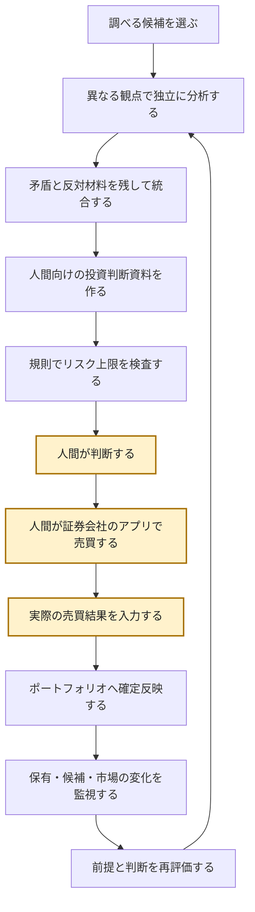
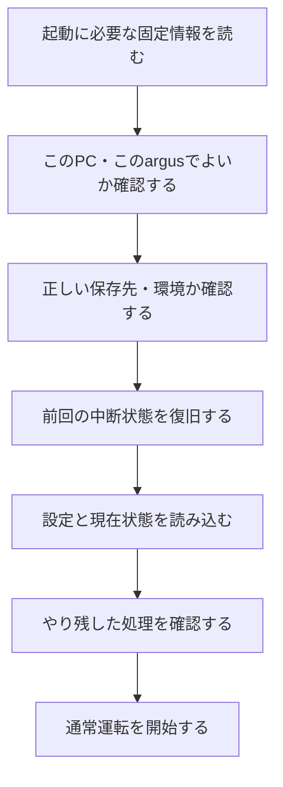

# argus System Design v0.1

**Document Role:** `HUMAN_SYSTEM_DESIGN`  
**Generated From:** `docs/model/argus_structured_design_model_v0.1.md`  

> 本書はStructured Design Modelから生成する、人間が理解・レビューするための設計書です。厳密な個別仕様はContracts、意思決定理由はADR、検証規則はTest Strategyで確認します。

## 目次

0. [設計環境](#0-設計環境)
1. [システム全体構成](#1-システム全体構成)
2. [投資機能](#2-投資機能)
   1. [機能構成](#21-機能構成)
   2. [投資処理](#22-投資処理)
   3. [判断と売買結果](#23-判断と売買結果)
   4. [保有後管理](#24-保有後管理)
3. [実行基盤](#3-実行基盤)
   1. [起動処理](#31-起動処理)
   2. [継続実行](#32-継続実行)
   3. [状態とデータ](#33-状態とデータ)
4. [外部接続](#4-外部接続)
5. [運用](#5-運用)
6. [安全設計](#6-安全設計)
7. [検証と改善](#7-検証と改善)
8. [機能一覧](#8-機能一覧)
9. [用語と正本](#9-用語と正本)
10. [継続検討事項](#10-継続検討事項)

# 0. 設計環境

argusは現在、Windows 11のローカルPC上でPythonにより動作し、インターネット経由で外部サービスを利用する前提です。WSLは使用しません。人間は平日日中09:00–17:30に仕事があり残業もあるため、即時応答を常時前提にしません。

| 区分 | 環境 | 設計への影響 |
|---|---|---|
| 現在 | Windows 11、ローカルPC、Python、internet接続、WSL不使用 | Windows native、停止・再開可能、local-first |
| 人間 | 平日日中は仕事、多忙時は残業 | 判断待ちの耐久化、通知時間、期限管理 |
| 外部 | J-Quants、EDINET、OpenAI API候補 | 変更・障害・料金を境界で隔離 |
| 将来 | cloud runtime構想 | local固有依存を合理的に隔離。ただし現在の実装必須要件ではない |

# 1. システム全体構成

argusは、人間に代わって注文する仕組みではありません。投資候補を探し、異なる観点の根拠と反対材料を整理し、人間の判断と実際の売買結果を記録し、その後も変化を見直す仕組みです。AIの提案がそのまま注文になったり、間違った保存先や壊れた状態で処理が続いたりしないことを重視します。

## 1.1 責務構成

次は機能の包含関係です。上から下へ実行する順番ではありません。

```text
argus
├─ 投資機能
│  ├─ 候補形成
│  ├─ 判断材料の作成
│  ├─ 人間の判断と売買結果
│  └─ ポートフォリオ管理・監視・再評価
├─ 実行基盤
│  ├─ 起動処理
│  ├─ 継続実行
│  └─ 状態・データ保存
├─ 外部接続と費用統制
├─ 人間・システム運用
├─ 検証・学習・変更統制
└─ 横断的な安全制約
```

## 1.2 役割分担

提案、人間の判断、実際に市場で起きたことを分けなければ、後から誰が何を決めたか確認できません。argusは情報処理と記録を担い、人間が最終判断と証券会社での操作を担います。

| 主体 | 担当 | 担当しないこと |
|---|---|---|
| AIとargus | 情報収集、候補形成、独立分析、矛盾保持、判断資料、監視、記録支援 | 最終投資判断、証券会社への自動注文 |
| 人間 | 承認・却下・保留、証券会社での操作、費用変更、重大復旧 | 大量情報の常時監視と機械的整理 |
| 外部サービス提供元 | 市場・開示・モデル等のサービス提供 | argusの投資判断と状態管理 |

# 2. 投資機能

全銘柄を同じ深さで調べ続けることはできません。また、情報を絞る途中で反対材料まで消すと、よい理由だけを見て判断することになります。投資機能は、候補を形成し、独立した分析を判断材料へまとめ、人間の判断と売買後の管理へつなぎます。

## 2.1 機能構成

この図は親子関係を示します。時間の流れは次節で別に示します。

```text
投資機能
├─ 候補形成
│  ├─ 対象銘柄の母集団
│  ├─ 一次絞込み
│  └─ 複数の探索方法
├─ 判断材料の作成
│  ├─ 独立分析
│  ├─ 矛盾・反対材料の保持
│  ├─ 統合
│  └─ 投資判断資料（Report）
├─ 人間の判断と売買結果
│  ├─ 決定論的リスク検証
│  ├─ 判断待ち一覧（Decision Queue）
│  ├─ 人間の判断（Human Decision）
│  └─ 実際の売買結果（Execution Fact）
└─ ポートフォリオ管理
   ├─ 資金配分
   ├─ 保有銘柄の監視
   ├─ 投資候補の監視
   ├─ 市場全体の監視
   └─ 再評価
```

## 2.2 投資処理

投資処理は一回で終わらず、保有後の監視から再評価へ戻ります。投資候補の監視は、候補の条件変化を検出して再評価を始めるものであり、曖昧な「接続」ではありません。



黄色の枠は人間が行う判断・操作・入力です。色が見えない場合もnode文言から識別できます。

## 2.3 判断と売買結果

魅力的な提案でも、決めていたリスク上限を破るなら通してはいけません。また、人間が承認した内容と実際の約定は同じではありません。規則による検証、判断待ち、人間の選択、実際の結果を別々に記録します。

| 日本語表示 | 説明 | Formal Name / 参照 |
|---|---|---|
| 決定論的リスク検証器 | AIの評価と独立して上限違反を拒否する | `Deterministic Risk Validator` / Design Source §17A |
| 判断待ち一覧 | 判断対象、期限、通知状態を失わない | `Decision Queue` / Design Source §24–25 |
| 人間の判断 | `BUY / ADD / HOLD / REDUCE / SELL`等を選ぶ | `Human Decision` / Design Source §10–11 |
| 実際の売買結果 | 証券会社で実際に起きた内容を表す | `Execution Fact` / Design Source §12 |
| ポートフォリオへの確定反映 | 照合済みの結果で正本状態を更新する | `Portfolio Commit` / Design Source §13 |

## 2.4 保有後管理

ポートフォリオ（Portfolio）は保有銘柄一覧だけではなく、現金、確定済み・未解決の資源、方針との関係を持つ状態です。保有銘柄、未保有候補、市場全体では見る理由が違うため、三つの監視を分けます。

| 監視 | 対象 | 確認すること |
|---|---|---|
| 保有銘柄の監視（Position Watch） | 現在の保有 | 投資理由、リスク、追加・縮小・売却条件の変化 |
| 投資候補の監視（Candidate Watch） | 未保有候補 | 購入条件や根拠の変化 |
| 市場全体の監視（Market Watch） | 市場全体 | 相場環境や広く影響する事象の変化 |

資金配分は銘柄単体の魅力度だけでなく、現金、集中、流動性、ポートフォリオ内の役割、リスク方針に制約されます。詳細はSystem Design §13–20、§24、§27を参照します。

# 3. 実行基盤

投資ロジックが正しくても、別のargusや保存先を開いたり、PC停止後に二重処理したり、状態の一部だけを書き換えたりすれば安全には動きません。実行基盤は、起動前提を確認し、中断可能な処理単位として動かし、状態を一貫して保存します。

## 3.1 起動処理

別の実行主体や古い設定なのに、正しい起動だと思って通常運転が始まると困ります。起動処理は、このPC・このargus・この保存先・この環境でよいかを確認し、中断状態とやり残しを整理してから通常運転へ進みます。



| 段階 | 何をするか | 何が困るから必要か | 対応する正式な仕組み | 正本参照 |
|---|---|---|---|---|
| 起動条件 | 起動に必要な固定条件を読み込む | 起動基準が毎回変わると正しさを確認できない | `SYSTEM.md` / Manifest | Design Source §4.2 |
| 実行主体 | host、path、利用可能な接続等を記録する | 別の実行主体を同じものと思い込む | 実行主体の識別情報（Runtime Identity） | Runtime Identity Contract |
| 保存先・環境 | logical identityとenvironmentを照合する | 「いつものL:」が別diskだと誤書込みする | Environment Binding | EB Contract §5 |
| 中断復旧 | 未処理・未配信・不明状態を確認する | 前回の途中状態を無視すると二重処理や欠落が起きる | Recovery | Design Source §4.2 |
| 設定・状態 | 実行設定、利用データが示す時点、人間と処理の状態を読む | 古い前提で通常運転すると判断を誤る | Runtime Config / state loading | Design Source §4.0, §4.2 |
| やり残し | 未実行期間や再試行待ちを検出する | 止まっていた期間の必要処理が抜ける | Relevance Check / catch-up | Design Source §4.2 |
| 通常運転 | 検証済み条件で継続処理へ移る | 安全確認前に副作用が始まる | 起動処理の統合（Bootstrap Orchestrator） | Bootstrap Contract §4 |

Manifestと設定、lockと復旧、secret確認の細かな相対順は未確定です。図は高位の順序だけを示します。

## 3.2 継続実行

PCや通信は止まり、外部サービスは失敗します。停止後に処理が抜けたり、同じ副作用を二度行ったりしないよう、継続実行管理、処理単位、再試行、途中成果、確定反映を分けます。

```text
継続実行管理（Runner）
└─ 継続実行ループ（Persistent Loop）
   └─ 処理単位（Job）
      ├─ その処理で固定した設定
      ├─ 業務サービス
      │  └─ 外部サービス共通窓口 / 提供元別接続部
      ├─ 再開用の途中成果（Durable Stage）
      └─ 単一書込み主体による確定反映
```

再開用の途中成果は物理的な保存階層の名前ではありません。外部APIやモデルの高価な処理を、最後の保存失敗のたびにやり直さずに済むよう保存した途中結果です。

## 3.3 状態とデータ

現金だけ変わって保有数量が変わらないなど、正本の一部だけが更新されると、どれが正しい状態か分からなくなります。正本状態は一つの書込み境界だけが、途中形を見せずに一括確定します。

| 種類 | 日本語表示 | 役割 |
|---|---|---|
| Canonical State | 正本状態 | 現在の投資状態について唯一の正とする |
| Single Writer | 単一書込み主体 | 正本状態を更新できる唯一の境界 |
| Atomic Commit | 状態の一括確定 | 関係する変更を全部または一つも反映しない |
| Raw data | 取得原本 | 上書きせず、後から再処理できるようにする |
| Normalized data | 共通形式データ | 提供元固有形式を投資ロジックから隠す |
| Archive / logs | 履歴・記録 | 判断と変更を後から追跡する |
| Backup | バックアップ | 破損・喪失から復旧する |

復旧したfileが証券会社等の現実と一致するとは限りません。再照合するまで購入・追加購入を止めます。

# 4. 外部接続

外部サービスは終了することがあり、API仕様、料金、利用上限、稼働状況も変わります。その依存が各モジュールへ直接埋め込まれると、一つの変更がシステム全体へ伝播します。外部依存を交換可能な境界へ隔離し、変更時は主に新しい接続モジュールの作成と差替えで対応できることを目指します。

```text
業務処理
    ↓
領域別サービス窓口
    ↓
外部サービス共通窓口（ExternalServiceGateway）
    ├─ 市場データ提供元
    ├─ 開示情報提供元
    ├─ モデル提供元
    └─ ニュース提供元
```

| 課題 | 方針 | 仕組み |
|---|---|---|
| 提供元変更の影響が各所へ広がる | 共通責務と固有処理を分離 | 外部サービス共通窓口、提供元別接続部（Provider Adapter） |
| 再試行で費用が重なる | 高価な処理結果と最終反映を分離 | 再開用の途中成果、利用量の精算 |
| 無断で費用が増える | 有料サービスは安全側に停止 | 人間の明示承認、費用上限の検査（Budget Gate）、有料代替先への自動切替禁止 |

この構造により、他モジュールの変更、回帰確認範囲、保守負荷を減らし、品質低下の波及を抑えます。テスト用の過去データも実サービスと同じ領域別取得インターフェースから利用できることはDesign SourceとTest Strategyに明示されています。ただし、secret、rate limit、費用統制まで実サービスと同一にするかは未確定です。

# 5. 運用

人間は常に即応できず、通知が多すぎれば重要判断が埋もれます。また、外部サービス、保存先、通知の障害は通常の投資判断と区別して扱う必要があります。

| 要素 | 何が困るか | 役割 |
|---|---|---|
| 利用者の対応状況（User Status） | 忙しい時に判断依頼が積み上がる | FREE/NORMAL/BUSY等から提示量を調整する |
| 判断待ち一覧（Decision Queue） | 処理停止中に判断対象が消える | 優先度、期限、状態を保持する |
| 通知可能時間 | 不要な時間に通知される | 緊急度と配送時刻を分ける |
| 人間による訂正 | 元記録の上書きで訂正経緯が消える | 原出力と訂正理由を別に保持する |
| 障害対応 | 障害を成功や通常待ちと混同する | 分類し、停止・縮退・確認・復旧する |
| バックアップと復旧 | 戻した状態を正しいと思い込む | 外部の現実と再照合する |

# 6. 安全設計

安全は一つの箱ではなく、起動、書込み、提案、外部利用、設計変更へ横断的に作用します。必要な情報を確認できない時は「たぶん大丈夫」と続けず、その情報に依存する動作を止めます。

| 仕組み | 守るもの | 主な作用点 |
|---|---|---|
| 安全確認不能時の停止（Fail Closed） | 全ての安全前提 | 開始、書込み、提案、外部利用 |
| 環境分離 | TEST/PAPER/LIVEの状態とデータ | 起動、書込み |
| 決定論的リスク検証 | 資金・保有・リスク上限 | 提案、実行前確認 |
| 人間の明示承認（Human Approval） | 投資、費用、重大変更 | 判断、有効化、変更 |
| 単一書込み主体と状態の一括確定 | 正本状態 | 確定反映 |
| 費用上限の検査（Budget Gate） | 金銭的費用 | モデル・外部サービス利用 |
| 出所と履歴 | 判断の追跡可能性 | 取得、分析、判断、売買結果 |

# 7. 検証と改善

テストが通ったように見えても、未来情報を使った結果や、証拠がずれた変更を確認済みとして扱うと困ります。要件からレビューまでの証拠、過去時点での検証、実資金を使わない運用確認、結果からの学習、設計変更の統制を分けます。

| 検証 | 目的 | 何をするか | 効果 | 正本 |
|---|---|---|---|---|
| Capability検証 | 実装が契約を満たすと証拠で示す | RequirementからTest、RED/GREEN、Reviewまで追跡 | test driftと未review変更を防ぐ | Test Strategy §24–25 |
| 過去検証 | 未来情報なしで再現性を調べる | 時刻Gate、再生、未使用期間で確認 | look-aheadと過学習を見つける | Design Source §38–40; Test Strategy §8, §13 |
| 模擬運用 | 実資金前に実時間運用を調べる | Provider更新、PC停止、通知、Human負荷を観測 | 運用上の成立性を確認する | Design Source §41–42A; Test Strategy §14 |
| system評価 | 成績以外の弱点も捉える | 投資成績、分析枝、health、costを評価 | 改善対象を分離する | Design Source §36–37 |
| 学習記録 | 判断結果を後から比較する | 反実仮想、理由重み、人間の訂正を記録 | 判断品質の較正材料を残す | Design Source §24.3, §31–31A |
| 変更統制 | 変更の重大度に応じて扱う | Break階層、System Version、承認 | objectiveを無意識に変えない | Design Source §32–35 |

# 8. 機能一覧

この一覧は機能間の依存に基づくおおまかな開発順です。完了・進行中・未着手といった現在の状態は示しません。現在の進捗はCapability RegistryとDevelopment Progressで確認してください。

| 開発順 | 機能 | 何をするか | 所属 | Formal Name / 詳細参照 |
|---:|---|---|---|---|
| 1 | 実行環境と保存先の確認 | environmentとData Rootの取違えを防ぐ | 起動・安全 | Environment Binding Contract |
| 2 | 実行主体の識別 | どの論理的argusかを表す | 起動 | Runtime Identity Contract |
| 3 | 実行設定 | 設定をstate/secretから分けて検証する | 起動 | Runtime Config / 詳細未確定 |
| 4 | 起動先の解決 | 使用するruntime資源を決める | 起動 | Entry Resolution / 詳細未確定 |
| 5 | 起動処理の統合 | 検証・復旧後に通常運転へ渡す | 起動 | Bootstrap Orchestrator / Bootstrap Contract |
| 6 | 共通実行サービス | 時刻、記録、保存、外部接続を共通化する | 実行基盤 | shared services / 正式範囲未確定 |
| 7 | 継続実行 | 処理単位、再試行、途中成果、確定反映を管理する | 実行基盤 | Runner / Job / Durable Stage |
| 8 | 投資機能の最小一周 | 候補から売買結果・監視までを一周させる | 投資 | Investment MVS |
| 9 | 過去検証 | 過去時点だけの情報で再現する | 検証 | Historical Validation |
| 10 | 模擬運用 | 実資金なしで実時間運用を確認する | 検証 | Paper Trading |
| 11 | 実運用準備 | 実資金を扱う前提を確認する | 検証・運用 | Live Readiness |

# 9. 用語と正本

| 日本語表示 | Formal Name | 短い意味 | 詳細 |
|---|---|---|---|
| 正本状態 | Canonical State | 現在の投資状態について唯一の正 | System Design §13 |
| 単一書込み主体 | Single Writer | 正本を更新できる唯一の境界 | System Design §13.2 |
| 状態の一括確定 | Atomic Commit | 全部または一つも反映しない | System Design §13.2 |
| 実行主体の識別情報 | Runtime Identity | どの論理的argusかを示す | Runtime Identity Contract |
| 実行環境と保存先の組合せ確認 | Environment Binding | environmentとData Root identityを照合 | EB Contract |
| 再開用の途中成果 | Durable Stage | 再実行を避けるため保存した途中結果 | System Design §2.2–2.3 |
| 判断待ち一覧 | Decision Queue | 人間の判断待ちを耐久化する | System Design §24–25 |
| 実際の売買結果 | Execution Fact | 市場で実際に起きた内容 | System Design §12 |
| 外部サービス共通窓口 | ExternalServiceGateway | 外部利用の共通統制境界 | ADR-003 |

正本案内:

- 設計入力資料: `docs/source/argus_design_source_v0.1.md`
- 構造化設計モデル: `docs/model/argus_structured_design_model_v0.1.md`
- 採用理由: `docs/adr/argus_architecture_decision_records_v0.1.md`
- テストと証拠: `docs/test/argus_test_strategy_v0.1.3.md`
- Environment Binding: `docs/contracts/argus_environment_binding_contract_v0.1.md`
- Runtime Identity: `docs/contracts/argus_runtime_identity_document_contract_v0.1.md`
- 現在の開発状態: `docs/development/argus_capability_registry.md`
- 読みやすい進捗: `docs/development/argus_development_progress.md`

# 10. 継続検討事項

本書は次を確定していません。

- 責務構成と投資処理循環の主従。
- 起動処理と継続実行の正式な境界。
- Environment Bindingの所属と横断作用の見せ方。
- 状態を集中分類するか、領域ごとの所有を前面に出すか。
- 三つの監視を状態viewと監視processへさらに分けるか。
- 安全設計の独立表示と各領域への注記をどう併用するか。
- 人間向け運用とシステム運用を分割するか。
- 共通サービスの正式な一覧と所有関係。
- 後続Runtime Capabilityをどの粒度で表示するか。
- 正式名称を括弧で併記する頻度。
- Design Sourceの「利用データ時刻」がdata自体のas-of時刻だけを指すか、処理時刻も含むか。
- Historical Providerへ実service用のsecret、rate limit、費用統制をどこまで共通適用するか。

## 派生情報

```text
document_role: HUMAN_SYSTEM_DESIGN
structured_design_model:
  path: docs/model/argus_structured_design_model_v0.1.md
  sha256: 6448a3871848ad1d2ec67175fcd15577146bdb744076b5ca69a70e265a386446
generation_instruction:
  path: docs/development/prompts/argus_system_design_prompt_v0.1.md
  sha256: ecc1c0761370056e4f754e0611e9ceab04d365cfc865525607aee1139675e941
source_pipeline: Design Source -> Structured Design Model -> Human Review -> System Design
```
