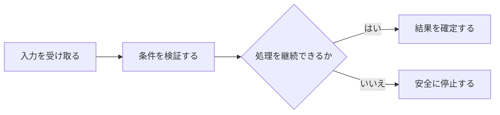

## 2.7 監視と再評価

監視対象別の優先度と、取得から通知までの観測可能なLatency境界を明示する。 本節では、個々の条件を列挙するのではなく、相互の関係と運用上の境界が読み取れる順序で整理する。

### 処理の入口

保有・候補・市場を同じ周期で扱うこと、およびLocal停止中も監視できると誤認することは、重大Riskの見逃しや能力の過大表示につながる。 Event取得、Thesis差分、再分析、通知を一段階として扱うと、Data不足やLatency境界を隠し得る。

### 流れと分岐

| 観点 | 設計上の内容 |
|---|---|
| problems | 保有・候補・市場を同じ周期で扱うこと、およびLocal停止中も監視できると誤認することは、重大Riskの見逃しや能力の過大表示につながる。 ／ Event取得、Thesis差分、再分析、通知を一段階として扱うと、Data不足やLatency境界を隠し得る。 |
| purposes | 監視対象別の優先度と、取得から通知までの観測可能なLatency境界を明示する。 ／ EventからHuman判断候補までの処理順序と各段階の失敗動作を分離する。 |
| processes | Position Watch、Candidate Watch、Market Watch、`Event`、Latency区間。 ／ ／ Position Watch ／ 保有銘柄 ／ Thesis、Invalidator、重大Event ／ 短周期・高優先 ／ 数量ゼロで終了し、必要ならCandidate Watchへ ／ ／ ／ Candidate Watch ／ 分析済み非保有銘柄 ／ 見送り理由解消、Valuation、新Event ／ Positionより低い ／ 候補状態に応じ更新 ／ ／ ／ Market Watch ／ 未候補市場全体 ／ 銘柄選定入口 ／ 定期Selection ／ Candidate化 ／ ／ `Event`-drivenは取得済みEventを次の週次・月次まで待たずに処理する意味である。 ／  ／ ／ 公開 ／ Event発生→Provider公開 ／ ARGUSが短縮できない ／ ／ ／ Provider更新 ／ 公開→Provider反映 ／ Provider plan / schedule依存 ／ ／ ／ Local availability ／ Provider反映→PC稼働 ／ Local-first制約 ／ ／ ／ Polling / acquisition ／ PC稼働→Data取得 ／ Watch周期・通信依存 ／ ／ ／ Analysis / Queue ／ 取得→Queue ready ／ 処理・Budget依存 ／ ／ ／ Notification window ／ Queue ready→delivery opportunity ／ Status / 時刻Policy依存 ／ ／ ／ Human / Market ／ delivery→response→market opportunity ／ 人と取引時間の外部条件 ／ ／ §18、§22.1、§27、§42A。 ／ `Event`、Adapter、Watch、Analysis、Decision Queue。 ／ ／ 1 ／ ARGUS ／ Adapter ／ Earnings、Disclosure、price move、news等 ／ `Event` / Evidence取得 ／ provenance検証 ／ Evidence Update ／ pollingなら遅延を記録 ／ Watch ／ ／ ／ 2 ／ ARGUS ／ Watch component ／ Evidence、Original Thesis ／ 差分比較 ／ unchanged / strengthened / weakened / invalidated ／ Thesis revision候補 ／ Data不足を明示 ／ 必要時Full Analysis ／ ／ ／ 3 ／ Agent / LLM ／ Agent Runtime ／ Eventと凍結Evidence ／ Analysis：独立分析・Contradiction ／ Recommendation生成可否 ／ ADD / HOLD / REDUCE / SELL候補 ／ 重大不足でBUY/ADD停止 ／ Allocation / Validator ／ ／ ／ 4 ／ ARGUS ／ Queue / Router ／ validated Proposal ／ Status / TTL / Window評価 ／ Human判断待ち ／ Human view ／ `Event`-drivenを即時Push保証としない ／ Human Decision ／ ／ Eventの例はEarnings、TDnet由来情報、Major price move、Important news、Dividend cut、Guidance revision、Large shareholder change、Regulation change。 ／ TDnet有料APIは利用せず、取得経路は未確定である。 ／ §27、§37A。 |
| actors_authorities | Human ／ ARGUS ／ Agent / LLM |

### 失敗時の境界

監視対象別の優先度と、取得から通知までの観測可能なLatency境界を明示する。 EventからHuman判断候補までの処理順序と各段階の失敗動作を分離する。 Position Watch、Candidate Watch、Market Watch、`Event`、Latency区間。 ／ Position Watch ／ 保有銘柄 ／ Thesis、Invalidator、重大Event ／ 短周期・高優先 ／ 数量ゼロで終了し、必要ならCandidate Watchへ ／ ／ Candidate Watch ／ 分析済み非保有銘柄 ／ 見送り理由解消、Valuation、新Event ／ Positionより低い ／ 候補状態に応じ更新 ／ ／ Market Watch ／ 未候補市場全体 ／ 銘柄選定入口 ／ 定期Selection ／ Candidate化 ／ `Event`-drivenは取得済みEventを次の週次・月次まで待たずに処理する意味である。  ／ 公開 ／ Event発生→Provider公開 ／ ARGUSが短縮できない ／ ／ Provider更新 ／ 公開→Provider反映 ／ Provider plan / schedule依存 ／ ／ Local availability ／ Provider反映→PC稼働 ／ Local-first制約 ／ ／ Polling / acquisition ／ PC稼働→Data取得 ／ Watch周期・通信依存 ／ ／ Analysis / Queue ／ 取得→Queue ready ／ 処理・Budget依存 ／ ／ Notification window ／ Queue ready→delivery opportunity ／ Status / 時刻Policy依存 ／ ／ Human / Market ／ delivery→response→market opportunity ／ 人と取引時間の外部条件 ／ §18、§22.1、§27、§42A。 `Event`、Adapter、Watch、Analysis、Decision Queue。 ／ 1 ／ ARGUS ／ Adapter ／ Earnings、Disclosure、price move、news等 ／ `Event` / Evidence取得 ／ provenance検証 ／ Evidence Update ／ pollingなら遅延を記録 ／ Watch ／ ／ 2 ／ ARGUS ／ Watch component ／ Evidence、Original Thesis ／ 差分比較 ／ unchanged / strengthened / weakened / invalidated ／ Thesis revision候補 ／ Data不足を明示 ／ 必要時Full Analysis ／ ／ 3 ／ Agent / LLM ／ Agent Runtime ／ Eventと凍結Evidence ／ Analysis：独立分析・Contradiction ／ Recommendation生成可否 ／ ADD / HOLD / REDUCE / SELL候補 ／ 重大不足でBUY/ADD停止 ／ Allocation / Validator ／ ／ 4 ／ ARGUS ／ Queue / Router ／ validated Proposal ／ Status / TTL / Window評価 ／ Human判断待ち ／ Human view ／ `Event`-drivenを即時Push保証としない ／ Human Decision ／ Eventの例はEarnings、TDnet由来情報、Major price move、Important news、Dividend cut、Guidance revision、Large shareholder change、Regulation change。 TDnet有料APIは利用せず、取得経路は未確定である。 §27、§37A。 Human ARGUS Agent / LLM
