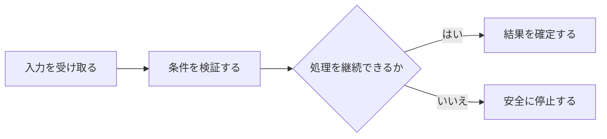

## 3.5 保存・バックアップ・復旧

Artifactごとの生成元、利用先、保持条件、不変条件を定義する。 本節では、個々の条件を列挙するのではなく、相互の関係と運用上の境界が読み取れる順序で整理する。

### 処理の入口

Runtime Artifactの正本性と派生性が不明だと、ProjectionやBackupを独立更新し得る。 古いsnapshotをそのまま正本へ戻すと、Brokerで成立した実約定やCashとの差異を消し得る。 容量目安、警告候補、保存形式を確定値として混同すると、不適切な閾値や形式を固定し得る。 Artifactごとの生成元、利用先、保持条件、不変条件を定義する。 Restore後に必ずReconciliationを行い、確認済み差分をEventとして再Commitする。 Storageの既定値、候補値、監視量、形式、将来移行条件を区別する。

### 流れと分岐

| 観点 | 設計上の内容 |
|---|---|
| problems | Runtime Artifactの正本性と派生性が不明だと、ProjectionやBackupを独立更新し得る。 ／ 古いsnapshotをそのまま正本へ戻すと、Brokerで成立した実約定やCashとの差異を消し得る。 ／ 容量目安、警告候補、保存形式を確定値として混同すると、不適切な閾値や形式を固定し得る。 |
| purposes | Artifactごとの生成元、利用先、保持条件、不変条件を定義する。 ／ Restore後に必ずReconciliationを行い、確認済み差分をEventとして再Commitする。 ／ Storageの既定値、候補値、監視量、形式、将来移行条件を区別する。 |
| processes | SYSTEM.md、Canonical State、Projection、inbox、evidence、logs、reports、validation、archive、stage。 ／ ／ `SYSTEM.md` ／ 起動Artifact ／ 配備工程 ／ 人、Runner ／ 起動手順、正本、版、入口、復旧を示す ／ §4 ／ ／ ／ `portfolio.json` ／ Canonical State ／ Single Writer ／ 全Domain処理 ／ 一つのAtomic Commit単位 ／ §4、§13 ／ ／ ／ `watchlist.json` / `decision_queue.json` / `runtime_state.json` ／ Projection ／ Canonical Stateから再生成 ／ UI、互換利用 ／ 独立更新しない ／ §4 ／ ／ ／ `performance.json` ／ 派生結果 ／ 評価処理 ／ Report ／ 計算条件と参照Commitを持つ ／ §4、§36 ／ ／ ／ `inbox/` ／ Durable入力 ／ Fact ingress ／ Parser、Writer ／ 適用完了まで受領原文を保持 ／ §4、§12 ／ ／ ／ `evidence/` ／ 根拠Artifact ／ Provider / acquisition ／ Analysis、Audit ／ source、時刻、hash、許諾範囲原文 ／ §4、§29 ／ ／ ／ `logs/decisions`等 ／ Audit Projection ／ Commit records ／ 人、別AI ／ event_id / commit_idで重複排除し、Application Logで代替しない ／ §4、§28〜30 ／ ／ ／ `logs/application/YYYY-MM-DD/` ／ Application Log ／ 生成主体・Writer実装は未確定 ／ 運用・障害解析 ／ `Asia/Tokyo`境界のDaily rotation。Canonical情報より低優先で有限保持。単独書込失敗はCanonical処理を失敗させない。Secret / Credential / Token等を記録しない ／ §2.6、§4、§28 ／ ／ ／ `reports/` ／ Human-facing Artifact ／ Analysis / Evaluation ／ 人 ／ 正本ではない ／ §4、§9〜10 ／ ／ ／ `validation/` ／ 検証Artifact ／ Test process ／ Gate判断 ／ 計画、入力、期待、実測、Evidenceを分離 ／ §4、§46B ／ ／ ／ `archive/events` ／ append-only Fact履歴 ／ Compaction / Writer ／ Rebuild、Audit ／ hash / range / high-water mark ／ §13.4 ／ ／ ／ `archive/observations` ／ append-only観測履歴 ／ Acquisition / archive ／ Analysis、Replay ／ revision / vintageを保持 ／ §13.4、§39 ／ ／ ／ `archive/audit` ／ append-only監査履歴 ／ Commit ／ Review ／ 過去Recordを削除しない ／ §13.4 ／ ／ ／ `stage/` ／ Durable Stage ／ External / Model call ／ Validate、Commit再開 ／ request/input/output hashとusage ／ §2.5、§13.4 ／ ／ Application LogはRuntime、Job、Adapter、Error等の運用・障害解析用記録であり、Canonical State、Fact、Event、Audit Recordとは別Artifactである。 ／  ／ Backup snapshot、Restore、Broker照合、Correction / missing Fact、通常運用復帰。 ／ ／ 1 ／ ARGUS ／ Backup Job ／ Canonical commit ／ commit_id、state_version、hash、版参照付きsnapshot作成 ／ Backup成功とCanonical Commit成功を分離 ／ recent / long-term snapshot ／ Secretを平文で含めない ／ freshness監視 ／ ／ ／ 2 ／ 人 ／ Recovery Service ／ 復元対象snapshot ／ 古いsnapshotを配置 ／ RESTORE_RECOVERY ／ 復旧State ／ 実約定を消したまま再開しない ／ Reconciliation ／ ／ ／ 3 ／ ARGUS ／ 未確定 ／ Broker / execution / cash / position ／ Reconciliation処理：現実とsnapshotを照合 ／ RECONCILIATION_REQUIRED ／ 差分 ／ 不明を推測しない ／ Correction / missing Fact ／ ／ ／ 4 ／ ARGUS ／ Writer ／ 確認済み差分 ／ EventとしてCommit ／ Reconciliation Complete ／ 整合State ／ 不整合残存時はBUY/ADD停止継続 ／ 通常運用 ／ ／ §4.5、§4.7。 ／ Data Root、2TB目安、1.8TB候補、usage / growth、Raw、JSONL、JSON、SQLite / Parquet。 ／ ／ Data Root ／ `L:\emori\InvestmentAgentData` ／ 初期物理保存先。marker照合必須 ／ §4.1、§4.7 ／ ／ ／ 利用上限目安 ／ 最大約2TB ／ 必要容量見積・予約領域ではない ／ §4.1 ／ ／ ／ Soft Warning候補 ／ 約1.8TB ／ 候補値。最終thresholdはDataset実測後CVで設定 ／ §4.7 ／ ／ ／ 監視量 ／ absolute usage、volume free、directory usage、daily / weekly growth ／ Adapter暴走・Log loop検知 ／ §4.1 ／ ／ ／ Raw ／ Response、ZIP、XBRL、PDF等 ／ 原本または許諾形式でimmutable ／ §4.7 ／ ／ ／ Normalized time series ／ JSONL初期標準候補 ／ Provider非依存schemaとprovenance ／ §4.7、§37A ／ ／ ／ Small metadata ／ JSON許容 ／ 小容量単発Record ／ §4.7 ／ ／ ／ 将来形式 ／ SQLite / Parquet候補 ／ 容量・検索性能がbottleneck時にBreak ／ §4.7 ／ |
| rules |  ／  |
| actors_authorities | Human ／ ARGUS ／ Broker |
| boundaries | ／ `logs/application/YYYY-MM-DD/` ／ Application Log ／ 生成主体・Writer実装は未確定 ／ 運用・障害解析 ／ `Asia/Tokyo`境界のDaily rotation。Canonical情報より低優先で有限保持。単独書込失敗はCanonical処理を失敗させない。Secret / Credential / Token等を記録しない ／ §2.6、§4、§28 ／ |
| 正確値 | `2TB` ／ `1.8TB` ／ `2TB` ／ `1.8TB` |

### 失敗時の境界

SYSTEM.md、Canonical State、Projection、inbox、evidence、logs、reports、validation、archive、stage。 ／ `SYSTEM.md` ／ 起動Artifact ／ 配備工程 ／ 人、Runner ／ 起動手順、正本、版、入口、復旧を示す ／ §4 ／ ／ `portfolio.json` ／ Canonical State ／ Single Writer ／ 全Domain処理 ／ 一つのAtomic Commit単位 ／ §4、§13 ／ ／ `watchlist.json` / `decision_queue.json` / `runtime_state.json` ／ Projection ／ Canonical Stateから再生成 ／ UI、互換利用 ／ 独立更新しない ／ §4 ／ ／ `performance.json` ／ 派生結果 ／ 評価処理 ／ Report ／ 計算条件と参照Commitを持つ ／ §4、§36 ／ ／ `inbox/` ／ Durable入力 ／ Fact ingress ／ Parser、Writer ／ 適用完了まで受領原文を保持 ／ §4、§12 ／ ／ `evidence/` ／ 根拠Artifact ／ Provider / acquisition ／ Analysis、Audit ／ source、時刻、hash、許諾範囲原文 ／ §4、§29 ／ ／ `logs/decisions`等 ／ Audit Projection ／ Commit records ／ 人、別AI ／ event_id / commit_idで重複排除し、Application Logで代替しない ／ §4、§28〜30 ／ ／ `logs/application/YYYY-MM-DD/` ／ Application Log ／ 生成主体・Writer実装は未確定 ／ 運用・障害解析 ／ `Asia/Tokyo`境界のDaily rotation。Canonical情報より低優先で有限保持。単独書込失敗はCanonical処理を失敗させない。Secret / Credential / Token等を記録しない ／ §2.6、§4、§28 ／ ／ `reports/` ／ Human-facing Artifact ／ Analysis / Evaluation ／ 人 ／ 正本ではない ／ §4、§9〜10 ／ ／ `validation/` ／ 検証Artifact ／ Test process ／ Gate判断 ／ 計画、入力、期待、実測、Evidenceを分離 ／ §4、§46B ／ ／ `archive/events` ／ append-only Fact履歴 ／ Compaction / Writer ／ Rebuild、Audit ／ hash / range / high-water mark ／ §13.4 ／ ／ `archive/observations` ／ append-only観測履歴 ／ Acquisition / archive ／ Analysis、Replay ／ revision / vintageを保持 ／ §13.4、§39 ／ ／ `archive/audit` ／ append-only監査履歴 ／ Commit ／ Review ／ 過去Recordを削除しない ／ §13.4 ／ ／ `stage/` ／ Durable Stage ／ External / Model call ／ Validate、Commit再開 ／ request/input/output hashとusage ／ §2.5、§13.4 ／ Application LogはRuntime、Job、Adapter、Error等の運用・障害解析用記録であり、Canonical State、Fact、Event、Audit Recordとは別Artifactである。  Backup snapshot、Restore、Broker照合、Correction / missing Fact、通常運用復帰。 ／ 1 ／ ARGUS ／ Backup Job ／ Canonical commit ／ commit_id、state_version、hash、版参照付きsnapshot作成 ／ Backup成功とCanonical Commit成功を分離 ／ recent / long-term snapshot ／ Secretを平文で含めない ／ freshness監視 ／ ／ 2 ／ 人 ／ Recovery Service ／ 復元対象snapshot ／ 古いsnapshotを配置 ／ RESTORE_RECOVERY ／ 復旧State ／ 実約定を消したまま再開しない ／ Reconciliation ／ ／ 3 ／ ARGUS ／ 未確定 ／ Broker / execution / cash / position ／ Reconciliation処理：現実とsnapshotを照合 ／ RECONCILIATION_REQUIRED ／ 差分 ／ 不明を推測しない ／ Correction / missing Fact ／ ／ 4 ／ ARGUS ／ Writer ／ 確認済み差分 ／ EventとしてCommit ／ Reconciliation Complete ／ 整合State ／ 不整合残存時はBUY/ADD停止継続 ／ 通常運用 ／ §4.5、§4.7。 Data Root、2TB目安、1.8TB候補、usage / growth、Raw、JSONL、JSON、SQLite / Parquet。 ／ Data Root ／ `L:\emori\InvestmentAgentData` ／ 初期物理保存先。marker照合必須 ／ §4.1、§4.7 ／ ／ 利用上限目安 ／ 最大約2TB ／ 必要容量見積・予約領域ではない ／ §4.1 ／ ／ Soft Warning候補 ／ 約1.8TB ／ 候補値。最終thresholdはDataset実測後CVで設定 ／ §4.7 ／ ／ 監視量 ／ absolute usage、volume free、directory usage、daily / weekly growth ／ Adapter暴走・Log loop検知 ／ §4.1 ／ ／ Raw ／ Response、ZIP、XBRL、PDF等 ／ 原本または許諾形式でimmutable ／ §4.7 ／ ／ Normalized time series ／ JSONL初期標準候補 ／ Provider非依存schemaとprovenance ／ §4.7、§37A ／ ／ Small metadata ／ JSON許容 ／ 小容量単発Record ／ §4.7 ／ ／ 将来形式 ／ SQLite / Parquet候補 ／ 容量・検索性能がbottleneck時にBreak ／ §4.7 ／   Human ARGUS Broker ／ `logs/application/YYYY-MM-DD/` ／ Application Log ／ 生成主体・Writer実装は未確定 ／ 運用・障害解析 ／ `Asia/Tokyo`境界のDaily rotation。Canonical情報より低優先で有限保持。単独書込失敗はCanonical処理を失敗させない。Secret / Credential / Token等を記録しない ／ §2.6、§4、§28 ／
