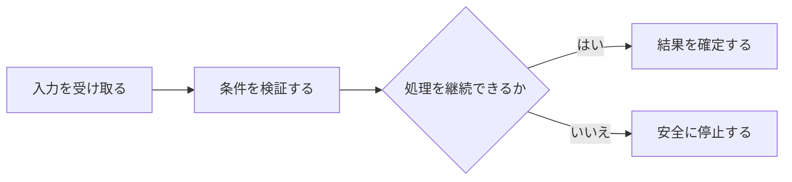

## 4.4 外部障害

失敗分類から安全な停止・Retry・Reconciliationへ追跡可能にする。 本節では、個々の条件を列挙するのではなく、相互の関係と運用上の境界が読み取れる順序で整理する。

### 処理の入口

Local停止、Provider障害、Storage不在、破損、入力矛盾は通常運用中に発生し、誤った継続や事実推測につながり得る。 異なる失敗を一律Retryまたは一律停止すると、無限Retry、危険継続、復旧不能が起き得る。

### 流れと分岐

| 観点 | 設計上の内容 |
|---|---|
| problems | Local停止、Provider障害、Storage不在、破損、入力矛盾は通常運用中に発生し、誤った継続や事実推測につながり得る。 ／ 異なる失敗を一律Retryまたは一律停止すると、無限Retry、危険継続、復旧不能が起き得る。 |
| purposes | 失敗分類から安全な停止・Retry・Reconciliationへ追跡可能にする。 ／ 失敗条件から状態、即時処理、復旧条件、人の関与までを追跡可能にする。 |
| processes | Runtime、Adapter、State、Storage、Budget、Secret、Clock。 ／ Network、Provider、Budget、Identity、State、Storage、Backup、Execution、Secret、Clockの失敗。 ／ ／ transient network / timeout ／ 一時通信失敗 ／ 外部Job ／ Retryable ／ 可 ／ burst retry→backoff+jitter ／ next_retry_at後または次Cycle ／ 原則不要 ／ §2.5、§46E ／ ／ ／ HTTP 429 ／ rate limit ／ Provider Job ／ Retryable ／ 可 ／ Provider Retry-After優先 ／ Circuit状態とBudget再検査後再試行 ／ 原則不要 ／ §2.5 ／ ／ ／ Provider 5xx連続 ／ 外部障害 ／ Adapter利用Job ／ ADAPTER_DEGRADED ／ 可 ／ Circuit Breakerで一定時間通常Job停止 ／ next_allowed_at後にhealth再評価 ／ 継続時確認 ／ §2.5 ／ ／ ／ quota / billing不足 ／ 契約・費用不足 ／ 有料Job ／ BUDGET_OR_QUOTA_BLOCKED ／ 時間だけでは不可 ／ 新規Call停止 ／ Budget / 契約を人が解決 ／ 必須 ／ §2.5、§37B ／ ／ ／ invalid key / permission ／ 認証失敗 ／ Adapter ／ CONFIG_REQUIRED ／ 不可 ／ Adapter停止 ／ 人がSecret / permission修正 ／ 必須 ／ §2.5 ／ ／ ／ Schema / Policy不整合 ／ 検証失敗 ／ Job / State ／ DATA_INVALID / POLICY_NOT_READY ／ 無限Retry不可 ／ Commit・BUY/ADD等を停止 ／ 正しいData / Policyを用意 ／ 場合により必須 ／ §2.2、§17A ／ ／ ／ Runner lock不明 ／ lock ownerを機械確認不能 ／ Runner ／ RUNNER_LOCK_RECOVERY_REQUIRED ／ 自動奪取不可 ／ 二重起動拒否 ／ host / pid / start time / heartbeat確認 ／ 必須の場合あり ／ §2.5 ／ ／ ／ Canonical State不明・破損 ／ 最新正本を確定不能 ／ 全write ／ RECOVERY_REQUIRED / System Critical ／ 不可 ／ 空Portfolio生成禁止 ／ Backup、Commit、Broker照合 ／ 必須 ／ §4.2、§22 ／ ／ ／ `Data` Root不在 ／ HDD未接続・read/write不能 ／ `Data` acquisition ／ DATA_STORAGE_UNAVAILABLE ／ 復帰後可 ／ State / Status閲覧を可能範囲で継続、Freshness依存BUY/ADD停止 ／ 正しいStorage再接続、cursorからCatch-up ／ 必要時 ／ §4.7 ／ ／ ／ Storage identity不一致 ／ markerとexpected不一致 ／ write ／ DATA_STORAGE_IDENTITY_MISMATCH / ENVIRONMENT_BINDING_MISMATCH ／ 不可 ／ write停止、System Critical記録 ／ 正しいBindingを確認 ／ 必須 ／ §4.1、§22 ／ ／ ／ Storage不足 ／ warning / critical閾値到達 ／ Data保存 ／ STORAGE_WARNING / CRITICAL ／ 条件次第 ／ 定義済み縮退順序を適用 ／ 容量回復、Integrity確認 ／ Critical時確認 ／ §4.7 ／ ／ ／ Position Watch最小Data不能 ／ Minimum Datasetも保存不能 ／ 保有監視 ／ POSITION_WATCH_DATA_UNAVAILABLE、CRITICAL / P0 INVESTMENT ／ 復帰後可 ／ Incident化、監視継続を表示しない ／ Data取得・保存能力回復 ／ 通知規則に従う ／ §4.7 ／ ／ ／ Backup stale ／ 許容期間超過 ／ Recovery能力 ／ BACKUP_STALE Warning ／ 再作成可 ／ Local / externalを別評価 ／ 正常Backup成功 ／ 継続時確認 ／ §4.7 ／ ／ ／ Pre-submit Model再検証不能 ／ Budget / quota / provider障害 ／ 承認済みTrade ／ HOLD_FOR_REVALIDATION ／ hold期間内可 ／ DO NOT SUBMIT、Incident ／ hold_ttl内に再検証、超過時Expire＋予約解放 ／ 必要時 ／ §25.1 ／ ／ ／ Execution入力矛盾 ／ 実残高不整合・方向不明 ／ Portfolio適用 ／ RECONCILIATION_REQUIRED ／ 推測不可 ／ 原文保持、Commit保留 ／ Broker / account照合、Correction / missing Fact ／ 必須 ／ §12 ／ ／ ／ Restore ／ 古いsnapshot復元 ／ Canonical State ／ RESTORE_RECOVERY→RECONCILIATION_REQUIRED ／ 照合後 ／ BUY / ADD停止 ／ execution / cash / position照合、必要Fact追加 ／ 必須 ／ §4.5 ／ ／ ／ Secret漏出疑い ／ scan / log等で検知 ／ Adapter / credential ／ SECURITY_INCIDENT ／ 再利用不可 ／ 対象Adapter停止 ／ Human確認、Secret rotation等 ／ 必須 ／ §46E ／ ／ ／ Clock discontinuity ／ OS時刻・timezone大幅変化 ／ Due判定 ／ CLOCK_DISCONTINUITY ／ 再評価 ／ 記録 ／ Due Job再評価 ／ 原則不要 ／ §2.6 ／ |
| actors_authorities | Human ／ Broker |

### 失敗時の境界

失敗分類から安全な停止・Retry・Reconciliationへ追跡可能にする。 失敗条件から状態、即時処理、復旧条件、人の関与までを追跡可能にする。 Runtime、Adapter、State、Storage、Budget、Secret、Clock。 Network、Provider、Budget、Identity、State、Storage、Backup、Execution、Secret、Clockの失敗。 ／ transient network / timeout ／ 一時通信失敗 ／ 外部Job ／ Retryable ／ 可 ／ burst retry→backoff+jitter ／ next_retry_at後または次Cycle ／ 原則不要 ／ §2.5、§46E ／ ／ HTTP 429 ／ rate limit ／ Provider Job ／ Retryable ／ 可 ／ Provider Retry-After優先 ／ Circuit状態とBudget再検査後再試行 ／ 原則不要 ／ §2.5 ／ ／ Provider 5xx連続 ／ 外部障害 ／ Adapter利用Job ／ ADAPTER_DEGRADED ／ 可 ／ Circuit Breakerで一定時間通常Job停止 ／ next_allowed_at後にhealth再評価 ／ 継続時確認 ／ §2.5 ／ ／ quota / billing不足 ／ 契約・費用不足 ／ 有料Job ／ BUDGET_OR_QUOTA_BLOCKED ／ 時間だけでは不可 ／ 新規Call停止 ／ Budget / 契約を人が解決 ／ 必須 ／ §2.5、§37B ／ ／ invalid key / permission ／ 認証失敗 ／ Adapter ／ CONFIG_REQUIRED ／ 不可 ／ Adapter停止 ／ 人がSecret / permission修正 ／ 必須 ／ §2.5 ／ ／ Schema / Policy不整合 ／ 検証失敗 ／ Job / State ／ DATA_INVALID / POLICY_NOT_READY ／ 無限Retry不可 ／ Commit・BUY/ADD等を停止 ／ 正しいData / Policyを用意 ／ 場合により必須 ／ §2.2、§17A ／ ／ Runner lock不明 ／ lock ownerを機械確認不能 ／ Runner ／ RUNNER_LOCK_RECOVERY_REQUIRED ／ 自動奪取不可 ／ 二重起動拒否 ／ host / pid / start time / heartbeat確認 ／ 必須の場合あり ／ §2.5 ／ ／ Canonical State不明・破損 ／ 最新正本を確定不能 ／ 全write ／ RECOVERY_REQUIRED / System Critical ／ 不可 ／ 空Portfolio生成禁止 ／ Backup、Commit、Broker照合 ／ 必須 ／ §4.2、§22 ／ ／ `Data` Root不在 ／ HDD未接続・read/write不能 ／ `Data` acquisition ／ DATA_STORAGE_UNAVAILABLE ／ 復帰後可 ／ State / Status閲覧を可能範囲で継続、Freshness依存BUY/ADD停止 ／ 正しいStorage再接続、cursorからCatch-up ／ 必要時 ／ §4.7 ／ ／ Storage identity不一致 ／ markerとexpected不一致 ／ write ／ DATA_STORAGE_IDENTITY_MISMATCH / ENVIRONMENT_BINDING_MISMATCH ／ 不可 ／ write停止、System Critical記録 ／ 正しいBindingを確認 ／ 必須 ／ §4.1、§22 ／ ／ Storage不足 ／ warning / critical閾値到達 ／ Data保存 ／ STORAGE_WARNING / CRITICAL ／ 条件次第 ／ 定義済み縮退順序を適用 ／ 容量回復、Integrity確認 ／ Critical時確認 ／ §4.7 ／ ／ Position Watch最小Data不能 ／ Minimum Datasetも保存不能 ／ 保有監視 ／ POSITION_WATCH_DATA_UNAVAILABLE、CRITICAL / P0 INVESTMENT ／ 復帰後可 ／ Incident化、監視継続を表示しない ／ Data取得・保存能力回復 ／ 通知規則に従う ／ §4.7 ／ ／ Backup stale ／ 許容期間超過 ／ Recovery能力 ／ BACKUP_STALE Warning ／ 再作成可 ／ Local / externalを別評価 ／ 正常Backup成功 ／ 継続時確認 ／ §4.7 ／ ／ Pre-submit Model再検証不能 ／ Budget / quota / provider障害 ／ 承認済みTrade ／ HOLD_FOR_REVALIDATION ／ hold期間内可 ／ DO NOT SUBMIT、Incident ／ hold_ttl内に再検証、超過時Expire＋予約解放 ／ 必要時 ／ §25.1 ／ ／ Execution入力矛盾 ／ 実残高不整合・方向不明 ／ Portfolio適用 ／ RECONCILIATION_REQUIRED ／ 推測不可 ／ 原文保持、Commit保留 ／ Broker / account照合、Correction / missing Fact ／ 必須 ／ §12 ／ ／ Restore ／ 古いsnapshot復元 ／ Canonical State ／ RESTORE_RECOVERY→RECONCILIATION_REQUIRED ／ 照合後 ／ BUY / ADD停止 ／ execution / cash / position照合、必要Fact追加 ／ 必須 ／ §4.5 ／ ／ Secret漏出疑い ／ scan / log等で検知 ／ Adapter / credential ／ SECURITY_INCIDENT ／ 再利用不可 ／ 対象Adapter停止 ／ Human確認、Secret rotation等 ／ 必須 ／ §46E ／ ／ Clock discontinuity ／ OS時刻・timezone大幅変化 ／ Due判定 ／ CLOCK_DISCONTINUITY ／ 再評価 ／ 記録 ／ Due Job再評価 ／ 原則不要 ／ §2.6 ／ Human Broker
