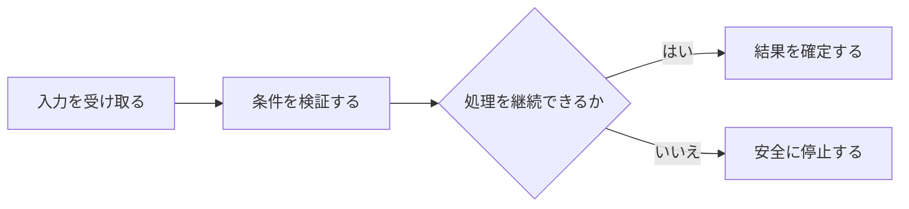

## 5.1 CLI / Human Interface

Human操作を共有Command / Service Layerへ統一し、非RUNNING時にもStatus、Help、System Statusの安全な操作入口を保つ。 本節では、個々の条件を列挙するのではなく、相互の関係と運用上の境界が読み取れる順序で整理する。

### 処理の入口

CLI、Tray、Runnerが独自LogicやWriter経路を持つと、同じ操作で異なる検証・更新結果が生じ得る。 Human操作の入口とWriter / Serviceが不明確だと、検証経路の分岐や直接更新が起き得る。 相対的なBUSY指定と適用時刻を区別しないと、週境界やRunner停止後の状態遷移を誤り得る。

### 流れと分岐

| 観点 | 設計上の内容 |
|---|---|
| problems | CLI、Tray、Runnerが独自LogicやWriter経路を持つと、同じ操作で異なる検証・更新結果が生じ得る。 ／ Human操作の入口とWriter / Serviceが不明確だと、検証経路の分岐や直接更新が起き得る。 ／ 相対的なBUSY指定と適用時刻を区別しないと、週境界やRunner停止後の状態遷移を誤り得る。 |
| purposes | Human操作を共有Command / Service Layerへ統一し、非RUNNING時にもStatus、Help、System Statusの安全な操作入口を保つ。 ／ 各Commandの入力、処理、出力、更新主体、失敗動作を固定する。 ／ presetを絶対終了時刻へ解決し、契約時刻と実適用時刻を追跡する。 |
| processes | Status、Budget、Proposal、Approval、Execution Paste、Alert、System操作。 ／ Help、Status、Budget、Proposal、Approval、Execution、Alert、System Command。 ／ ／ `help [command]` ／ 人 ／ 任意command名 ／ 利用可能操作と引数を表示 ／ Help ／ Shared Service ／ 不明commandを説明 ／ §4.3 ／ ／ ／ `status free/normal/busy ...` ／ 人 ／ Statusとlease preset ／ 絶対終了時刻計算、echo、version検査 ／ Status更新 ／ Status Writer ／ version conflict時は再読込 ／ §4.3、§21 ／ ／ ／ `budget status/review/set` ／ 人 ／ 閲覧または金額 ／ usage / reservation / remaining表示、変更検証 ／ Budget表示またはConfig変更 ／ Budget Service / Config Writer ／ 自動増額しない ／ §4.3、§37B ／ ／ ／ `proposals list/show` ／ 人 ／ proposal_id等 ／ QueueのHuman viewを表示 ／ Proposal detail ／ Decision Queue ／ 利用不能時は実行可能状態でないことを示す ／ §4.3 ／ ／ ／ Approval / Rejection ／ 人 ／ request_id、command_type、proposal revision、trade_hash等 ／ 最新State / Policy / TTL / Validator再検証 ／ 承認CommitまたはSUPERSEDED等 ／ Approval Service / Writer ／ 条件変化で旧承認を流用しない ／ §4.3、§25 ／ ／ ／ `execution paste` ／ 人 ／ Broker原文 / structured fields ／ RUNNING中だけinbox Durable保存後にFact parsing ／ receipt、適用状態 ／ Fact Ingress / Writer ／ 非RUNNING時は実行可能状態でないErrorとして拒否。不明・矛盾は照合待ち ／ §4.3、§12 ／ ／ ／ `alerts` / `alert ack` / `incidents` ／ 人 ／ ID等 ／ Durable Queue閲覧・認知記録 ／ 状態表示 ／ Alert / Incident Service ／ Popup表示をACKにしない ／ §4.3、§24 ／ ／ ／ `system status/version` ／ 人 ／ なし ／ Runtime / Service状態を集約 ／ System status ／ Shared Service ／ 観測不能をNOT_OBSERVABLEと表示 ／ §4.3、§29 ／ ／ CLI / TrayはRunner lockを取得せず、各Writer lockを通る。 ／ Tray停止はCanonical / Runner Stateを破壊しない。 ／ §4.3。 ／ 1時間、3時間、今日、今週、変更するまでのBUSY Lease。 ／ ／ 1時間 ／ 設定時刻＋1時間 ／ NORMAL ／ timezone付き排他的終了時刻 ／ ／ ／ 3時間 ／ 設定時刻＋3時間 ／ NORMAL ／ 同上 ／ ／ ／ 今日いっぱい ／ 翌日00:00 JST ／ NORMAL ／ CLIが絶対時刻をecho ／ ／ ／ 今週いっぱい ／ 次の日曜00:00 JST ／ NORMAL ／ 週は日曜00:00〜土曜24:00 ／ ／ ／ 変更するまで ／ null ／ 自動遷移なし ／ lease_type=`UNTIL_CHANGED` ／ ／ §21.1〜21.3。 |
| rules |  ／  |
| actors_authorities | Human ／ Broker |
| 正確値 | `1時` ／ `3時` ／ `1時` ／ `1時` ／ `3時` ／ `3時` ／ `00:00` ／ `00:00` ／ `00:00` ／ `24:00` |
| 状態 | `BUSY` ／ `NORMAL` ／ `RUNNING` |

### 失敗時の境界

Human操作を共有Command / Service Layerへ統一し、非RUNNING時にもStatus、Help、System Statusの安全な操作入口を保つ。 各Commandの入力、処理、出力、更新主体、失敗動作を固定する。 presetを絶対終了時刻へ解決し、契約時刻と実適用時刻を追跡する。 Status、Budget、Proposal、Approval、Execution Paste、Alert、System操作。 Help、Status、Budget、Proposal、Approval、Execution、Alert、System Command。 ／ `help [command]` ／ 人 ／ 任意command名 ／ 利用可能操作と引数を表示 ／ Help ／ Shared Service ／ 不明commandを説明 ／ §4.3 ／ ／ `status free/normal/busy ...` ／ 人 ／ Statusとlease preset ／ 絶対終了時刻計算、echo、version検査 ／ Status更新 ／ Status Writer ／ version conflict時は再読込 ／ §4.3、§21 ／ ／ `budget status/review/set` ／ 人 ／ 閲覧または金額 ／ usage / reservation / remaining表示、変更検証 ／ Budget表示またはConfig変更 ／ Budget Service / Config Writer ／ 自動増額しない ／ §4.3、§37B ／ ／ `proposals list/show` ／ 人 ／ proposal_id等 ／ QueueのHuman viewを表示 ／ Proposal detail ／ Decision Queue ／ 利用不能時は実行可能状態でないことを示す ／ §4.3 ／ ／ Approval / Rejection ／ 人 ／ request_id、command_type、proposal revision、trade_hash等 ／ 最新State / Policy / TTL / Validator再検証 ／ 承認CommitまたはSUPERSEDED等 ／ Approval Service / Writer ／ 条件変化で旧承認を流用しない ／ §4.3、§25 ／ ／ `execution paste` ／ 人 ／ Broker原文 / structured fields ／ RUNNING中だけinbox Durable保存後にFact parsing ／ receipt、適用状態 ／ Fact Ingress / Writer ／ 非RUNNING時は実行可能状態でないErrorとして拒否。不明・矛盾は照合待ち ／ §4.3、§12 ／ ／ `alerts` / `alert ack` / `incidents` ／ 人 ／ ID等 ／ Durable Queue閲覧・認知記録 ／ 状態表示 ／ Alert / Incident Service ／ Popup表示をACKにしない ／ §4.3、§24 ／ ／ `system status/version` ／ 人 ／ なし ／ Runtime / Service状態を集約 ／ System status ／ Shared Service ／ 観測不能をNOT_OBSERVABLEと表示 ／ §4.3、§29 ／ CLI / TrayはRunner lockを取得せず、各Writer lockを通る。 Tray停止はCanonical / Runner Stateを破壊しない。 §4.3。 1時間、3時間、今日、今週、変更するまでのBUSY Lease。 ／ 1時間 ／ 設定時刻＋1時間 ／ NORMAL ／ timezone付き排他的終了時刻 ／ ／ 3時間 ／ 設定時刻＋3時間 ／ NORMAL ／ 同上 ／ ／ 今日いっぱい ／ 翌日00:00 JST ／ NORMAL ／ CLIが絶対時刻をecho ／ ／ 今週いっぱい ／ 次の日曜00:00 JST ／ NORMAL ／ 週は日曜00:00〜土曜24:00 ／ ／ 変更するまで ／ null ／ 自動遷移なし ／ lease_type=`UNTIL_CHANGED` ／ §21.1〜21.3。   Human Broker
