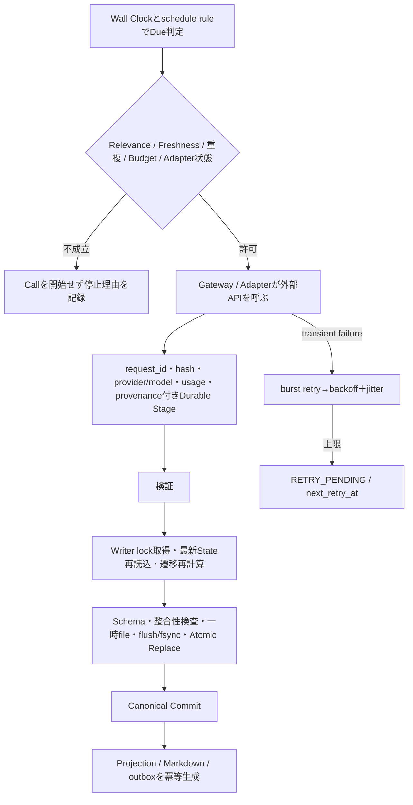
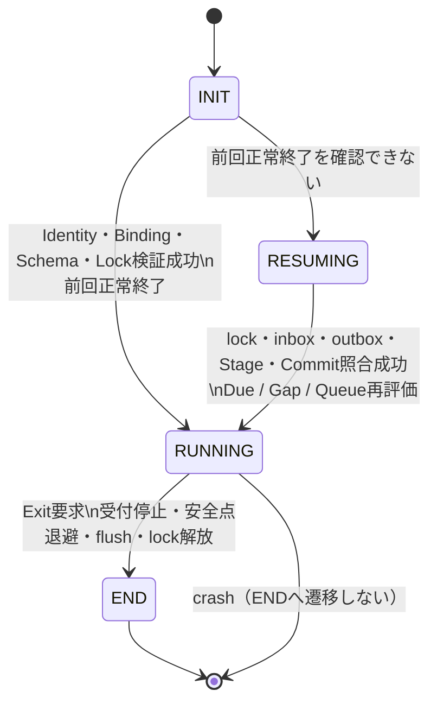

# 3 実行基盤

ARGUSの実行基盤は、安全に起動するだけでなく、外部副作用を伴うJobを継続し、停止や障害から正本性を失わずに再開し、保存・復旧・配置まで同じ安全境界で扱う。投資判断や候補評価の意味はここでは再定義せず、Human approval、Risk、通知などの上位機能についても接続境界だけを扱う。

## 3.1 起動

起動は一つの万能機構へ集約しない。Identity、Configuration、起動対象、Environment Bindingでは失敗原因とAuthorityが異なるため、次の順序と責務を固定する。各Subsystemは固有のtyped failureを保持し、上位境界で既存のstartup outcomeまたはIncidentへ写像する。全Subsystem共通の巨大なfailure enumは新設しない。

| 順序 | Subsystem | 責務 | 境界・禁止 |
|---:|---|---|---|
| 1 | `RUNTIME-IDENTITY-DOCUMENT` | logical instance identityを提供する | 可変Configurationやpathを格納しない |
| 2 | `RUNTIME-CONFIG-MECHANISM` | Configurationを読み込み、検証してsnapshot化する | Secret値の解決は、それを使用するSubsystemの責務とする |
| 3 | `RUNTIME-ENTRY-RESOLUTION` | 起動対象とBinding入力を解決する | environmentをdirectoryから推論しない |
| 4 | `RUNTIME-BOOTSTRAP-ORCHESTRATOR` | Subsystemを順序付け、Environment Binding APIを呼ぶ | startup tokenを永続的なwrite authorizationにしない |

安全・費用・State基盤より投資分析を先行させると、成立条件を検証できない実装が積み上がる。このため実装・確認も依存関係に沿って段階化する。

| 段階 | 成立させるもの | 確認する境界 |
|---:|---|---|
| 0 | Design / ADR baseline、Test Strategy分離 | Authorityと試験基準 |
| 1 | OpenAI、J-Quants Free、EDINET setup | 外部Capability |
| 2 | Dev / Runtime / テストデータ分離、Windows Manifest、Secret、Config Schema | Environment安全境界 |
| 3 | Shared Service、Status Writer、CLI status / help | Human操作入口 |
| 4 | Runner single instance、Lifecycle、clock、wait、Lease | Runtime基盤 |
| 5 | Writer lock、Atomic Commit、recovery、Config Snapshot、Correction | State integrity |
| 6 | Gateway、Paid Governance、Service Registry | 外部依存境界 |
| 7〜13 | Stub Provider、Test Dataset Generator、Budget Gate、Usage、Review、Circuit Breaker、Alert Queue、Override、ACK、Durable Stage、retry resume、External Storage、marker、growth、dual backup、Adapter CV、frozen criteria | 安全な試験入力、費用・Retry、Human通知、復旧、データ保全、Validation Integrity |
| 14〜16 | Risk Validator、Decision Queue、Single-ticker slice、Historical Test、Human承認によるJ-Quants Light、Capability Verification | Trade安全Gate、End-to-end MVS、Paper Provider Gate |
| 17〜18 | Realtime Paper、Live Readiness | 運用実測後の判断 |
| 19 | Multi-branch expansion | 基盤成立後の拡張 |

投資分析Agentを先に増やさず、Human Approval、Cost、State integrity、Retry economyを先に閉じる。起動後の反復処理は3.2へ続く。

## 3.2 継続実行

中断は例外ではなく通常条件である。Runnerは周期とイベント入力を評価し、外部呼出しの結果を先にDurable Stageへ保存してから、Single WriterによるCanonical Commitへ進む。これにより、Local停止、並行更新、再試行が重なっても、処理喪失、二重適用、重複課金を避ける。

version競合時は最新Stateから決定論的遷移を再計算する。Commit前停止はinboxまたはStageから再開し、Commit後ログ前停止は`applied_event_ids`またはoutboxから`event_id`単位で再生成する。API成功後にLocal Commitだけが失敗した場合は、同一`input_hash`のStageを使い、外部呼出しと課金を繰り返さない。

Retry上限に達してもJobを永久破棄せず、次回再試行状態を残す。Schema、Policy、認証、quotaなどの非Retryable failureは、`BLOCKED`、`CONFIG_REQUIRED`、`DATA_INVALID`、`POLICY_NOT_READY`、`BUDGET_OR_QUOTA_BLOCKED`として記録し、Humanまたは設定修復を待つ。無限Retryは行わない。Job前検査、Retry制御、Failure分類の具体的な実装主体は未確定である。

| 周期 | 主なJob | 入力 | 出力 | 欠落・復帰時 |
|---|---|---|---|---|
| Daily | Position Watch、重要事象確認 | Holding、Thesis、Providerデータ | Incident / Proposal / Log | Gapを記録し、復帰後Catch-up |
| Weekly | Candidate Watch、Portfolio Review | Candidate、Portfolio、Policy | 再分析・Allocation候補 | Relevanceを再評価 |
| Monthly | Stock Selection、Performance Report、System Health Report | Universe、Result、Run telemetry | Candidate、Report | 未取得期間を隠さない |
| Quarterly | Architecture-level Break | Logs、評価、制約 | B3等のProposal | Human Approvalを必須とする |

時刻・順序・再開条件をRun記録へ残し、古い分析を即時結果として見せない。停止からの状態遷移は3.3、保存済み結果の復旧は3.5で扱う。

## 3.3 中断・再開

Runnerは`INIT / RUNNING / RESUMING / END`だけを状態とする。OS killやcrashは状態ではなく終了事象であり、正常終了と混同しない。

`INIT`で正本が不明ならFail Closedで起動に失敗する。`RESUMING`で復旧不能ならIncident化して起動に失敗する。`RUNNING`でExit要求を受けた場合は新規Job受付を止め、実行中処理を安全点またはDurable Stageへ退避し、flush後にlockを解放して`END`へ進む。crash後は次回`INIT`が異常終了を検出する。

Scheduleの暦時刻と処理の経過時間は分離する。

| 用途 | Clock・基準 | 復帰時の扱い |
|---|---|---|
| Schedule、Due、Market calendar | timezone付きWall Clock、`Asia/Tokyo` | Sleep中に通過した予定時刻を検出する |
| wait、timeout、retry interval | monotonic clock | OS時計変更の影響を受けない |
| 時計・timezoneの大幅変更 | Wall Clock観測 | `CLOCK_DISCONTINUITY`を記録しDue Jobを再評価する |
| 停止期間からの復帰 | `last_success` / cursor / inbox | FreshnessとTTLにより`RUN / REANALYZE / EXPIRE / MERGE / DROP`を決める |

復旧対象の保存と照合は3.5に従う。

## 3.4 状態とデータ

正本性を守るには、現在状態、分類、現実の事実、時点付き観測、判断結果、変更要求、永続化段階を別の概念として扱う必要がある。

| 概念 | 固定値・意味 | 境界 |
|---|---|---|
| State | DomainまたはRuntime対象の現在値と遷移履歴 | User Status、Policy Mode、分類値を一括してStateと呼ばない |
| User Status | `FREE / NORMAL / BUSY`。Humanが直接操作 | Configurationではなく`human_capacity`の入力 |
| `human_capacity` | `LARGE / MEDIUM / SMALL`。Status Mapperが導出 | Human入力値でもStatusそのものでもない |
| Runner State | `INIT / RUNNING / RESUMING / END` | OS kill / crashやUser Statusとは別 |
| Policy Mode | `NORMAL / BOOTSTRAP / REPAIR` | Holding Horizon、Role Bucketとは別 |
| Holding Horizon | `SHORT / MEDIUM / LONG / CORE` | 強制SELL状態ではない |
| Role Bucket | `INCOME / GROWTH / EVENT / DEFENSIVE / OTHER / CASH` | Horizonと合算せずlotを二重計上しない |
| severity | `INFO / WARNING / CRITICAL` | 配送priorityとは別 |
| priority | `P0〜P3` | severityから暗黙導出しない |

| 種別 | 意味とAuthority | 不変条件 |
|---|---|---|
| Fact | 約定、Cash、Position、配当、税、費用など確認済みの現実 | TTLやPolicy違反でも拒否せず、過去へ上書きしない |
| Observation | price、FX、liquidity等の時点付き観測 | `as_of / published / retrieved / source / revision / hash`を保持 |
| Judgment | Decision、Thesis revision、分類などの判断結果 | Factを上書きせず、変更は履歴追加 |
| Command | `request_id`付きのHumanまたはSystemからWriterへの変更要求 | FactやProposalと区別する |
| Correction | Human入力誤りの訂正履歴 | 過去Recordを削除せず、Broker現実をRollbackせず、Governanceを迂回しない |
| Evidence | 出典原文または許諾範囲の抜粋、取得情報、hash、vintage | URLだけで固定しない |

外部呼出し結果はDurable Stage ResultでありCanonical Stateではない。検証済み遷移だけをSingle Writerが一つの原子的State versionとしてCommitするが、外部API副作用は同じRollback境界にない。`portfolio.json`がPortfolioとWorkflowのCanonical Stateであり、Current Envelopeは現在状態と復旧に必要な直近参照だけを持ち、全履歴はarchiveを参照する。Projection（watchlist、queue、Markdown等）はCanonical Stateから再生成し、独立更新しない。Configurationは`config.json`を単一正本とし、Status、State、Secret、Identityから分離する。Runtime Identityは不変な`state_id / environment / data_root_id`等だけを持ち、pathや設定値を含めない。Raw Dataは許諾範囲でimmutableに保存し、Normalized DataはprovenanceからRawへ追跡可能にする。Audit / Decision LogはCommitから生成するProjectionであり、Application Logや会話履歴を正本にしない。

Domain状態も一つの銘柄状態へ押し込まない。

| 対象 | 遷移 | 条件・禁止 |
|---|---|---|
| Research | 未登録→`DISCOVERED`→`CANDIDATE`→`ANALYZED`→`WATCH`、任意→`ARCHIVED` | 枝別欠損を否定評価にせず、`DATA_INSUFFICIENT`を0点化せず、未評価理由を保存する。WATCHは売買承認ではなく、ARCHIVEDでも履歴を削除しない |
| Thesis | 未作成→`VALID`→`WEAKENED`または`INVALIDATED`、任意→`UNKNOWN` | revisionを上書きしない。データ不足時は`UNKNOWN`を検討し、trueや`VALID`へ推測しない。Priceだけで即SELLしない |
| Holding | 未保有 / `CLOSED`→`OPEN`、partial SELL後もquantity>0なら`OPEN`、quantity=0で`CLOSED` | 確認済みExecution Factだけで遷移する。cumulative quantityを新規fill扱いせず、Slot / reservation整合前に終了しない |

lot / trancheはDecisionとThesisへ多対一で紐付く。同一銘柄には保有とCandidate、新旧Thesis、複数Decisionが併存できる。集計Positionは`account_id＋instrument_id`単位とする。

## 3.5 保存・バックアップ・復旧

保存先はArtifactのAuthorityを変えない。`SYSTEM.md`は起動手順、正本、版、入口、復旧をHumanとRunnerへ示す。`portfolio.json`はSingle WriterだけがAtomic Commitする正本である。`watchlist.json`、`decision_queue.json`、`runtime_state.json`、`performance.json`、reports、Audit Projectionは派生物であり独立更新しない。`inbox/`は適用完了まで受領原文を保持し、`evidence/`はsource、時刻、hash、許諾範囲原文を持つ。`archive/events`、`archive/observations`、`archive/audit`はappend-onlyで、hash、range、high-water mark、revision、vintageを必要に応じて保持し、過去Recordを削除しない。`stage/`はrequest/input/output hashとusageを持つDurable Stageである。`validation/`は計画、入力、期待、実測、Evidenceを分離する。

Application LogはRuntime、Job、Adapter、Errorの運用・障害解析用で、Canonical State、Fact、事象、Audit Recordとは別Artifactである。`logs/application/YYYY-MM-DD/`を`Asia/Tokyo`境界でDaily rotationし、Canonical情報より低い優先度で有限保持する。単独書込失敗でCanonical処理を失敗させず、Secret、Credential、Tokenを記録しない。生成主体とWriter実装は未確定である。

BackupはCanonical Commitとは別の成功条件を持つ。Backup Jobは`commit_id`、`state_version`、hash、版参照付きsnapshotを作り、Secretを平文で含めず、freshnessを監視する。RestoreではHumanが対象snapshotを配置して`RESTORE_RECOVERY`へ入り、必ずBrokerのexecution、Cash、Positionと照合する。Reconciliation主体は未確定で、不明な差分を推測せず`RECONCILIATION_REQUIRED`として扱う。確認済み差分はCorrectionまたは欠落FactのイベントとしてWriterが再Commitする。不整合が残る間はBUY / ADD停止を継続し、Reconciliation Complete後だけ通常運用へ戻す。古いsnapshotで実約定を消したまま再開してはならない。

| Storage項目 | 値・形式 | 扱い |
|---|---|---|
| データルート | `L:\emori\InvestmentAgentData` | 初期物理保存先。marker照合必須 |
| 利用上限目安 | 最大約2TB | 必要容量見積や予約領域ではない |
| Soft Warning候補 | 約1.8TB | 確定値ではなく、Dataset実測後CVで最終thresholdを設定 |
| 監視量 | absolute usage、volume free、directory usage、daily / weekly growth | Adapter暴走やLog loopを検知 |
| Raw | Response、ZIP、XBRL、PDF等 | 原本または許諾形式でimmutable |
| Normalized time series | JSONL初期標準候補 | Provider非依存schemaとprovenanceを保持 |
| Small metadata | JSON許容 | 小容量単発Record |
| 将来形式 | SQLite / Parquet候補 | 容量・検索性能がbottleneckになった時点でBreakとして判断 |

## 3.6 Deployment

DeploymentでもRuntimeの状態、設定、データをコードと一緒に上書きしない。稼働中更新や部分置換はState破損、Schema不整合、復旧不能を招くため、停止と復旧可能性確認を配備の前提とする。

ConfigurationはJob開始時に検証済みimmutable snapshotを取得し、Run、Stage、Decisionへversion/hashを記録する。snapshotを取得できなければJob開始を拒否するか`CONFIG_REQUIRED`とする。Humanが運用中に変更したConfigは次Jobから有効化し、実行中Jobは旧snapshotで完了させる。新しいBudget limitが既存reservation未満になった場合、既存予約を維持して新規reservationを停止し、暗黙取消しをせず`LIMIT_BELOW_EXISTING_RESERVATION`を表示する。

配備は次の順序で行う。

1. HumanがDev codeを実装・試験し、Acceptance / CVがFAILならDeployしない。
2. RunnerへGraceful Exitを要求し、`RUNNING`から`END`へ進めてlockを解放する。crashなら次回起動時に`RESUMING`で扱う。
3. Backup JobがState / Config snapshotを作り、復旧可能性を確認する。Backup失敗をCommit成功と混同しない。
4. HumanがRuntime `app/`のCodeを置換する。Deployment mechanismの詳細は未確定であり、状態 / 設定 / データを上書きせず、部分更新を禁止する。
5. Migration / Validation componentがCode要求SchemaとState Schemaのversionを照合する。必要ならMigrationを行ってauditを残し、`MIGRATION_REQUIRED`またはvalidを得る。不一致ならRunnerを開始しない。
6. Schema確認後に再起動する。

`SYSTEM_VERSION`、`CONFIG_SCHEMA_VERSION`、`STATE_SCHEMA_VERSION`は分離する。自動download、self-replace、自動rollbackは初期必須ではない。
